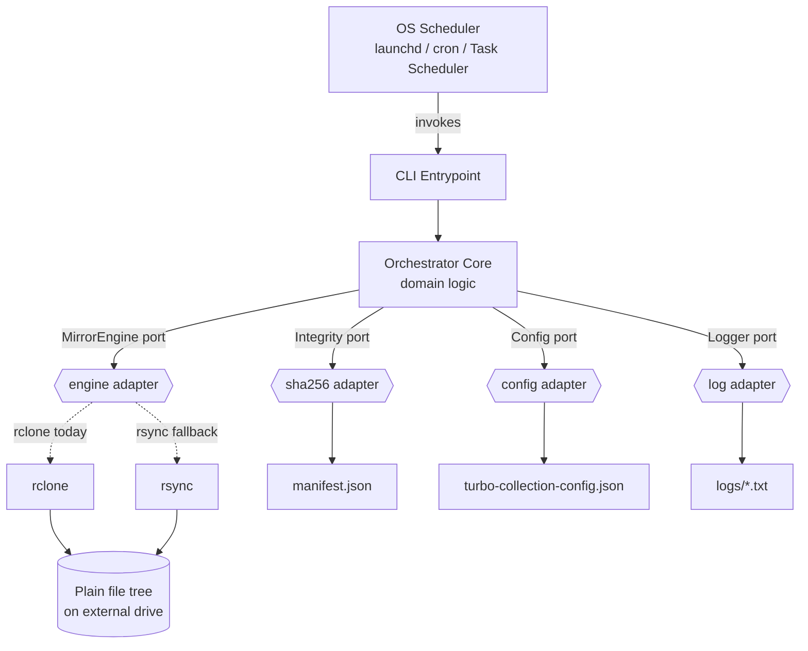
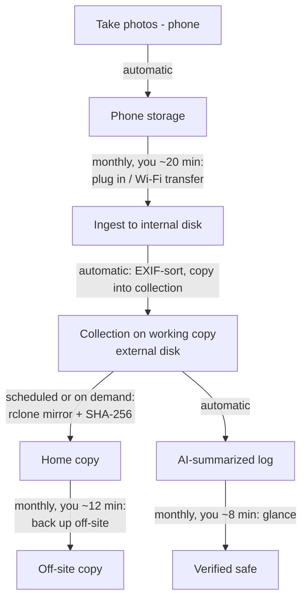

# Photo Collection: Project Plan & Design Record

> **Status:** Design agreed. Specification drafted; implementation not started.
> **Created:** 2026-07-09, as `plan.md`. Renamed 2026-08-01.
> **License (intended):** MIT
> **This document records why, not what.** What must be true lives in
> [`specs/turbo-collection-spec.md`](../specs/turbo-collection-spec.md), which is the source of
> truth that code cites. Here you will find goals, rejected options, architecture rationale, a
> decades-scale migration analysis, and an operations runbook. Decisions taken since live in
> [`decisions/`](decisions/), which holds current decision records; where one changes what is stated
> here, this narrative is corrected to match, and git preserves earlier wording.

---

## 0. How to use this document

- **Read it fully before acting.** Every decision here was reached deliberately; the *rationale*
  matters as much as the decision.
- **Distinguish durable principles from dated assumptions.** Section 13 (Assumptions Register)
  lists facts that were true as of 2026-07-09 and **must be re-verified** before you rely on them
  (tool status, licenses, prices, versions, even which AIs exist). Do not trust them blindly.
- **The specification exists; the code does not.** Read
  [`specs/turbo-collection-spec.md`](../specs/turbo-collection-spec.md) for what must be true, and
  [`spec-guide.md`](spec-guide.md) for a map of which document covers what.
- **The owner is tech-savvy** and expects to remain so, and assumes continued access to some AI
  (cloud today, possibly local models later). Write for that audience.

---

## Table of Contents

1. [Problem statement & goals](#1-problem-statement--goals)
2. [Guiding philosophy](#2-guiding-philosophy)
3. [What we rejected and why](#3-what-we-rejected-and-why)
4. [The chosen approach](#4-the-chosen-approach)
5. [Architecture (ports & adapters)](#5-architecture-ports--adapters)
6. [Technology decisions (the bindings)](#6-technology-decisions-the-bindings)
7. [Specification approach](#7-specification-approach)
8. [Draft requirements (superseded)](#8-draft-requirements-superseded)
9. [What-if migration analysis](#9-what-if-migration-analysis)
10. [Operations runbook](#10-operations-runbook)
11. [The 4-hour/month maintenance budget](#11-the-4-hourmonth-maintenance-budget)
12. [Discontinuity-driven refinements](#12-discontinuity-driven-refinements)
13. [Assumptions register (dated; re-verify)](#13-assumptions-register-dated-re-verify)
14. [Glossary](#14-glossary)
15. [Next steps (superseded)](#15-next-steps-superseded)

---

## 1. Problem statement & goals

The owner has decades of personal photos (~**1 TB** to start), historically backed up manually.
Subscription photo services (iCloud/Google/OneDrive, ~$10/mo) can be discontinued, repriced, or
changed at any time, and they tie access to payment.

**This project does not replace them. It changes their role.** An iPhone and iCloud stay in daily
use, as camera, as sync, as sharing surface, and they stop being where photos *live*. Custody moves
to a **self-controlled** collection of plain files. After that a vendor service holds as much or as
little as suits you, and losing one costs you convenience rather than photographs.

That is a better outcome than leaving, and a more honest description of the design: iCloud is
currently the **import source** for the iPhone, so this project depends on it working well
rather than wishing it away.

**Hard goals:**

- **Full control & ownership**: no company, server, or subscription required to access photos.
- **Longevity**: survive OS changes, company bankruptcies, discontinued apps (they were burned by
  Picasa's shutdown), and hardware deprecation. Thinking in **decades to centuries**.
- **OS-independence**: must survive leaving Apple or Microsoft; portable across macOS/Windows/Linux.
- **Easy migration**: every part must have a clear, cheap migration path (e.g., NTFS→ReFS,
  rsync→rclone, TypeScript→another language, one machine→another).
- **Open & permissive**: prefer **MIT/permissive** tools and open standards least likely to lose support.
- **Minimal, transparent stack**: the owner wants to *see the full stack*; no hidden magic.
- **CLI-first**: a GUI may be layered on later, but must not be a core dependency.
- **Low human effort**: target **≤ 4 hours/month** of maintenance as a **hard limit** (see Section 11).
- **Safe release of what an import source holds**: Turbo-Collection never deletes anything from iCloud or from a
  phone, and R-SRC-7 forbids it from trying. What this project delivers is deletion *by you*, made
  safe: once photos are in the collection and verified, you can free that storage yourself and stop
  paying for it. A primary motivator rather than a pleasant side effect, and what turns "I have a
  backup" into "I own my photos". It also sets an obligation, since safe deletion by hand needs the
  tool to answer, for a specific set of photos rather than for a whole tree, whether they are already
  stored and intact.

**Non-goals (for now):**

- Not building a photo *manager* (no face recognition, albums, AI search). This is a **backup/preservation**
  system. Curation/enjoyment is separate and out of scope.
- Versioning/snapshots are a **later** addition; start with plain mirroring.
- Cloud off-site is **optional**; start local, add cloud later if desired.

---

## 2. Guiding philosophy

The core principle that everything else follows from:

> **Separate your data from your tools.** Data should be so plain that *any* tool can read it.
> Tools should be so ubiquitous and simple that if one dies, you swap it without touching the data.

Supporting principles. Those every specification and design decision has to satisfy are also stated
as requirements, in [`specs/durability-requirement.md`](../specs/durability-requirement.md)
(`R-DUR-*`); this section keeps the reasoning behind them.

- **Plain files, plain folder tree.** The foundation is a directory of original files
  (format-agnostic: JPEG, HEIC, RAW, video, copied byte-for-byte with no conversion). No database, no
  proprietary container. Files as a concept have survived ~75 years across every OS.
- **Format & tool independence.** Picasa died; the `.jpg` files didn't. The backup must never lock
  data behind an app or a company. Proprietary formats are the long-term readability risk, not any one
  codec: camera RAW (CR3, NEF, ARW) is undocumented and single-vendor, HEIC and HEVC are
  patent-encumbered. The rule is the same for all of them and whatever replaces them: keep the
  original bytes, and optionally hedge with an open-format copy beside the original, never in place of
  it (R-COL-5).
- **Durable invariants vs. dated bindings.** Some things are near-permanent (files, checksums,
  the 3-2-1 rule, the *intent*). Others are today's expression of them (rclone, TypeScript, Mermaid,
  GitHub) and are expected to be swapped. Isolate the volatile parts so churn never touches the data.
- **Minimize dependencies.** Every dependency is a future liability, for both humans and AIs to
  maintain or translate. Prefer standard libraries and single-binary tools.
- **Non-default configuration is a dependency too.** Every flag, key and configuration file is
  something to maintain, something that can drift out of step with the tool that reads it, and
  something a later reader has to reconstruct. Anything non-default therefore needs a good reason,
  and the test is empirical rather than aesthetic: remove it, and measure whether behavior changes.
  Settings that look load-bearing frequently are not, and a file that documents a boundary is not the
  same as a file that enforces one.
- **AI-optional to operate, AI-assumed to recover.** Operating this system requires no AI: the stack
  is simple enough to run and maintain by hand. Recovering data when Turbo-Collection is gone is the
  other half, and it leans on the next principle. The boundary is worth keeping sharp: normal
  operation assumes nothing, recovery assumes help.
- **A future reader has help.** A person who finds this data, at any point across the decades it is
  meant to survive, is assumed to have access to a capable AI assistant and to be able to ask it to
  act on what they find. So *readable without Turbo-Collection* means readable by a person holding
  plain, self-describing data and an assistant, rather than by a person holding one particular
  command-line program. This licenses removing **pre-computed conveniences**: a second copy of a
  manifest in some tool's format earns nothing, because anyone who can obtain that conversion can
  obtain the verification directly and skip the intermediate file. It licenses nothing whatever about
  **self-description**, because an assistant can act only on data that states what it is. Every
  meta file still carries its format version, names its algorithm, and travels beside the
  specification governing it, so this principle makes R-VER-8 and the `version` field (R-MFILE-4)
  more important rather than less. It moves work from the writer to the reader's assistant; it must never
  move work to the reader's guesswork. **Conventional tooling is the safety net, not the main mode of
  operation.** Standard utilities, format parsers, GNU coreutils and ordinary programming skill remain
  a complete fallback should assistance ever be unavailable, and no decision may close that path off.
  They are simply no longer what this project designs *for*. Note the fallback does not require the
  reader to hold that skill, only that the skill still exists and can be bought: someone who inherits
  this drive and cannot program can hire a person who can, and the data is plain and self-describing
  enough that such a person needs no familiarity with this project to work on it. That is a far
  weaker condition than it first sounds, and it is what makes relying on the primary path safe. That distinction is what decides each
  case: the fallback must stay **possible**, and need not be made **convenient**. Self-description is
  what keeps it possible, which is why it survives every application of this principle;
  the companion manifest was what made it convenient, which is why it did not. Being wrong therefore
  costs inconvenience rather than data, because a reader with no help at all still holds plain files,
  checksums in documented JSON, and a specification sitting beside them, which is the strongest
  position available to anyone. And it is self-testing: the annual
  re-validation ritual in Section 10 already asks a then-current AI to re-check this project's
  assumptions, so if that ritual can be run, this principle holds, and if nobody can run it you have
  learned it failed by the only means that would tell you. First applied by withdrawing R-INT-9, the
  companion manifest, on 2026-08-16.
- **Future-translatability.** Even if a language disappears, a mainstream + idiomatic + small +
  dependency-light codebase can be translated (by a future human or AI) into the language of the day.
- **Only ever add.** Turbo-Collection creates and reports; it never deletes; reasoning is in
  [the append-only decision](decisions/2026-08-13-append-only-decision.md). Worth stating here as
  philosophy and not only as a requirement, because it explains an otherwise odd shape: every copy
  grows monotonically, so copies converge by each gaining what the others hold, never by one being
  overwritten to match another. The single carve-out, removing a run's own incomplete work
  (R-MIRROR-8), is bounded so it cannot reopen the guarantee: only a file Turbo-Collection created,
  only one that never became complete at its final path, and only one a human can recognize as
  temporary. Without it the crash-safe write-to-temporary-then-rename that R-MIRROR-6 needs could not
  be implemented.
- **A record lives with the data it describes.** There is no central index of what is stored where.
  Every directory carries its own manifest and its own receipt; every copy carries its own
  `README.md`, its own configuration, and optionally its own copy of the specification; nothing
  remembers an import source's contents between runs.
  Picasa is the worked example here as well as for plain files: it first stored album definitions in
  `.pal` files under a user profile directory, away from the photographs, and version 3.9 moved album
  data into a `.picasa.ini` **inside each photo folder**. Google reached this conclusion themselves,
  too late for anyone whose albums predated the move. The industry name for what is rejected is a
  **catalog**: in backup software, the central database of what was backed up onto which media, whose
  known failure is that losing it leaves you holding media you can no longer interpret, so it needs
  its own backup and its own recovery procedure. The cost accepted instead is repetition, which is
  redundancy (`R-DUR-2`) applied to metadata. Reasoning:
  [the receipts decision](decisions/2026-09-07-receipts-decision.md).
- **A vendor may be an import source, never a custodian, and the same holds for hardware.** The rule
  began as a statement about services and tools, and it turns out to describe three layers of the same
  choice. A **service** may be how photographs come in (iCloud) but never where they live. A **tool**
  may be required to perform an import but never to read the result, which is what disqualifies
  restic, Borg and Kopia as the core. And **silicon** may be in the path but must not hold the only
  key to the data, which is what disqualifies storage soldered into a computer and enclosures that
  encrypt on their own chip. The hardware layer differs in one way worth stating: silicon can never be
  removed from the path, only kept standard and replaceable, so the goal there is **minimal
  dependency** rather than none. Reasoning:
  [the drive and hardware decision](decisions/2026-08-15-drive-naming-and-hardware-decision.md).
- **The computer is equipment, not infrastructure.** No machine is part of this system. Configuration
  travels on the working copy, logs are written to the drives, and nothing is installed or
  remembered on a host, so a backup can be performed on a borrowed computer in another building. This
  is what several separately-argued decisions were quietly buying.
- **The code is not the trust anchor.** This principle is what makes the previous one hard. If the
  orchestrator is small, regenerable from a specification, and therefore disposable, then any
  guarantee resting on the code alone can be regenerated away. Borg is instructive here: it does not
  enforce append-only in its client at all, and puts the restriction in an SSH `command=` on the
  server, where the client cannot reach it. A promise a tool makes about itself is weaker than a
  constraint imposed outside it. Offline drive rotation is the cheapest such constraint available
  here, and it is already the design: a disconnected drive cannot be deleted from.
- **Design for discontinuity.** Disruption is the norm, not the exception: most people live
  through several (revolutions, wars, blackouts, natural disasters, hyperinflation, services
  shutting down), and the coming decades are unlikely to be calmer. The architecture deliberately
  leans on nothing that requires a stable company, government, or grid to keep standing.

---

## 3. What we rejected and why

| Option | Why rejected |
|---|---|
| **Immich** (self-hosted Google Photos clone) | Excellent, but too heavy; stores metadata in a **PostgreSQL database** (violates "plain files"), felt overwhelming, and it's a *manager* not a *backup*. AGPL (fine for personal use, but not the direction). |
| **PhotoPrism / LibrePhotos** | Same class as Immich: DB-backed photo managers, heavier than needed. |
| **Managed cloud services as the *system of record*** (iCloud/Google/OneDrive/Dropbox) | Rejected as **custodian**, not as **tool**. Subscription cost, lock-in in a vendor metadata format, and access tied to payment make them a poor place for photos to live. They stay in use here regardless: iCloud is the import source for the iPhone, and a cloud bucket storing one object per file is a perfectly good backup copy (Section 10). What is rejected is depending on any of them for custody. |
| **Proprietary backup apps** (e.g., Bvckup 2) | The owner *liked* Bvckup's file-mirroring model, but it's **proprietary** → no full control. We want an open equivalent. |
| **Full versioned/repo backup tools as the core** (restic/Borg/Kopia) | Great tools, but their **repo format** isn't plain browsable files; you need the tool to read it back. Fine as a *later, optional* versioned layer, not the core. |
| **POSIX shell as the orchestration language** | Durable on Unix but **not truly OS-independent** (not native on Windows) and less approachable. A high-level language with a cross-platform runtime is more portable. |

**Note on AGPL vs MIT (discussed):** AGPL requires sharing modified source if you offer the software
as a network service; it closes the "SaaS loophole." For *personal use* it imposes nothing. The owner
nonetheless prefers **MIT/permissive** on philosophical/longevity grounds, and will license *this*
project MIT.

---

## 4. The chosen approach

An **open, "Bvckup-like" file-mirroring preservation system**. Conceptually:

```
Photos (plain folder tree)
   ├── mirror engine (rclone) ──▶ external drive  (exact, browsable copy)
   ├── SHA-256 manifest ────────▶ bit-rot / integrity detection
   ├── thin orchestrator (TypeScript) coordinates the run
   ├── OS scheduler (launchd) runs it automatically
   └── (optional, later) off-site copy: physical drive rotation OR cloud (rclone→B2)
```

Key properties:

- The destination is a **plain mirror** you can browse in Finder/Explorer; no tool required to restore.
- **CLI-first / headless core.** A GUI, if ever built, is a *consumer* of the core, not part of it
  (avoids GUI dependency hell: WinUI3, React Native, Swift, etc.).
- **Plain mirror ⇒ engine swaps need zero data migration** (both rclone and rsync produce the same
  browsable file tree; switching them never rewrites the destination).
- Start **local-only** (like Bvckup). Cloud off-site and versioning are clean later additions.

---

## 5. Architecture (ports & adapters)

The design is **hexagonal (ports & adapters)**: a thin orchestrator core talks to the outside world
only through **ports** (interfaces); each port has a swappable **adapter**. The core never knows
whether the engine is rclone or rsync, the config JSON or TOML, the scheduler launchd or cron.

**A note on words.** _Port_ and _adapter_ are this section's architecture vocabulary and appear
nowhere in the specification, which names concrete things instead: an **importer** reads an **import
source**, a copy sits on a **medium** and its **storage** declares what that medium can guarantee,
and the tool that brings copies into agreement is the **mirror engine**. Read "Source" below as the
import contract and "Storage" as the storage contract. Reasoning:
[the vocabulary decision](decisions/2026-10-05-spec-vocabulary-decision.md).



**The pieces:**

| Piece | Port (interface) | Today's adapter | Why isolated |
|---|---|---|---|
| Data | (none) | Plain file tree | The sacred core; only the engine touches it |
| Source | `capabilities()` / `list()` / `fetch(item)` | none yet | Every vendor-specific fact lives in an adapter, never in the core |
| Storage | `capabilities()` / `push()` / `verify()` | local drive | A copy's storage declares what it can guarantee, rather than being merely a path (port formerly **Target**; `R-TGT-*` IDs frozen) |
| Mirror engine | `mirror(src, dst, excludes)` | rclone | Swap to rsync = change one adapter, no data change |
| Integrity | `build()` / `verify()` | SHA-256 manifest | Verification is separate from copying |
| Config | `load() -> Config` | JSON file (data) | Config is *data, not code*; survives a language rewrite |
| Logger | `log(event)` | Plain-text file | Observability decoupled from logic |
| Scheduler | *(external)* | launchd | Lives *outside* the core; core is one-shot "run once" |

**Architectural principles (why it's sound):**

1. **Dependency inversion on the engine**: core depends on the *idea* "mirror A→B," not on rclone.
2. **Config as data, not code**: rewrite the orchestrator in any language later; config carries over.
3. **Thin orchestrator**: glue only coordinates; real work is in the durable engine + plain data.
   Keep it small enough to rewrite/regenerate in an afternoon.
4. **One-shot core + external scheduler**: the program does one run and exits with a clear code;
   *when* it runs is the OS scheduler's job (the most OS-specific part stays outside the code).
5. **Separation of concerns**: copy, verify, configure, log, schedule are distinct, individually
   replaceable pieces.
6. **Durable WHAT vs. volatile HOW**: requirements describe *what* must be true (naming no tool);
   a separate "current bindings" section records *how* it's done today. Migrations touch only HOW.

### The core / importer seam

An importer produces content and nothing else. The core owns every copy, decides where each file
goes, and writes every meta file. An importer never sees a copy (`R-SRC-17`).

- **One transport.** Every importer, whether a function inside the program or a separate executable,
  writes what it fetched into a hand-off directory outside every copy, and the core takes files in
  from there. Every real import source already delivers files (a camera card, an export directory,
  an archive), so streaming bytes through the core would buy almost nothing and cost a second code
  path. Because a separate executable hands over files, no framing protocol over a byte stream is
  ever needed. This transport is a binding, as the way importers are loaded is: the specification
  states the boundary and leaves the hand-off mechanism free.
- **The core is the sole writer.** It reads each handed-over file, checksums it, computes its path
  (`R-SRC-10`), writes it under a temporary name, verifies it, and renames it into place
  (`R-MIRROR-6`, `R-MIRROR-9`), then writes the manifest and the receipt. A re-run converges instead
  of duplicating (`R-SRC-8`), because a file's path follows from the file and what its import source
  supplied with it.
- **Where the guarantee stops.** The core guarantees that what reached the hand-off directory reaches
  the collection faithfully and verified. Whether everything at an import source reached the
  hand-off directory is outside that guarantee, and belongs to the importer and the operator. One
  check is rescued from that gap: an importer may state how many items it expects to supply, and the
  core compares that count with what it received and reports a mismatch (`R-SRC-18`). The check is
  honest about its reach, which is small: it catches a loss only when an importer knows a count that
  is independent of what it produced.
- **Fidelity.** A file handed over bare is a claim that it is an original. An import source that
  degrades has to say so (`R-SRC-6`), and one whose degradation cannot be detected is refused
  outright (`R-SRC-19`).

What lost:

- **An importer writes into a path the core provides.** A file's final path cannot be known before
  its bytes are read (`R-SRC-10`), so providing a destination up front contradicts itself. Add-only
  and integrity checks would also live in two places, and the core would have to read every file
  back to build a manifest it could have built while writing.
- **Streaming bytes through the core for an importer inside the program.** A second transport, for a
  saving no real import source offers.
- **A callback or event interface.** The seam is a contract about data, not about control flow: fix
  what an importer hands over, and let the transport vary.

---

## 6. Technology decisions (the bindings)

> These are **bindings**: today's expression of durable intent. All are swappable. See Section 13
> for the ones that must be re-verified over time.

| Concern | Decision | Rationale |
|---|---|---|
| **Mirror engine** | **rclone** (MIT); **rsync** as fallback | MIT license; single self-contained Go binary; runs on every OS incl. Windows; local + 70 cloud backends with same syntax. rsync is the ultra-durable fallback and swap is trivial (plain mirror ⇒ no data migration). |
| **Orchestration language** | **TypeScript on Node.js** (direct TS execution, no transpile step) | Owner values **strong static types**. Node runs TS directly (type-stripping) → no build/transpile. Mainstream + idiomatic + small ⇒ future-AI-translatable. Runs on any OS. |
| **Dependencies** | **Standard library first** (minimal third-party) | Dependencies are the hardest thing to maintain/translate. Node built-ins (`node:child_process`, `node:crypto`, `node:fs`, `node:path`) cover nearly everything. A package is admitted only when it implements a documented format the specification cites, has no dependencies of its own, and is vendored into the repository (core specification Section 12). |
| **Config format** | **JSON** | Node parses JSON **natively** (zero dependency). (TOML was the earlier default *for a Python build*, since Python 3.11+ has built-in `tomllib`; Node has no built-in TOML parser, so JSON keeps deps at zero.) Config is pure data, trivially convertible later. |
| **Integrity** | **SHA-256 manifest** (JSON, one per directory) | Detects silent bit-rot. For *integrity* (not security) even weaker hashes suffice; SHA-256 is solid for decades. A manifest names its algorithm, so switching is explicit. Why JSON and not the `shasum` text format: [the manifest-format decision](decisions/2026-08-16-manifest-format-decision.md). |
| **Scheduler** | **launchd** (macOS) → cron / Task Scheduler / systemd later | OS built-in; external to the core; ship snippets for all major OSes. |
| **Version control** | **git** | A *binding* (see below). Distributed ⇒ every clone is complete. |
| **Code hosting** | **GitHub** | A *binding*. Because git is distributed, leaving GitHub is one command (`git remote set-url`) to any host or a copy kept on the drives. Hosts the *system*, never the photos. |
| **Diagrams** | **Mermaid** (plain-text source) | A *binding*, same bucket as languages. Plain-text ⇒ diffable, translatable, AI-convertible to any future notation. Keep diagram **source** in the docs, not binary images. |
| **License** | **MIT** | Maximum permissiveness/reuse/longevity. |

**Language note (important nuance):** If the language is ever changed to **Python**, the natural config
format flips back to **TOML** (Python has built-in `tomllib`; avoid adding a TOML dep to Node). The
architecture and spec do not change; only the two coupled bindings do (language + config format).

---

## 7. Specification approach

The **specification is the durable, language-neutral source of truth**: the seed from which code
(and tests) can be regenerated in any future language. This is precisely how the internet works:
protocols (TCP, HTTP, DNS) are defined by English-language **RFCs** that have outlived countless
implementations for 40+ years.

**Format of the spec (to be written next):**

- **Structured English**, layered by purpose:
  - *Prose* for intent & principles (the "why", which survives everything).
  - *Numbered requirements* using **RFC 2119** keywords (**MUST / SHOULD / MAY**); atomic, testable.
  - *Tables* for enumerable facts (config schema, exit codes, port I/O contracts).
  - *Diagrams* (Mermaid) for structure & flow.
- **Durable WHAT vs. volatile HOW split:** requirements name no tool/language; a separate
  "Current Bindings" section records today's implementation. Migrations change only the bindings.
- **Traceability:** each requirement has a stable ID (R-1, R-2, …); code references the ID
  (e.g., `// R-3`) so conformance is auditable, not inferred.
- **Controlled language:** the writing rules that keep the spec's English interpretable across
  decades of language drift (obligations only via RFC 2119 keywords, one term one meaning, no
  idiom in normative text; inspired by ASD-STE100 "Simplified Technical English") are codified
  in `specs/language-requirement.md`, which binds every normative document in the project.
- **No performance numbers in the core specification.** Throughput and duration depend on hardware
  and on a vendor's service, and both change. A number written into the core would be wrong within a
  hardware generation, and would read as a promise in the meantime. Measurements live only in import
  source specifications, each with its date and the conditions it was taken under.

**Conformance checking has two directions** (both AI-assisted, both periodic):

1. **Internal (code vs. spec):** for each requirement, locate the responsible code, judge
   Satisfied / Partial / Violated / Missing, cite evidence (file:line). Language-agnostic because the
   AI reads both the English and the code. Bidirectional: also flag code doing things the spec
   doesn't mention (→ update spec) and requirements with no code (→ fix code).
2. **External (assumptions vs. the world):** periodically re-validate the dated assumptions
   (Section 13) against then-current reality (is rclone still maintained & MIT? better tool now?
   prices/drives/filesystems shifted? SHA-256 still fine? scheduler changed?).

**Tests complement, don't replace, AI review.** AI conformance-checking is a strong *reviewer*, not a
mathematical proof (it can miss subtle behavioral bugs). So: **each MUST maps to at least one test.**
Layering:

- **English spec**: source of truth (language-free).
- **Tests**: deterministic, but language-bound.
- **Implementation**: language-bound.

On a language migration, the English spec regenerates **both** the tests and the code in the new language.

---

## 8. Draft requirements (superseded)

**Superseded.** Ten draft requirements were sketched here, numbered R-1 to R-10, alongside a first
cut at port contracts. All of it became
[`specs/turbo-collection-spec.md`](../specs/turbo-collection-spec.md), which states the real
requirements and the real contracts, and which has since moved past this sketch in several
places: exit codes were deliberately left open rather than given a code per failure class, and the
import and storage contracts did not exist here at all.

The text is not reproduced, for two reasons. Superseded requirements sitting beside live ones invite
a reader to follow the wrong set, and `language-requirement.md` R-LANG-17 keeps obligation keywords
out of documents that bind nobody.

---

## 9. What-if migration analysis

Every component has a clear migration path, ranked by **conversion cost** and **realistic likelihood**.
Organizing test: *does the destination stay a plain browsable mirror?* (Yes ⇒ filesystem/engine swaps
are trivial.)

### Component layer

| Component | What-if trigger | Migration path | Cost | Likelihood | Mitigation |
|---|---|---|---|---|---|
| **Data** (files) | "file" concept dies | none (read directly) | none | ~nil | 75-yr track record |
| **Filesystem** (APFS↔NTFS↔ReFS↔ext4) | new drive/OS | OS-level file copy | Low (time only) | Medium | use no FS-specific features; real risk = filenames (see below) |
| **Engine** (rclone) | project dies / better tool | swap one adapter (~40 lines); no data change | Low | Low–Med | MIT (forkable); rsync fallback; plain mirror ⇒ zero destination migration |
| **Orchestrator** (TypeScript) | language/runtime churn | regenerate ~200 lines from spec (AI) | Low–Med | Medium | stdlib-only; language-neutral spec; thin glue |
| **Integrity** (SHA-256) | hash deprecated | recompute manifest | Low (CPU) | Low | plain JSON manifest; algo recorded; even "broken" hash detects bit-rot |
| **Config** (JSON) | format churn | data transform (JSON↔TOML/YAML) | Trivial | Very Low | config is data; native parse = zero dep |
| **Scheduler** (launchd) | OS change | replace external schedule file | Low | Medium | one-shot core; ship snippets for all OSes |
| **OS** (macOS) | leave Apple | reinstall Node+rclone, copy repo, edit paths | Low–Med | Medium | every component already cross-platform; paths in config |
| **VCS/hosting** (git/GitHub) | git/GitHub dies | export repo to plain files; `git remote set-url` to any host | Trivial | Very Low | distributed; holds the *system*, never the photos |

**The filename gotcha (the real filesystem-migration risk):** a plain copy across ReFS↔NTFS↔APFS is
lossless *except* filenames: reserved characters, case-sensitivity collisions, and macOS's NFD vs.
everyone else's NFC Unicode normalization. Mitigation: the **name-hazard check (`R-NAME-1`)** flags
risky names before copying, and the **SHA-256 manifest** verifies every file arrived intact after any
move.

### Substrate layer (the environment beneath the stack)

| Dependency | What-if trigger | Continuity path | Cost | Likelihood | Mitigation |
|---|---|---|---|---|---|
| **Host computer** | ~3-yr refresh; OS/HW EOL; laptop dies | install Node+rclone, clone repo, plug drives, edit paths | Low (~1–2 hr / 3 yr) | High | host holds *no* irreplaceable state ("cattle, not pets") |
| **Electricity** | outage (short/long) | batch system resumes when power returns; storage persists powerless | ~Zero (short) | Common, zero-impact | UPS on primary; SHA-256 catches mid-write corruption |
| **Internet** | outage / sustained loss | core backup is fully offline; only cloud off-site + AI need net | ~Zero for core | Common, zero-impact on core | choose physical off-site ⇒ entire core is offline-capable |
| **AI access** | internet loss / lose frontier AI | local open-weight model → or hand-maintain (owner is tech-savvy) | Low | Medium | small, spec-driven code lowers the AI bar; whoever maintains it later needs little help to translate or fix it |

**Key insights:**

- **The danger quadrant (high cost AND high likelihood) is empty.** That is the whole design goal.
- **Volatility is concentrated in the smallest, best-isolated box** (the ~200-line orchestrator),
  which is also the only piece with a language-neutral spec behind it.
- **Of every component, the host computer is the most disposable**: it holds no irreplaceable state
  (that lives on the portable drives + git), so replacing it is a rebuild, never a recovery.
- **Persistence needs no power or network; only *throughput* does.** Photos sit safe on non-volatile
  drives regardless; power/net are needed only intermittently, to *run* backups.
- **Nothing in daily operation depends on AI**: ingest, mirror, and verify all run without it or the
  internet (the "AI-optional" principle of Section 2, in practice).

**Bracketed (out of scope by owner's request):** civilizational disruption (war, collapse). Even so,
plain files on portable drives are near the top of the digital-survivability ladder. The only rung
above is analog: **printing the most precious handful of photos**, the one medium that survives loss
of all computing.

---

## 10. Operations runbook

The complete end-to-end human workflow, from one-time setup through rare events.

### Day one (one-time, AI-assisted)

| Task | Effort | Notes |
|---|---|---|
| Stand up the stack | ~an afternoon | Install Node + rclone, drop in scripts, write config, first backup, set schedule |
| Consolidate existing photos | ~a few hours | Pull years of scattered manual backups into one library tree; de-dup; EXIF-sort |

### Monthly hot path (recurring)



Scheduling is optional. The mirror step above runs on a schedule or on demand: `R-CLI-2` makes the
tool one-shot with no daemon, and `R-CLI-6` requires it to be fully usable with no scheduler
installed. Connecting a backup copy only when you use it trades automation for a stronger air gap,
and pushes the whole burden of protecting new photos onto the backup procedure, which is why
`R-REL-2` is written as a gate on release rather than as a nightly habit.

**Monthly checklist (~40 min):**

1. **Ingest**: plug in phone, transfer new photos; auto-filing sorts them (~20 min).
2. **Confirm backup**: check the run went green in the AI-summarized log (~8 min).
3. **Off-site**: take the working copy to the off-site copy, or confirm the cloud upload (~12 min).
4. **Quarterly add-on**: restore a random sample to prove backups are restorable (~25 min, 4×/yr).

### Hardware lifecycle (~2–3 year cadence, driven by drive *age*)

1. **Monitor** *(automatic)*: orchestrator flags any drive >80% full or past ~3-yr age in the log.
2. **Buy online** *(you, ~30–60 min)*: order **one drive at a time**, of a different model from the
   drive it joins, and check that model against current published failure data before ordering.
   See the buying cheat-sheet below.
3. **Receive & prep** *(you, ~20–30 min)*: unbox, connect, format, physically label, drop a text file
   on the drive recording purchase date & role.
4. **Burn-in & onboard** *(you ~15 min active, rest passive)*: add to config, run first full mirror +
   SHA-256 verify (this doubles as a DOA/burn-in test).
5. **Rotate & retire** *(you, ~10 min)*: fresh drive takes over; demote the older drive to a **cold
   spare** (bonus extra copy) rather than discarding.

**Buying cheat-sheet:**

| Decision | Guidance |
|---|---|
| Type | SSD for the working copy, which is carried between machines; **HDD for both backup copies**, on price alone at roughly 30 against 60–80 USD/TB. Any medium is permitted in any role (`R-SET-2`) |
| Avoid | SMR drives for backup (prefer **CMR**); avoid unknown/relabeled sellers (counterfeit risk) |
| Capacity | Buy **≥ 2× the library** so *age*, not fullness, is the trigger. Headroom costs money and costs no verification time |
| Quantity | **Three copies total, bought on separated dates** (`R-SET-13`, `R-SET-3`). Never two matching drives together |
| Brand | Prefer different models, and different manufacturers where an enclosure discloses one. A suggestion, not a rule, because enclosures often do not disclose |
| Filesystem | exFAT only where a drive must be written by both macOS and Windows; a journaled native filesystem everywhere else |
| On arrival | First mirror + checksum verify = free DOA/burn-in check |

**Why these choices.**

*Different models, never matching drives.* Failures inside a manufacturing batch are correlated over
multi-year periods, and measured failure rates differ between models by two orders of magnitude, so
two identical drives bought together are one bet placed twice. A saving grace this architecture
already has: mirrors are independent plain trees, so recovery is an ordinary file copy and never a
RAID rebuild, which removes the mechanism that usually kills a second drive right after the first.

*SSD permitted in any role.* An SSD is fine for the off-site copy. JEDEC JESD218's one-year
client figure is measured on a drive stressed to its full rated terabytes written, and a photo
collection leaves a drive at a small fraction of that, where retention is far longer. Medium is
chosen on price, and the property that actually establishes a copy is intact is reading it on a
cadence, still undecided. Shock resistance is a reason to put the SSD on the working copy, since that is the one carried between machines. Full reasoning:
[storage hardware decision](decisions/2026-08-10-storage-hardware-decision.md).

*What sets the cadence.* The immutable-backup literature supplies the idea worth borrowing:
**dwell time**, the period damage sits undetected between the moment it happens and the moment
someone looks. A verification cadence longer than dwell time means every surviving copy can be bad
before anyone finds out. That reframes cadence as a **safety parameter rather than a performance
one**, and raises its priority accordingly: it is now the only thing standing where the withdrawn
media rule used to stand. The cost is measured and awkward, roughly 3 hours per terabyte, disk-bound
rather than hash-bound, so a full pass over 4 TB is a twelve-hour operation and cannot be the answer
every time. Sampled-plus-periodic-full is a shape the core specification's requirements already
permit, and per-directory manifests (`R-MFILE-8`) make a partial pass a natural unit. No number is
chosen yet.

Append-only sharpens one edge of this. Never overwriting protects copies that already exist, and does
nothing to stop bad bytes reaching new ones, so a collection file that corrupts silently would be
faithfully copied to the next fresh copy. `R-MIRROR-9` closes that by verifying immediately before
each copy, which is cheap because the file is being read anyway. It does not replace a cadence; it
only stops corruption spreading at the one moment the tool is already looking.

**Capacity math (1 TB start):** at ~10–20 GB/month growth, a 2–4 TB drive outlives its ~3-yr age life
before filling. So replacement is **age-driven**, ~two drives every ~2–3 years: predictable, never an emergency.

### Exceptions (rare, bounded)

- **Backup run fails** → flagged in log → investigate, AI-guided (~15 min).
- **Checksum mismatch (bit-rot)** → the system *working*; restore that file from another copy (~15 min).
- **A drive dies** → no data lost (3-2-1); triggers a procurement event.

### Annual assumption re-validation ritual

Once a year (or at each machine refresh), have a *then-current* AI re-check the Assumptions Register
(Section 13) against reality: tool maintenance/licenses, prices, drive/filesystem norms, hash adequacy,
scheduler changes, AI availability. Update this document accordingly.

---

## 11. The 4-hour/month maintenance budget

**4 hours/month is a HARD limit.** Verified by amortizing all tasks (incl. laptop/drive replacement,
migrations) and stress-testing the worst month.

### Active vs. passive time

Only **active, attended minutes** count. Terabyte copies run **unattended** (passive wall-clock) and
do not count. A drive onboarding is ~20 active minutes + hours of unwatched copying.

### Fully-amortized monthly (everything included)

| Task | Frequency | Active/event | ~Monthly |
|---|---|---|---|
| Ingest | monthly | 20 min | 20.0 |
| Confirm backup | monthly | 8 min | 8.0 |
| Off-site rotation | monthly | 12 min | 12.0 |
| Restore test | quarterly | 25 min | 8.3 |
| Assumption re-validation | yearly | 90 min | 7.5 |
| Software updates | ~4×/yr | 20 min | 6.7 |
| Breakage/debugging (AI-assisted) | ~4×/yr | 20 min | 6.7 |
| New hard drives (2) | ~every 30 mo | 70 min | 2.3 |
| New laptop (rebuild) | ~every 36 mo | 60 min | 1.7 |
| OS major upgrade | ~every 36 mo | 60 min | 1.7 |
| Migrations (engine/lang/format) | ~every 60 mo | 180 min | 3.0 |
| Failure handling | ~every 24 mo | 30 min | 1.3 |
| **Total** | | | **≈ 79 min/mo (~1.3 h)** |

### Worst realistic single month (laptop refresh + new drives stacked)

| That month | Active time |
|---|---|
| New laptop rebuild | ~60 min |
| New drives (buy, prep, kick off copy, verify, rotate) | ~70 min |
| Ingest + confirm + off-site | ~40 min |
| Restore test | deferred |
| **Total active** | **≈ 2.8 h (under 4 h)** |

### The four rules that guarantee the ceiling

1. **Count active time; never babysit a copy.**
2. **Stagger predictable events**: never schedule laptop refresh and drive replacement in the same
   month; split drive *buy* vs. *onboard* across months.
3. **Keep AI in the loop**: caps the one open-ended risk (software debugging).
4. **Everything is deferrable, with a cloud pressure valve**: switch off-site to cloud (~0 min) and
   postpone non-urgent tasks when a month is tight.

### Why it's genuinely enforceable

The only **data-safety-critical** work (scheduled mirror + checksum) is **fully automated and needs
zero human time**. Every human task is supervisory/periodic and **deferrable**: you can stop at 4
hours and nothing is at risk.

### Caveat (scope of the budget)

- **Building new features** (versioning, dedup, GUI, search) is *project* time, not maintenance; keep
  it separate.
- **Browsing/curating** photos is leisure, not maintenance, and goes uncounted.

---

## 12. Discontinuity-driven refinements

Designing for discontinuity (Section 2) is not about preparing for rare, unlikely events. Over an
ordinary lifetime (let alone the decades-to-centuries this system aims for), most people live
through several major disruptions: natural disasters, blackouts, wars or unrest, hyperinflation, beloved
tech services shutting down. There is no reason to expect the coming decades to be calmer, so the
system treats disruption as part of its normal operating environment, not a tail risk. That
baseline sharpens two concrete choices:

- **Grab-and-go portability**: keep the library on a **portable drive** (and the off-site copy on a
  portable SSD) so photos are one item you can pick up and carry. Tips the library-location choice
  toward external/portable.
- **Real geographic separation**: the off-site copy lives genuinely *elsewhere* (another building,
  city, or with trusted people), not just another room. Against local disaster/unrest, *distance* is
  the protection.

These fold into the spec: off-site becomes *geographic*; library defaults to *portable*.

---

## 13. Assumptions register (dated; re-verify)

> Everything below was believed true **as of 2026-07-09** and **must be re-verified** before relying on
> it. The AI writing this has a training cutoff and may already be stale. Re-check annually (Section 10).

| Assumption (as of 2026-07-09) | Re-verify |
|---|---|
| rclone exists, is maintained, and is MIT-licensed | tool status + license |
| rsync remains a viable fallback engine | tool status |
| restic/Borg/Kopia remain options for later versioning (BSD/Apache) | tool status + license |
| Node.js runs TypeScript directly (type-stripping), no transpile needed | runtime behavior + version |
| Python 3.11+ has built-in `tomllib` (relevant only if switching to Python) | runtime behavior |
| Backblaze B2 exists at ~$6/TB/month (as an off-site option) | provider + price |
| SMR-vs-CMR advice and ~3–5 yr drive life still hold | hardware norms |
| exFAT remains the portable cross-OS filesystem | filesystem support |
| SHA-256 remains adequate for integrity | crypto/hash norms |
| GitHub/Microsoft, and git, still exist and are dominant | tool/host status |
| Mermaid remains a common diagram format | format status |
| An AI as capable as today's exists to assist; if not, a local model can stand in | AI availability |
| macOS uses NFD filename normalization (portability concern) | OS behavior |
| Proprietary formats (HEIC, HEVC, CR3, NEF, ARW) remain readable by current tooling | format status |

**Durable (assert with confidence, unlikely to change):** plain files & folder trees; checksums/fixity;
the 3-2-1 rule; off-site copies; separation of data from tools; the requirements/intent;
SHA-256 *as a chosen mechanism*.

---

## 14. Glossary

- **3-2-1 rule**: 3 copies of data, on 2 different media, with 1 off-site.
- **Binding**: today's concrete expression of a durable intent (e.g., rclone, TypeScript, Mermaid,
  GitHub); expected to be swapped over time.
- **Fixity**: proof that data has not changed/corrupted, via checksums (here, SHA-256).
- **Bit-rot**: silent data corruption on storage over time; detected by comparing checksums.
- **Backup**: the operation and its purpose, moving photographs into safety; carried out by the mirror mechanism across copies.
- **Peer copy**: one of several byte-equal copies of a collection; no copy is privileged.
- **Mirror**: the mechanism that brings copies into agreement, transferring only files a copy lacks; symmetric and add-only, never a one-way push and never a delete.
- **Manifest**: a JSON file, one per directory, recording each file's SHA-256 checksum.
- **Port / Adapter**: an interface (port) and its swappable implementation (adapter); the core depends
  on ports, not concrete tools. Architecture vocabulary for this document only; the specification
  names concrete things instead (Section 5).
- **Orchestrator / glue**: the thin program (TypeScript) that coordinates engine + integrity + logging.
- **Ingest**: transferring new photos from phone/camera into the library.
- **Cold spare**: a still-working retired drive kept as a bonus extra copy.
- **RFC 2119**: the spec convention defining MUST / SHOULD / MAY obligation levels.
- **CMR / SMR**: hard-drive recording types; prefer CMR for backup (SMR is slow on rewrite).
- **NFC / NFD**: Unicode normalization forms; macOS uses NFD for filenames, others NFC (migration risk).

---

## 15. Next steps (superseded)

**Superseded.** This section listed steps toward a specification that has since been written, at a
different path under a different name, and a repository scaffold that predates the import and storage
contracts. Neither survives contact with what exists now.

What is next lives outside this document by design, because a narrative that also tracks a work queue
goes stale the moment either changes. Current obligations are in
[`specs/turbo-collection-spec.md`](../specs/turbo-collection-spec.md) and the specifications beside
it; decisions taken since 2026-08-01 are in [`decisions/`](decisions/).
