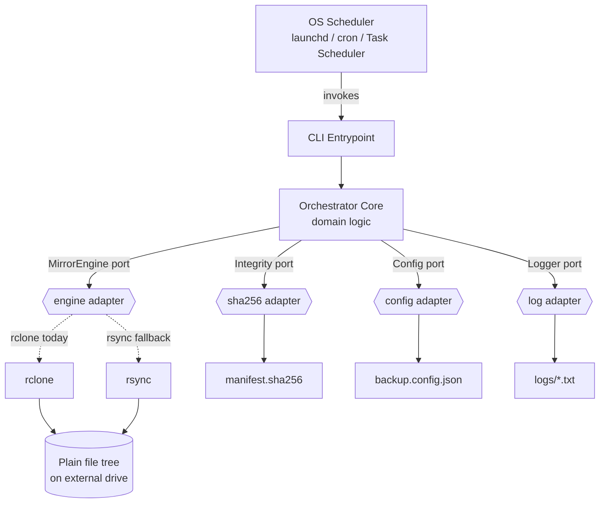
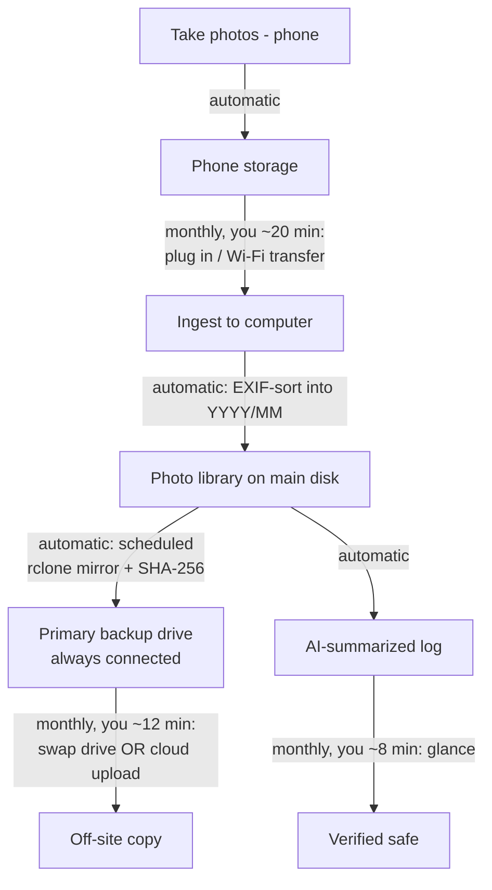

# Photo Collection: Project Plan & Design Record

> **Status:** Design agreed. Specification and implementation not started yet.
> **Created:** 2026-07-09
> **License (intended):** MIT
> **This document is the single source of truth.** It is self-contained on purpose so that
> *any* future session (a different AI, a different machine, or the human owner alone) can
> pick up the project without needing the original chat history. If you are a future AI
> session: read this whole file first, then help continue with the spec and implementation.

---

## 0. How to use this document

- **Read it fully before acting.** Every decision here was reached deliberately; the *rationale*
  matters as much as the decision.
- **Distinguish durable principles from dated assumptions.** Section 13 (Assumptions Register)
  lists facts that were true as of 2026-07-09 and **must be re-verified** before you rely on them
  (tool status, licenses, prices, versions, even which AIs exist). Do not trust them blindly.
- **Nothing has been built yet.** There is no code and no formal spec, only this plan. The next
  artifacts are (1) a formal specification and (2) the implementation. See Section 15 (Next Steps).
- **The owner is tech-savvy** and expects to remain so, and assumes continued access to some AI
  (cloud today, possibly local models later). Write for that audience.

---

## Table of Contents

1. [Problem statement & goals](#1-problem-statement--goals)
2. [Guiding philosophy](#2-guiding-philosophy)
3. [What we rejected and why](#3-what-we-rejected-and-why)
4. [The chosen approach](#4-the-chosen-approach)
5. [Architecture (ports & adapters)](#5-architecture-ports--adapters)
6. [Technology decisions (the bindings)](#6-technology-decisions-the-bindings)
7. [Specification approach](#7-specification-approach)
8. [Draft requirements (seed for the spec)](#8-draft-requirements-seed-for-the-spec)
9. [What-if migration analysis](#9-what-if-migration-analysis)
10. [Operations runbook](#10-operations-runbook)
11. [The 4-hour/month maintenance budget](#11-the-4-hourmonth-maintenance-budget)
12. [Discontinuity-driven refinements](#12-discontinuity-driven-refinements)
13. [Assumptions register (dated; re-verify)](#13-assumptions-register-dated-re-verify)
14. [Glossary](#14-glossary)
15. [Next steps for a future session](#15-next-steps-for-a-future-session)

---

## 1. Problem statement & goals

The owner has decades of personal photos (~**1 TB** to start), historically backed up manually.
They want an **alternative** to subscription photo services (iCloud/Google/OneDrive ~$10/mo), which
can be discontinued or changed at any time, and to instead run a **self-controlled** system.

**Hard goals:**

- **Full control & ownership**: no company, server, or subscription required to access photos.
- **Longevity**: survive OS changes, company bankruptcies, discontinued apps (they were burned by
  Picasa's shutdown), and hardware deprecation. Thinking in **decades to centuries**.
- **OS-independence**: must survive leaving Apple or Microsoft; portable across macOS/Windows/Linux.
- **Easy migration**: every part must have a clear, cheap migration path (e.g., NTFS→ReFS,
  rsync→rclone, TypeScript→another language, one machine→another).
- **Open & permissive**: prefer **MIT/permissive** tools and open standards least likely to lose support.
- **Minimal, transparent stack**: the owner wants to *see the full stack*; no hidden magic.
- **CLI-first**: a GUI may be layered on later, but must not be a core dependency.
- **Low human effort**: target **≤ 4 hours/month** of maintenance as a **hard limit** (see Section 11).

**Non-goals (for now):**

- Not building a photo *manager* (no face recognition, albums, AI search). This is a **backup/preservation**
  system. Curation/enjoyment is separate and out of scope.
- Versioning/snapshots are a **later** addition; start with plain mirroring.
- Cloud off-site is **optional**; start local, add cloud later if desired.

---

## 2. Guiding philosophy

The core principle that everything else follows from:

> **Separate your data from your tools.** Data should be so plain that *any* tool can read it.
> Tools should be so ubiquitous and simple that if one dies, you swap it without touching the data.

Supporting principles:

- **Plain files, plain folder tree.** The foundation is a directory of original files
  (format-agnostic: JPEG, HEIC, RAW, video, copied byte-for-byte with no conversion). No database, no
  proprietary container. Files as a concept have survived ~75 years across every OS.
- **Format & tool independence.** Picasa died; the `.jpg` files didn't. The backup must never lock
  data behind an app or a company.
- **Durable invariants vs. dated bindings.** Some things are near-permanent (files, checksums,
  the 3-2-1 rule, the *intent*). Others are today's expression of them (rclone, TypeScript, Mermaid,
  GitHub) and are expected to be swapped. Isolate the volatile parts so churn never touches the data.
- **Minimize dependencies.** Every dependency is a future liability, for both humans and AIs to
  maintain or translate. Prefer standard libraries and single-binary tools.
- **AI-optional, not AI-dependent.** AI makes maintenance and future migration cheap, but the stack
  must be simple enough to run and maintain without it. AI is an accelerant, not a load-bearing part.
- **Future-translatability.** Even if a language disappears, a mainstream + idiomatic + small +
  dependency-light codebase can be translated (by a future human or AI) into the language of the day.
- **Design for discontinuity.** Disruption is the norm, not the exception: most people live
  through several (revolutions, wars, blackouts, natural disasters, hyperinflation, services
  shutting down), and the coming decades are unlikely to be calmer. The architecture deliberately
  leans on nothing that requires a stable company, government, or grid to keep standing.

---

## 3. What we rejected and why

| Option | Why rejected |
|---|---|
| **Immich** (self-hosted Google Photos clone) | Excellent, but too heavy; stores metadata in a **PostgreSQL database** (violates "plain files"), felt overwhelming, and it's a *manager* not a *backup*. AGPL (fine for personal use, but not the direction). |
| **PhotoPrism / LibrePhotos** | Same class as Immich: DB-backed photo managers, heavier than needed. |
| **Managed cloud services** (iCloud/Google/OneDrive/Dropbox) | The thing being escaped: subscription cost, lock-in (metadata in their format), and "access" tied to "payment." Good for non-technical people; wrong for these goals. |
| **Proprietary backup apps** (e.g., Bvckup 2) | The owner *liked* Bvckup's file-mirroring model, but it's **proprietary** → no full control. We want an open equivalent. |
| **Full versioned/repo backup tools as the core** (restic/Borg/Kopia) | Great tools, but their **repo format** isn't plain browsable files; you need the tool to read it back. Fine as a *later, optional* versioned layer, not the core. |
| **POSIX shell as the orchestration language** | Durable on Unix but **not truly OS-independent** (not native on Windows) and less approachable. A high-level language with a cross-platform runtime is more portable. |

**Note on AGPL vs MIT (discussed):** AGPL requires sharing modified source if you offer the software
as a network service; it closes the "SaaS loophole." For *personal use* it imposes nothing. The owner
nonetheless prefers **MIT/permissive** on philosophical/longevity grounds, and will license *this*
project MIT.

---

## 4. The chosen approach

An **open, "Bvckup-like" file-mirroring preservation system**. Conceptually:

```
Photos (plain folder tree)
   ├── mirror engine (rclone) ──▶ external drive  (exact, browsable copy)
   ├── SHA-256 manifest ────────▶ bit-rot / integrity detection
   ├── thin orchestrator (TypeScript) coordinates the run
   ├── OS scheduler (launchd) runs it automatically
   └── (optional, later) off-site copy: physical drive rotation OR cloud (rclone→B2)
```

Key properties:

- The destination is a **plain mirror** you can browse in Finder/Explorer; no tool required to restore.
- **CLI-first / headless core.** A GUI, if ever built, is a *consumer* of the core, not part of it
  (avoids GUI dependency hell: WinUI3, React Native, Swift, etc.).
- **Plain mirror ⇒ engine swaps need zero data migration** (both rclone and rsync produce the same
  browsable file tree; switching them never rewrites the destination).
- Start **local-only** (like Bvckup). Cloud off-site and versioning are clean later additions.

---

## 5. Architecture (ports & adapters)

The design is **hexagonal (ports & adapters)**: a thin orchestrator core talks to the outside world
only through **ports** (interfaces); each port has a swappable **adapter**. The core never knows
whether the engine is rclone or rsync, the config JSON or TOML, the scheduler launchd or cron.



**The pieces:**

| Piece | Port (interface) | Today's adapter | Why isolated |
|---|---|---|---|
| Data | (none) | Plain file tree | The sacred core; only the engine touches it |
| Mirror engine | `mirror(src, dst, excludes)` | rclone | Swap to rsync = change one adapter, no data change |
| Integrity | `build()` / `verify()` | SHA-256 manifest | Verification is separate from copying |
| Config | `load() -> Config` | JSON file (data) | Config is *data, not code*; survives a language rewrite |
| Logger | `log(event)` | Plain-text file | Observability decoupled from logic |
| Scheduler | *(external)* | launchd | Lives *outside* the core; core is one-shot "run once" |

**Architectural principles (why it's sound):**

1. **Dependency inversion on the engine**: core depends on the *idea* "mirror A→B," not on rclone.
2. **Config as data, not code**: rewrite the orchestrator in any language later; config carries over.
3. **Thin orchestrator**: glue only coordinates; real work is in the durable engine + plain data.
   Keep it small enough to rewrite/regenerate in an afternoon.
4. **One-shot core + external scheduler**: the program does one run and exits with a clear code;
   *when* it runs is the OS scheduler's job (the most OS-specific part stays outside the code).
5. **Separation of concerns**: copy, verify, configure, log, schedule are distinct, individually
   replaceable pieces.
6. **Durable WHAT vs. volatile HOW**: requirements describe *what* must be true (naming no tool);
   a separate "current bindings" section records *how* it's done today. Migrations touch only HOW.

---

## 6. Technology decisions (the bindings)

> These are **bindings**: today's expression of durable intent. All are swappable. See Section 13
> for the ones that must be re-verified over time.

| Concern | Decision | Rationale |
|---|---|---|
| **Mirror engine** | **rclone** (MIT); **rsync** as fallback | MIT license; single self-contained Go binary; runs on every OS incl. Windows; local + 70 cloud backends with same syntax. rsync is the ultra-durable fallback and swap is trivial (plain mirror ⇒ no data migration). |
| **Orchestration language** | **TypeScript on Node.js** (direct TS execution, no transpile step) | Owner values **strong static types**. Node runs TS directly (type-stripping) → no build/transpile. Mainstream + idiomatic + small ⇒ future-AI-translatable. Runs on any OS. |
| **Dependencies** | **Standard library only** (zero third-party) | Dependencies are the hardest thing to maintain/translate. Node built-ins (`node:child_process`, `node:crypto`, `node:fs`, `node:path`) cover everything. |
| **Config format** | **JSON** | Node parses JSON **natively** (zero dependency). (TOML was the earlier default *for a Python build*, since Python 3.11+ has built-in `tomllib`; Node has no built-in TOML parser, so JSON keeps deps at zero.) Config is pure data, trivially convertible later. |
| **Integrity** | **SHA-256 manifest** (standard `shasum` text format) | Detects silent bit-rot. For *integrity* (not security) even weaker hashes suffice; SHA-256 is solid for decades. Store algorithm in the manifest/filename so switching is explicit. |
| **Scheduler** | **launchd** (macOS) → cron / Task Scheduler / systemd later | OS built-in; external to the core; ship snippets for all major OSes. |
| **Version control** | **git** | A *binding* (see below). Distributed ⇒ every clone is complete. |
| **Code hosting** | **GitHub** | A *binding*. Because git is distributed, leaving GitHub is one command (`git remote set-url`) to any host or a copy on the backup drive. Hosts the *system*, never the photos. |
| **Diagrams** | **Mermaid** (plain-text source) | A *binding*, same bucket as languages. Plain-text ⇒ diffable, translatable, AI-convertible to any future notation. Keep diagram **source** in the docs, not binary images. |
| **License** | **MIT** | Maximum permissiveness/reuse/longevity. |

**Language note (important nuance):** If the language is ever changed to **Python**, the natural config
format flips back to **TOML** (Python has built-in `tomllib`; avoid adding a TOML dep to Node). The
architecture and spec do not change; only the two coupled bindings do (language + config format).

---

## 7. Specification approach

The **specification is the durable, language-neutral source of truth**: the seed from which code
(and tests) can be regenerated in any future language. This is precisely how the internet works:
protocols (TCP, HTTP, DNS) are defined by English-language **RFCs** that have outlived countless
implementations for 40+ years.

**Format of the spec (to be written next):**

- **Structured English**, layered by purpose:
  - *Prose* for intent & principles (the "why", which survives everything).
  - *Numbered requirements* using **RFC 2119** keywords (**MUST / SHOULD / MAY**); atomic, testable.
  - *Tables* for enumerable facts (config schema, exit codes, port I/O contracts).
  - *Diagrams* (Mermaid) for structure & flow.
- **Durable WHAT vs. volatile HOW split:** requirements name no tool/language; a separate
  "Current Bindings" section records today's implementation. Migrations change only the bindings.
- **Traceability:** each requirement has a stable ID (R-1, R-2, …); code references the ID
  (e.g., `// R-3`) so conformance is auditable, not inferred.
- **Controlled language:** the writing rules that keep the spec's English interpretable across
  decades of language drift (obligations only via RFC 2119 keywords, one term one meaning, no
  idiom in normative text; inspired by ASD-STE100 "Simplified Technical English") are codified
  in `docs/language-requirement.md`, which binds every normative document in the project.

**Conformance checking has two directions** (both AI-assisted, both periodic):

1. **Internal (code vs. spec):** for each requirement, locate the responsible code, judge
   Satisfied / Partial / Violated / Missing, cite evidence (file:line). Language-agnostic because the
   AI reads both the English and the code. Bidirectional: also flag code doing things the spec
   doesn't mention (→ update spec) and requirements with no code (→ fix code).
2. **External (assumptions vs. the world):** periodically re-validate the dated assumptions
   (Section 13) against then-current reality (is rclone still maintained & MIT? better tool now?
   prices/drives/filesystems shifted? SHA-256 still fine? scheduler changed?).

**Tests complement, don't replace, AI review.** AI conformance-checking is a strong *reviewer*, not a
mathematical proof (it can miss subtle behavioral bugs). So: **each MUST maps to at least one test.**
Layering:

- **English spec**: source of truth (language-free).
- **Tests**: deterministic, but language-bound.
- **Implementation**: language-bound.

On a language migration, the English spec regenerates **both** the tests and the code in the new language.

---

## 8. Draft requirements (seed for the spec)

These are a starting point drafted during design; refine and expand when writing the formal spec.
(RFC 2119 keywords; language-free.)

- **R-1 (Mirror):** The system MUST copy every source file that is absent or changed at the destination.
- **R-2 (Safety):** The system MUST NOT modify or delete any file in the source.
- **R-3 (Safety):** The system MUST NOT delete destination files unless deletion-mirroring is explicitly enabled in config.
- **R-4 (Fixity):** The system MUST record a SHA-256 checksum for every copied file.
- **R-5 (Fixity):** The system MUST be able to verify the destination against recorded checksums and report any mismatch.
- **R-6 (Portability):** The system MUST flag filenames unsafe across common filesystems (reserved
  characters, case collisions, non-NFC Unicode normalization) *before* copying.
- **R-7 (Observability):** The system MUST write a plain-text log per run with start time, end time,
  files copied, bytes copied, and outcome.
- **R-8 (Exit contract):** The system MUST exit 0 on success and non-zero on error, with a distinct
  code per failure class.
- **R-9 (Idempotence):** A second run with no source changes MUST copy nothing.
- **R-10 (Config):** The system MUST read all source/destination/exclusion settings from an external
  config file and MUST NOT hardcode paths.

**Port contracts to formalize:** `MirrorEngine`, `IntegrityStore`, `Config`, `Logger`
(each with: inputs, outputs, preconditions, postconditions, error behavior, exit codes).

Example (`MirrorEngine`):

| Aspect | Contract |
|---|---|
| Operation | `mirror(source, destination, excludes)` |
| Precondition | source readable; destination writable |
| Postcondition | destination contains every current source file; only changed files transferred |
| Must not | modify source; delete destination files unless mirror-delete enabled |
| Errors | unreadable source → distinct exit code; write failure → distinct exit code |

---

## 9. What-if migration analysis

Every component has a clear migration path, ranked by **conversion cost** and **realistic likelihood**.
Organizing test: *does the destination stay a plain browsable mirror?* (Yes ⇒ filesystem/engine swaps
are trivial.)

### Component layer

| Component | What-if trigger | Migration path | Cost | Likelihood | Mitigation |
|---|---|---|---|---|---|
| **Data** (files) | "file" concept dies | none (read directly) | none | ~nil | 75-yr track record |
| **Filesystem** (APFS↔NTFS↔ReFS↔ext4) | new drive/OS | OS-level file copy | Low (time only) | Medium | use no FS-specific features; real risk = filenames (see below) |
| **Engine** (rclone) | project dies / better tool | swap one adapter (~40 lines); no data change | Low | Low–Med | MIT (forkable); rsync fallback; plain mirror ⇒ zero destination migration |
| **Orchestrator** (TypeScript) | language/runtime churn | regenerate ~200 lines from spec (AI) | Low–Med | Medium | stdlib-only; language-neutral spec; thin glue |
| **Integrity** (SHA-256) | hash deprecated | recompute manifest | Low (CPU) | Low | standard shasum format; algo recorded; even "broken" hash detects bit-rot |
| **Config** (JSON) | format churn | data transform (JSON↔TOML/YAML) | Trivial | Very Low | config is data; native parse = zero dep |
| **Scheduler** (launchd) | OS change | replace external schedule file | Low | Medium | one-shot core; ship snippets for all OSes |
| **OS** (macOS) | leave Apple | reinstall Node+rclone, copy repo, edit paths | Low–Med | Medium | every component already cross-platform; paths in config |
| **VCS/hosting** (git/GitHub) | git/GitHub dies | export repo to plain files; `git remote set-url` to any host | Trivial | Very Low | distributed; holds the *system*, never the photos |

**The filename gotcha (the real filesystem-migration risk):** a plain copy across ReFS↔NTFS↔APFS is
lossless *except* filenames: reserved characters, case-sensitivity collisions, and macOS's NFD vs.
everyone else's NFC Unicode normalization. Mitigation: the **portability check (R-6)** flags risky
names before copying, and the **SHA-256 manifest** verifies every file arrived intact after any move.

### Substrate layer (the environment beneath the stack)

| Dependency | What-if trigger | Continuity path | Cost | Likelihood | Mitigation |
|---|---|---|---|---|---|
| **Host computer** | ~3-yr refresh; OS/HW EOL; laptop dies | install Node+rclone, clone repo, plug drives, edit paths | Low (~1–2 hr / 3 yr) | High | host holds *no* irreplaceable state ("cattle, not pets") |
| **Electricity** | outage (short/long) | batch system resumes when power returns; storage persists powerless | ~Zero (short) | Common, zero-impact | UPS on primary; SHA-256 catches mid-write corruption |
| **Internet** | outage / sustained loss | core backup is fully offline; only cloud off-site + AI need net | ~Zero for core | Common, zero-impact on core | choose physical off-site ⇒ entire core is offline-capable |
| **AI access** | internet loss / lose frontier AI | local open-weight model → or hand-maintain (owner is tech-savvy) | Low | Medium | small, spec-driven code lowers the AI bar; whoever maintains it later needs little help to translate or fix it |

**Key insights:**

- **The danger quadrant (high cost AND high likelihood) is empty.** That is the whole design goal.
- **Volatility is concentrated in the smallest, best-isolated box** (the ~200-line orchestrator),
  which is also the only piece with a language-neutral spec behind it.
- **Of every component, the host computer is the most disposable**: it holds no irreplaceable state
  (that lives on the portable drives + git), so replacing it is a rebuild, never a recovery.
- **Persistence needs no power or network; only *throughput* does.** Photos sit safe on non-volatile
  drives regardless; power/net are needed only intermittently, to *run* backups.
- **Nothing in daily operation depends on AI**: ingest, mirror, and verify all run without it or the
  internet (the "AI-optional" principle of Section 2, in practice).

**Bracketed (out of scope by owner's request):** civilizational disruption (war, collapse). Even so,
plain files on portable drives are near the top of the digital-survivability ladder. The only rung
above is analog: **printing the most precious handful of photos**, the one medium that survives loss
of all computing.

---

## 10. Operations runbook

The complete end-to-end human workflow, from one-time setup through rare events.

### Day one (one-time, AI-assisted)

| Task | Effort | Notes |
|---|---|---|
| Stand up the stack | ~an afternoon | Install Node + rclone, drop in scripts, write config, first backup, set schedule |
| Consolidate existing photos | ~a few hours | Pull years of scattered manual backups into one library tree; de-dup; EXIF-sort |

### Monthly hot path (recurring)



**Monthly checklist (~40 min):**

1. **Ingest**: plug in phone, transfer new photos; auto-filing sorts them (~20 min).
2. **Confirm backup**: check the run went green in the AI-summarized log (~8 min).
3. **Off-site**: swap the rotation drive, or confirm the cloud upload (~12 min).
4. **Quarterly add-on**: restore a random sample to prove backups are restorable (~25 min, 4×/yr).

### Hardware lifecycle (~2–3 year cadence, driven by drive *age*)

1. **Monitor** *(automatic)*: orchestrator flags any drive >80% full or past ~3-yr age in the log.
2. **Buy online** *(you, ~30–60 min)*: order **two matching drives** (primary + off-site) so they
   rotate in sync.
3. **Receive & prep** *(you, ~20–30 min)*: unbox, connect, format, physically label, drop a text file
   on the drive recording purchase date & role.
4. **Burn-in & onboard** *(you ~15 min active, rest passive)*: add to config, run first full mirror +
   SHA-256 verify (this doubles as a DOA/burn-in test).
5. **Rotate & retire** *(you, ~10 min)*: fresh drive takes over; demote the older drive to a **cold
   spare** (bonus extra copy) rather than discarding.

**Buying cheat-sheet:**

| Decision | Guidance |
|---|---|
| Type | HDD for always-connected primary (cheapest/TB); SSD for the carried off-site drive (shock-resistant) |
| Avoid | SMR drives for backup (prefer **CMR**); avoid unknown/relabeled sellers (counterfeit risk) |
| Capacity | Buy **≥ 2× the library** so *age*, not fullness, is the trigger |
| Quantity | **Two at a time** (primary + off-site) |
| Filesystem | exFAT for a carry-anywhere off-site drive; robust native FS for the primary |
| On arrival | First mirror + checksum verify = free DOA/burn-in check |

**Capacity math (1 TB start):** at ~10–20 GB/month growth, a 2–4 TB drive outlives its ~3-yr age life
before filling. So replacement is **age-driven**, ~two drives every ~2–3 years: predictable, never an emergency.

### Exceptions (rare, bounded)

- **Backup run fails** → flagged in log → investigate, AI-guided (~15 min).
- **Checksum mismatch (bit-rot)** → the system *working*; restore that file from another copy (~15 min).
- **A drive dies** → no data lost (3-2-1); triggers a procurement event.

### Annual assumption re-validation ritual

Once a year (or at each machine refresh), have a *then-current* AI re-check the Assumptions Register
(Section 13) against reality: tool maintenance/licenses, prices, drive/filesystem norms, hash adequacy,
scheduler changes, AI availability. Update this document accordingly.

---

## 11. The 4-hour/month maintenance budget

**4 hours/month is a HARD limit.** Verified by amortizing all tasks (incl. laptop/drive replacement,
migrations) and stress-testing the worst month.

### Active vs. passive time

Only **active, attended minutes** count. Terabyte copies run **unattended** (passive wall-clock) and
do not count. A drive onboarding is ~20 active minutes + hours of unwatched copying.

### Fully-amortized monthly (everything included)

| Task | Frequency | Active/event | ~Monthly |
|---|---|---|---|
| Ingest | monthly | 20 min | 20.0 |
| Confirm backup | monthly | 8 min | 8.0 |
| Off-site rotation | monthly | 12 min | 12.0 |
| Restore test | quarterly | 25 min | 8.3 |
| Assumption re-validation | yearly | 90 min | 7.5 |
| Software updates | ~4×/yr | 20 min | 6.7 |
| Breakage/debugging (AI-assisted) | ~4×/yr | 20 min | 6.7 |
| New hard drives (2) | ~every 30 mo | 70 min | 2.3 |
| New laptop (rebuild) | ~every 36 mo | 60 min | 1.7 |
| OS major upgrade | ~every 36 mo | 60 min | 1.7 |
| Migrations (engine/lang/format) | ~every 60 mo | 180 min | 3.0 |
| Failure handling | ~every 24 mo | 30 min | 1.3 |
| **Total** | | | **≈ 79 min/mo (~1.3 h)** |

### Worst realistic single month (laptop refresh + new drives stacked)

| That month | Active time |
|---|---|
| New laptop rebuild | ~60 min |
| New drives (buy, prep, kick off copy, verify, rotate) | ~70 min |
| Ingest + confirm + off-site | ~40 min |
| Restore test | deferred |
| **Total active** | **≈ 2.8 h (under 4 h)** |

### The four rules that guarantee the ceiling

1. **Count active time; never babysit a copy.**
2. **Stagger predictable events**: never schedule laptop refresh and drive replacement in the same
   month; split drive *buy* vs. *onboard* across months.
3. **Keep AI in the loop**: caps the one open-ended risk (software debugging).
4. **Everything is deferrable, with a cloud pressure valve**: switch off-site to cloud (~0 min) and
   postpone non-urgent tasks when a month is tight.

### Why it's genuinely enforceable

The only **data-safety-critical** work (scheduled mirror + checksum) is **fully automated and needs
zero human time**. Every human task is supervisory/periodic and **deferrable**: you can stop at 4
hours and nothing is at risk.

### Caveat (scope of the budget)

- **Building new features** (versioning, dedup, GUI, search) is *project* time, not maintenance; keep
  it separate.
- **Browsing/curating** photos is leisure, not maintenance, and goes uncounted.

---

## 12. Discontinuity-driven refinements

Designing for discontinuity (Section 2) is not about preparing for rare, unlikely events. Over an
ordinary lifetime (let alone the decades-to-centuries this system aims for), most people live
through several major disruptions: natural disasters, blackouts, wars or unrest, hyperinflation, beloved
tech services shutting down. There is no reason to expect the coming decades to be calmer, so the
system treats disruption as part of its normal operating environment, not a tail risk. That
baseline sharpens two concrete choices:

- **Grab-and-go portability**: keep the library on a **portable drive** (and the off-site copy on a
  portable SSD) so photos are one item you can pick up and carry. Tips the library-location choice
  toward external/portable.
- **Real geographic separation**: the off-site copy lives genuinely *elsewhere* (another building,
  city, or with trusted people), not just another room. Against local disaster/unrest, *distance* is
  the protection.

These fold into the spec: off-site becomes *geographic*; library defaults to *portable*.

---

## 13. Assumptions register (dated; re-verify)

> Everything below was believed true **as of 2026-07-09** and **must be re-verified** before relying on
> it. The AI writing this has a training cutoff and may already be stale. Re-check annually (Section 10).

| Assumption (as of 2026-07-09) | Re-verify |
|---|---|
| rclone exists, is maintained, and is MIT-licensed | tool status + license |
| rsync remains a viable fallback engine | tool status |
| restic/Borg/Kopia remain options for later versioning (BSD/Apache) | tool status + license |
| Node.js runs TypeScript directly (type-stripping), no transpile needed | runtime behavior + version |
| Python 3.11+ has built-in `tomllib` (relevant only if switching to Python) | runtime behavior |
| Backblaze B2 exists at ~$6/TB/month (as an off-site option) | provider + price |
| SMR-vs-CMR advice and ~3–5 yr drive life still hold | hardware norms |
| exFAT remains the portable cross-OS filesystem | filesystem support |
| SHA-256 remains adequate for integrity | crypto/hash norms |
| GitHub/Microsoft, and git, still exist and are dominant | tool/host status |
| Mermaid remains a common diagram format | format status |
| An AI as capable as today's exists to assist; if not, a local model can stand in | AI availability |
| macOS uses NFD filename normalization (portability concern) | OS behavior |

**Durable (assert with confidence, unlikely to change):** plain files & folder trees; checksums/fixity;
the 3-2-1 rule; off-site copies; separation of data from tools; the requirements/intent;
SHA-256 *as a chosen mechanism*.

---

## 14. Glossary

- **3-2-1 rule**: 3 copies of data, on 2 different media, with 1 off-site.
- **Binding**: today's concrete expression of a durable intent (e.g., rclone, TypeScript, Mermaid,
  GitHub); expected to be swapped over time.
- **Fixity**: proof that data has not changed/corrupted, via checksums (here, SHA-256).
- **Bit-rot**: silent data corruption on storage over time; detected by comparing checksums.
- **Mirror**: an exact, browsable copy of a folder tree; only changed files are transferred on update.
- **Manifest**: a plain-text file listing each file's SHA-256 checksum (standard `shasum` format).
- **Port / Adapter**: an interface (port) and its swappable implementation (adapter); the core depends
  on ports, not concrete tools.
- **Orchestrator / glue**: the thin program (TypeScript) that coordinates engine + integrity + logging.
- **Ingest**: transferring new photos from phone/camera into the library.
- **Cold spare**: a still-working retired drive kept as a bonus extra copy.
- **RFC 2119**: the spec convention defining MUST / SHOULD / MAY obligation levels.
- **CMR / SMR**: hard-drive recording types; prefer CMR for backup (SMR is slow on rewrite).
- **NFC / NFD**: Unicode normalization forms; macOS uses NFD for filenames, others NFC (migration risk).

---

## 15. Next steps for a future session

Nothing has been built yet. Recommended order:

1. **Write the formal specification** (`SPEC.md`) from Section 7 & 8:
   - Principles, numbered RFC-2119 requirements (expand R-1…R-10), port contracts, current bindings,
     migration playbook, operations runbook, continuity/substrate, assumptions register.
   - Include the conformance procedure (both directions) and the traceability convention.
2. **Confirm two open sub-decisions with the owner:**
   - **Library location:** internal disk (working copy) vs. dedicated portable external drive
     (leans portable, per Section 12).
   - **Off-site:** physical drive rotation (free, ~12 min/mo) vs. cloud rclone→B2 (paid, ~0 min).
3. **Scaffold the repository** (TypeScript, stdlib-only):
   - `config/backup.config.json`: declarative sources/destinations/excludes.
   - `src/`: `main.ts` (CLI entrypoint), `core.ts` (orchestrator), `engine.ts` (MirrorEngine port +
     rclone adapter), `integrity.ts` (SHA-256 build/verify), `config.ts`, `logs.ts`.
   - `src/portability.ts`: filename safety check (R-6).
   - `scripts/`: launchd `.plist` (+ cron/Task Scheduler snippets later).
   - `logs/`: plain-text run logs (gitignored).
   - `docs/SPEC.md`, `README.md` (bill of materials + recreate steps), `.gitignore`, `LICENSE` (MIT).
4. **Implement against the spec**, adding tests so each MUST maps to ≥1 test.
5. **Run the first conformance check** (code vs. spec) and record results.
6. **Initialize git**, commit, and (optionally) push to GitHub under MIT.

**Confirmed decisions (do not re-litigate without reason):** open file-mirroring approach; CLI-first;
rclone engine (rsync fallback); TypeScript/Node, stdlib-only; JSON config; SHA-256 manifest; launchd
scheduler; git/GitHub; Mermaid; MIT license; spec-as-source-of-truth; plain files as the sacred core;
4 h/month hard maintenance budget; start local + plain mirror (versioning/cloud are later additions).
