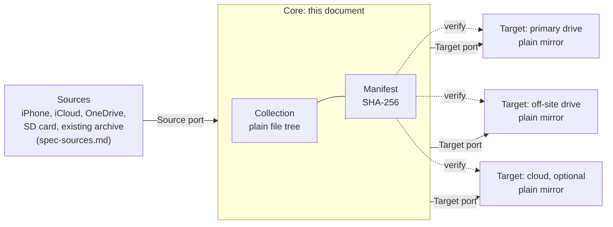

# Turbo-Collection: Specification (Core)

> **Spec version:** 0.1.0-draft
> **Created:** 2026-07-12
> **Status:** Draft. No implementation exists yet.

This document is the **normative source of truth** for what Turbo-Collection must do. It is
language-neutral and tool-neutral on purpose, so that the tests and the implementation can be
regenerated from it in any future implementation language, in the way an RFC outlives any single
implementation of a protocol.

---

## 0. How to use this document

### 0.1 Document hierarchy

Each document has one job. Confusing them is the most common way a specification rots.

| Document | Role | Normative? | May code cite it? |
|---|---|---|---|
| `plan.md` | Design record: **why**. Rationale, rejected options, history. | No | **No** |
| `spec.md` (this file) and `spec-sources.md` | Specification: **what** must be true. | **Yes** | **Yes, and only these** |
| `language-requirement.md` | Authoring standard: **how normative documents are written**, so their English stays interpretable over decades. | Yes, for document authors | **No** (its R-LANG-2) |
| Section 12, Current bindings | **How** it is done today. Volatile by design. | Yes, but expected to change | Yes |

| ID | Requirement |
|---|---|
| **R-META-1** | This specification MUST be sufficient to implement and test Turbo-Collection with no other document in hand. If an implementer needs a fact that is not here, that is a defect in this specification, and the fix is to add the fact here. |
| **R-META-2** | Code and tests MUST cite requirement IDs from a specification document only. They MUST NOT cite `plan.md`, design discussions, or conversation history. |
| **R-META-3** | Any behavior in the code that is not traceable to a requirement is either a specification gap (add the requirement) or unauthorized behavior (remove the code). There is no third option. |

R-META-1 has a deliberate consequence: this document carries its **own** glossary (Section 3) and its
**own** assumptions list (Section 12). It does not defer them elsewhere. Where `plan.md` is mentioned
at all, it is for rationale only, and is explicitly non-normative.

### 0.2 Conventions

**Requirement keywords** (MUST, MUST NOT, SHOULD, SHOULD NOT, MAY) are used as defined in **RFC
2119**.

**Requirement IDs** are stable and domain-prefixed: `R-COL-1`, `R-SRC-6`, `R-TGT-12`. Once this
specification is published at a version, an ID MUST NOT be renumbered and MUST NOT be reused. A
withdrawn requirement keeps its ID and is marked withdrawn.

**Traceability.** Code cites the ID it satisfies (for example, a `R-MIRROR-3` comment on the function
that enforces it), so conformance can be audited mechanically rather than inferred. See Section 13.

**Writing rules.** The language discipline this document is written under (controlled vocabulary,
one term per concept, the normative-text/commentary split) is defined in `language-requirement.md`,
which binds every normative document in this project.

---

## 1. Scope, non-goals, and invocation

The diagram below *is* the scope statement. It draws the line between what this document owns, what
`spec-sources.md` owns, and what sits outside Turbo-Collection entirely. Note the symmetry: a port on
each end, and nothing vendor-specific in the middle.

Every copy of the collection (the collection itself, and each target's mirror of it) is verifiable
against the manifest independently, and each target carries its own copy of the manifest (R-TGT-9).
**No copy is privileged.** Fixity, not location, is what establishes that data is intact.

### 1.1 In scope

The durable core: the Source contract, the Target contract, mirror semantics, integrity, filename
safety, artifact versioning, configuration, logging, and the command-line contract.

### 1.2 Out of scope

| Concern | Where it lives |
|---|---|
| Concrete source adapters (iPhone, iCloud, OneDrive, SD card) and their format quirks | `spec-sources.md`, not yet written |
| *When* a run happens (scheduling) | Outside Turbo-Collection entirely. See Section 1.4. |

### 1.3 Non-goals (normative)

Turbo-Collection does **not** do the following, and MUST NOT grow them by accident. Each has a
documented path to becoming a goal later, in Section 10, so that deferring them costs no
architectural flexibility.

| Non-goal | Path to enabling it |
|---|---|
| Albums and tags | Section 10 |
| Captions, ratings, face recognition | Section 10 |
| AI search | Section 10 |
| A browsing graphical interface | Section 10 |
| Versioning and snapshots *of the collection* | Section 10 |
| Deduplication | Section 10 |

> These are non-goals, not rejections. The distinction matters: a rejection means the idea is wrong,
> and a non-goal means it is simply not being built yet. Section 10 exists to prove the difference is
> real, by showing exactly what each would cost.

### 1.4 Invocation is external

Turbo-Collection is invoked from outside: by **a human on demand**, or by **an OS scheduler**. Both
are equal citizens, and both live outside the system. Turbo-Collection contains no scheduling logic
(R-CLI-2) and is fully usable with no scheduler installed at all (R-CLI-6).

---

## 2. Guiding principles (normative)

These are the principles the requirements are derived from. Where a requirement seems to conflict
with a principle, the conflict is a defect, and one of the two must change.

- **Plain data over clever mechanism.** No database, no container, no archive format. The data must
  be so plain that any tool can read it, so that when a tool dies the data does not.

- **Redundancy over cleverness.** Storage is cheap; reliability is not. Given a choice between a
  space-saving mechanism (symlinks, hardlinks, in-place transformation, deduplication) and simply
  storing another copy, choose the copy. Duplication that increases the number of independent,
  self-sufficient copies is a feature, not waste. This principle authorizes R-COL-5 (keep the
  original *and* the derivative) and R-TGT-9 (every target carries its own manifest), and it is why
  symlink-based schemes are rejected in advance.

- **The core is indifferent to both ends.** The core knows nothing about **how a file arrived**
  (Source port) or **where and how it is stored** (Target port). It knows only the collection and the
  two contracts. Every vendor-specific, device-specific, and storage-specific fact lives in an
  adapter, never in the core.

- **Declare, do not assume.** Both ports state what they can guarantee, and Turbo-Collection refuses
  to proceed on a silent guarantee failure (R-SRC-6 on input, R-TGT-6 on output).

- **Re-check, do not trust yesterday.** A guarantee that held last year may not hold today. Declared
  capabilities are re-evaluated on every run and never cached (R-SRC-11, R-TGT-12), because the
  failure this system most needs to survive is a vendor quietly changing its behavior.

- **Data outlives code, and the specification travels with the data.** The orchestrator is small and
  regenerable from this document, so it is disposable. This document is not, because it is what makes
  regeneration possible. So a copy of it lives on every target, beside the photos it describes, and
  artifacts are written so they can be read even if it is lost anyway (Section 9).

---

## 3. Terminology

Self-contained, per R-META-1.

- **Turbo-Collection.** This system: the orchestrator, its ports, and its adapters.

- **Collection.** The authoritative set of original photo and video files, stored as a plain file
  tree. This is the data Turbo-Collection exists to protect. (The word "library" is deliberately
  avoided, because it collides with "code library".)

- **Plain tree.** A directory structure in which every original exists as **exactly one file**,
  **byte-identical** to the original, at a path derived from its path in the collection, and
  **retrievable without any Turbo-Collection software**. A cloud bucket holding one object per file
  qualifies. A chunked, deduplicated, or encrypted repository does not. This definition is
  load-bearing: R-COL-4 and R-TGT-6 both test against it, so it must be decidable by inspection
  rather than by judgment.

- **Source.** An origin that supplies files into the collection, reached through the Source port.

- **Target.** A backup copy of the collection, reached through the Target port. (The word
  "destination" is deliberately avoided, so that one concept has one name.)

- **Port.** A contract the core depends on: Source, Target, MirrorEngine, IntegrityStore, Config,
  Logger. Durable, and specified normatively in this document.

- **Adapter.** A concrete implementation of a port: an iCloud source, a local-drive target, an rclone
  mirror engine. Swappable, and named only in Section 12.

- **Original.** A file exactly as it arrived, byte-for-byte.

- **Derivative.** Anything Turbo-Collection produced from an original (for example, a JPEG rendered
  from a HEIC). Always additional, never a replacement (R-COL-5).

- **Artifact.** Anything Turbo-Collection persists that outlives a single run: the config, the
  manifest, the recovery note, the logs, the collection marker, and the copy of this specification
  carried on each target. Artifacts are versioned and must be self-evident (Section 9). Originals are
  neither: they are preserved untouched, exactly as they arrived.

- **Published (of a specification version).** Stamped into an artifact that has left the machine
  holding the collection (R-VER-10). A version whose stamp carries the `-draft` suffix is not
  published; it changes freely.

- **MAJOR line.** All versions of this specification that share a MAJOR number (for example, the
  2.x line). The **terminal text** of a line is its last published version at the moment the line
  is superseded by the next MAJOR.

- **Format generation.** The artifact formats and collection layout convention in force under a
  MAJOR line. A new format generation begins only at a MAJOR version that changes an artifact
  format or the layout convention; a MAJOR version that only forbids previously conforming
  behavior does not begin one. Format generations change more rarely than specification versions.

- **Migration.** The operation that converts a copy of the collection from an older format
  generation to the current one (R-VER-15, R-VER-16).

- **Change ledger.** The per-version, per-requirement record of specification changes, kept in
  Section 15 (R-VER-13).

- **Import.** The act of a source supplying files into the collection.

- **Mirror.** To make a target match the collection, transferring only what changed.

- **Mirror-delete.** Propagating a deletion from the collection to a target. Disabled by default
  (R-MIRROR-3).

- **Manifest.** A plain-text file recording a checksum for each file (R-INT-4).

- **Fixity.** Evidence that data has not changed or corrupted, established by comparing checksums.

- **Capability.** A statement by an adapter about what it can and cannot guarantee (R-SRC-6,
  R-TGT-5). Re-evaluated every run.

- **Run.** A single invocation of Turbo-Collection, which performs its work once and exits.

- **Grouping.** A named set of items within the collection (an album, a tag). **Defined here but
  reserved:** groupings are a non-goal for now (Section 1.3). The term is fixed in advance so that
  the extension path in Section 10 has a name to use.

---

## 4. Collection invariants (`R-COL-*`)

These constrain the collection itself. They outrank everything else in this document: any requirement
that conflicts with them is wrong and must be changed.

| ID | Requirement |
|---|---|
| **R-COL-1** | The collection MUST be a plain directory tree of ordinary files. Turbo-Collection MUST NOT introduce a database, archive, container, or any other format that requires software to read the files back. |
| **R-COL-2** | Turbo-Collection MUST preserve originals byte-for-byte. It MUST NOT transcode, recompress, resize, or strip metadata from an original, under any circumstance, including at import. |
| **R-COL-3** | The collection MUST remain fully usable without Turbo-Collection. Any ordinary file manager or file-copy tool MUST be sufficient to browse it and recover its contents. |
| **R-COL-4** | **Every** target MUST be a plain tree structurally equivalent to the collection. |
| **R-COL-5** | A derivative in an open format (for example, a JPEG rendered from a HEIC, or a DNG from a proprietary RAW) MAY be stored **in addition to** the original. It MUST be identifiable as derived, and it MUST NEVER replace an original. Deleting every derivative MUST leave the collection complete. |

> **Why R-COL-4 says "every" and grants no exceptions.** It would be tempting to require only that
> *at least one* target be a plain tree, leaving room for a future versioned repository alongside it.
> That would be a permission carved out for a feature that does not exist and is not wanted yet, and
> it would weaken today's guarantee to serve a hypothetical. As written, the guarantee is the
> strongest available: **every copy in existence is browsable with no tool at all.** The path to
> versioning is documented in Section 10, and it costs one amended requirement. The door stays open
> without being left ajar.

> **Why R-COL-5 is not specific to HEIC.** The risk is proprietary formats generally. Camera RAW
> formats (CR3, NEF, ARW) are undocumented and single-vendor; HEIC and HEVC are patent-encumbered.
> The rule is the same for all of them, and for whatever replaces them: keep the original bytes, and
> optionally hedge with an open-format copy beside it. Preserve first, hedge second.

---

## 5. The Source port (`R-SRC-*`)

The core must be indifferent to whether a photo arrived by cable, from iCloud, through a OneDrive
sync folder, or from something not yet invented.

This contract is specified completely enough (R-META-1) that **anyone can write a source adapter from
this document alone, without modifying Turbo-Collection's core.** That is the extensibility that
matters. How adapters are loaded is a binding (Section 12), not a requirement.

| ID | Requirement |
|---|---|
| **R-SRC-1** | Files MUST enter the collection only through the Source port. The core MUST contain no logic specific to any individual source, device, vendor, or service. |
| **R-SRC-2** | Adding support for a new source MUST require writing only a new adapter. It MUST NOT require changing the core, this specification's requirements, or any existing adapter. |
| **R-SRC-3** | Which sources are active, and their settings, MUST be declared in configuration, not in code. A source MUST be able to be enabled or disabled without a code change. |
| **R-SRC-4** | Multiple sources MUST be able to coexist and MUST be importable independently. The failure of one source MUST NOT prevent import from another, and MUST still be reported. |
| **R-SRC-5** | A source adapter MUST supply the **original bytes** of each item. It MUST NOT transcode, recompress, or strip metadata in the course of importing. |
| **R-SRC-6** | **The honesty requirement.** If a source **cannot** supply original bytes, the adapter MUST declare this, and Turbo-Collection MUST report it. Turbo-Collection MUST NOT silently accept a degraded file as though it were an original. A degraded import MUST be either refused or explicitly recorded as degraded, per configuration, and **the default MUST be to refuse**. |
| **R-SRC-7** | Import MUST be read-only with respect to the origin. A source adapter MUST NOT delete, modify, or move anything at the source device or service. |
| **R-SRC-8** | Import MUST be idempotent. Importing the same item twice MUST NOT produce a duplicate in the collection, and re-running an interrupted import MUST converge rather than accumulate. |
| **R-SRC-9** | An item consisting of multiple files that are semantically one thing (for example, a still image and its paired motion clip) MUST be imported atomically: either all of its parts arrive, or none do. An adapter MUST NOT split such an item silently. |
| **R-SRC-10** | The collection layout produced by import MUST NOT depend on which source supplied the file. Two identical photos arriving by different routes MUST land in the same place. |
| **R-SRC-11** | A source's capabilities MUST be re-evaluated on every run and MUST NOT be cached from a previous run. A source that *begins* degrading files MUST be caught at the next import, and MUST NOT be assumed to still be honest merely because it was honest before. |

> **R-SRC-6 is the requirement that earns its keep.** The realistic failure mode of a cloud photo
> source is not that it breaks loudly. It is that it hands you a slightly worse file and says
> nothing. A system whose entire purpose is preservation must treat a silently degraded original as a
> hard error, not as a successful import.

> **R-SRC-11 is R-SRC-6 extended across time.** Over the decades this system is meant to last, the
> likeliest way the honesty guarantee fails is not that an adapter lies, but that the service beneath
> it changes: a sync client begins transcoding HEIC in some future year, having not done so before.
> Trusting a capability because it was true once is exactly the mistake this system exists to avoid.

---

## 6. The Target port (`R-TGT-*`)

Symmetric to the Source port, and held to the same discipline. Data leaves Turbo-Collection only
through the Target port.

A target is **not merely a path.** It is an adapter that declares what it can and cannot guarantee.

| ID | Requirement |
|---|---|
| **R-TGT-1** | Data MUST leave the collection only through the Target port. The core MUST contain no logic specific to any individual target, medium, vendor, or service. |
| **R-TGT-2** | Adding support for a new target MUST require writing only a new adapter. It MUST NOT require changing the core, this specification's requirements, or any existing adapter. |
| **R-TGT-3** | Which targets are active, and their settings, MUST be declared in configuration, not in code. |
| **R-TGT-4** | Multiple targets MUST be able to coexist and MUST be written independently. The failure of one target MUST NOT prevent the attempt against another, and MUST still be reported. |
| **R-TGT-5** | A target adapter MUST declare its capabilities: whether it is a plain tree, whether it can be verified in place, whether it supports deletion, and whether it is remote. |
| **R-TGT-6** | **The plain-mirror guarantee.** Turbo-Collection MUST refuse to run if any configured target does not declare itself a plain tree. This check MUST happen before any work is done, enforcing R-COL-4 rather than merely hoping for it. |
| **R-TGT-7** | A target adapter MUST be read-only with respect to the collection. It MUST NOT modify, rename, move, or delete a collection file. |
| **R-TGT-8** | A target adapter MUST refuse to delete its own contents unless mirror-delete is explicitly enabled in configuration. The default MUST be disabled. (This is the adapter-level counterpart of R-MIRROR-3, deliberately duplicated so that neither layer alone can authorize a deletion.) |
| **R-TGT-9** | Each target MUST carry a manifest covering **its own** contents, so that it is self-verifying without the collection and without Turbo-Collection. |
| **R-TGT-10** | Each target MUST carry a plain-text recovery note stating what the data is, how it is organized, and how to verify it with standard tools. |
| **R-TGT-11** | Every target MUST be restorable by ordinary file copy, using no Turbo-Collection software. |
| **R-TGT-12** | A target's capabilities MUST be re-evaluated on every run and MUST NOT be cached from a previous run (symmetric to R-SRC-11). A target that has ceased to be a plain tree MUST be caught **before** it is written to, not after. |

> **R-TGT-6 is what makes the architecture honest.** R-COL-4 demands that every target be a plain
> tree. Without a capability declaration, that demand is merely a hope. With one, Turbo-Collection
> can check it before doing any work and refuse a configuration that would leave a copy locked behind
> a tool.

> **What a target carries, and why.** Four things, all of them plain text, all of them negligible
> against terabytes of photos: the **files** themselves, a **manifest** of their checksums (R-TGT-9),
> a one-page **recovery note** (R-TGT-10), and a copy of the **specification** the target was written
> under (R-VER-8). They serve a single scenario, in escalating order of need: *someone finds this
> drive in forty years, and Turbo-Collection no longer exists.* They read the note to learn what the
> drive is; they verify the files against the manifest with a standard checksum tool; and they
> consult the specification only if they need the full rules. The photos are recoverable at every
> step, including the step where the finder reads nothing at all and simply copies the files off.

---

## 7. Preservation requirements

### 7.1 Mirroring (`R-MIRROR-*`)

The semantics of the mirror operation, as distinct from the target contract in Section 6.

| ID | Requirement |
|---|---|
| **R-MIRROR-1** | Turbo-Collection MUST copy to a target every collection file that is absent there, or that differs from the collection's copy. |
| **R-MIRROR-2** | Mirroring MUST be read-only with respect to the collection. It MUST NOT modify, rename, move, or delete any collection file. |
| **R-MIRROR-3** | Turbo-Collection MUST NOT delete any file at a target unless mirror-delete is explicitly enabled in configuration. Mirror-delete MUST default to disabled. |
| **R-MIRROR-4** | **Idempotence.** A run against an unchanged collection MUST transfer no file data. |
| **R-MIRROR-5** | Turbo-Collection MUST support more than one target and MUST treat each independently: a failure against one MUST NOT prevent the attempt against another, and MUST still be reported. |
| **R-MIRROR-6** | An interrupted run (power loss, disconnected drive, termination) MUST leave the target in a state from which a subsequent run converges to a correct mirror. A run MUST NOT leave a partially-written file that a later run would mistake for a complete one. |
| **R-MIRROR-7** | Turbo-Collection MUST support a dry-run mode that reports exactly what a real run would transfer or delete, and mutates nothing. |

### 7.2 Integrity (`R-INT-*`)

| ID | Requirement |
|---|---|
| **R-INT-1** | Turbo-Collection MUST be able to record a SHA-256 checksum for every file in the collection, stored in a manifest. |
| **R-INT-2** | Turbo-Collection MUST be able to verify a collection or a target against a manifest, and MUST report every discrepancy it finds. |
| **R-INT-3** | Verification MUST distinguish these outcomes per file, and MUST NOT conflate them: **ok**; **missing** (in the manifest, absent on disk); **corrupt** (present, but the checksum differs); **extra** (present on disk, absent from the manifest). |
| **R-INT-4** | The manifest MUST be plain text in a standard, widely-readable checksum format, such that a standard checksum utility can verify it **without Turbo-Collection**. |
| **R-INT-5** | The manifest MUST record which hash algorithm produced it, so that changing the algorithm later is explicit and detectable rather than silent. |
| **R-INT-6** | Verification MUST NOT repair, overwrite, or delete anything as a side effect. It reports. Any repair MUST be a separate, explicitly requested action. |
| **R-INT-7** | On a mismatch between a collection file and a target's copy, Turbo-Collection MUST report **which side differs** and MUST NOT treat either side as authoritative. Choosing the surviving copy is a human decision. |

> **Why R-INT-6 and R-INT-7 exist.** A verifier that "helpfully" repairs can propagate corruption from
> a bad copy over a good one, destroying the very data it was invoked to protect. Detection and repair
> are therefore separated on purpose. Turbo-Collection's job is to tell the truth about what it found.

### 7.3 Filename safety (`R-NAME-*`)

| ID | Requirement |
|---|---|
| **R-NAME-1** | Before copying, Turbo-Collection MUST check collection filenames for hazards that do not survive a move between common filesystems, and MUST report them. At minimum: characters reserved on some filesystems; names differing only by case; Unicode normalization differences (NFC versus NFD); trailing spaces or dots; reserved device names; and path lengths beyond common limits. |
| **R-NAME-2** | Turbo-Collection MUST NOT silently rename a file to resolve such a hazard. It reports; the human decides. |
| **R-NAME-3** | A filename hazard MUST NOT, by default, abort an otherwise valid run. Hazards are reported as warnings, because a name that is harmless on today's filesystem still needs backing up today. |

---

## 8. Operation: configuration, logging, and the command line

### 8.1 Configuration (`R-CFG-*`)

| ID | Requirement |
|---|---|
| **R-CFG-1** | Turbo-Collection MUST read all collection paths, source declarations, target declarations, exclusions, and options from an external configuration file. It MUST NOT hardcode any path. |
| **R-CFG-2** | Configuration MUST be plain data in a text format that a human can read and edit, and that a tool other than Turbo-Collection can parse. |
| **R-CFG-3** | Turbo-Collection MUST validate configuration **before** performing any filesystem mutation. Invalid configuration MUST cause the run to fail immediately, with no partial effect. |
| **R-CFG-4** | Turbo-Collection MUST fail rather than guess. A missing, ambiguous, or unparseable setting MUST NOT be silently defaulted into a destructive behavior. In particular, it MUST NOT default into enabling mirror-delete (R-MIRROR-3), and MUST NOT default into accepting a degraded import (R-SRC-6). |

### 8.2 Logging (`R-LOG-*`)

| ID | Requirement |
|---|---|
| **R-LOG-1** | Every run MUST write a plain-text log recording at minimum: start time; end time; the configuration used; per source, the count of items imported and any degraded or refused items; per target, the count and byte total of files transferred and deleted; every error encountered; and the final outcome. |
| **R-LOG-2** | Logs MUST be observability only. The correctness of the collection or of any target MUST NOT depend on a log file existing or being readable. |
| **R-LOG-3** | A run's log MUST record the Turbo-Collection version and the specification version it conforms to, so that a past run's behavior can be reconstructed. |
| **R-LOG-4** | Failures MUST be reported in the log even when the process exits non-zero. A crash MUST NOT be the only evidence that something went wrong. |

### 8.3 Command line (`R-CLI-*`)

| ID | Requirement |
|---|---|
| **R-CLI-1** | Turbo-Collection MUST exit **0** on success and non-zero on failure. (The taxonomy of failure classes is deliberately deferred; see Section 8.5 and Section 14.) |
| **R-CLI-2** | **One-shot.** Turbo-Collection MUST perform one run and exit. It MUST NOT daemonize, poll, or schedule itself. *When* it runs is the responsibility of whatever invokes it. |
| **R-CLI-3** | Turbo-Collection MUST be fully operable from a command line, with no graphical interface required. A graphical interface, if one is ever built, MUST be a consumer of this core and MUST NOT be a dependency of it. |
| **R-CLI-4** | Turbo-Collection MUST NOT require network access to mirror to a locally-attached target. |
| **R-CLI-5** | Every operation (**check**, **import**, **mirror**, **verify**, **check-names**) MUST be independently invocable on demand, not only as part of a combined run. |
| **R-CLI-6** | Turbo-Collection MUST be fully usable with **no scheduler installed or configured**. Scheduling is optional. |
| **R-CLI-7** | Effects MUST be identical whether Turbo-Collection is invoked by a human or by a scheduler. Output formatting MAY differ (for example, progress reporting on a terminal); effects MUST NOT. |
| **R-CLI-8** | No operation may require an interactive prompt to complete. Destructive actions MUST be authorized by configuration or by an explicit flag, never by an interactive prompt, because a scheduled run cannot answer one. |
| **R-CLI-9** | Turbo-Collection MUST provide a read-only **check** operation that transfers and modifies nothing, and that reports, for every configured source and target: whether it is reachable and authorized; what capabilities it **currently** declares (R-SRC-11, R-TGT-12); and whether the configuration would be refused (R-TGT-6). |

### 8.4 Three distinct read-only inspections

The word "verify" hides three different questions. All three MUST be separately answerable (R-CLI-5),
because they fail in different ways and at different times.

| Question | Operation | Requirement |
|---|---|---|
| Are my sources and targets reachable, authorized, and still honoring what they promised? | **check** | R-CLI-9 |
| Do the bytes on this copy still match the manifest? (fixity) | **verify** | R-INT-2 |
| How far behind is this target? What *would* a run transfer? (drift) | **dry-run** | R-MIRROR-7 |

> **Why `check` exists as its own operation.** Fixity answers "is what I stored still intact." It
> cannot answer "is my off-site drive even plugged in," "has my cloud token expired," or "did this
> source start degrading files since last year." Those are questions about the **adapters**, not about
> the data, and a preservation system that only ever notices such problems mid-run notices them too
> late.

### 8.5 Exit status

Turbo-Collection MUST exit **0** on success and non-zero on failure (R-CLI-1). That is all this
specification commits to at this version.

The taxonomy of failure classes, and their specific exit codes, is deliberately left open until the
failure modes have been worked through properly (Section 14). Fixing an exit-code table before
knowing what can actually go wrong would be inventing a contract that cannot yet be justified.

---

## 9. Versioning and change (`R-VER-*`)

This section governs the specification itself: how a version is numbered and published (9.2), how
artifacts declare the version that governs them (9.3), how the document is preserved across its own
changes (9.4), how the system crosses a format-generation boundary (9.5), and the checklist that
publishes a version (9.6).

> **Audience note.** Not every requirement here binds the implementation. The numbering, archiving,
> ledger, and publication rules bind the **maintainers of this document**; code has nothing to cite
> in them. The stamping, reading, and migration rules bind the implementation as usual.

### 9.1 The regress, and where it stops

Code is regenerable from this specification, so code need not be preserved. But **this specification
changes too**, which appears to relocate the problem rather than solve it: now we must know which
version an artifact was written under, and we must preserve the specification itself. That is a real
objection, and it is answered in three moves.

1. **The specification is an artifact, and it travels with the data.** Every target carries a copy of
   the version it was written under (R-VER-8). It is a few tens of kilobytes against terabytes; the
   redundancy principle (Section 2) authorizes this without argument. The specification cannot float
   away into abstraction, and it cannot die with a code-hosting service: it survives as long as any
   copy of the collection survives.

2. **Artifacts are self-*evident*, not merely self-*described*** (R-VER-4). A version stamp tells a
   reader *which rules applied*; it MUST NOT be the *key to decoding*. A manifest is one checksum and
   one path per line: it can be read by looking at it, with no specification in hand. So losing the
   specification entirely is survivable. This property is available only because every format is
   plain text, which is the payoff of the choice already made in R-COL-1.

3. **Versioning does not require a decoder.** RFCs *are* versioned, and rigorously: each is immutable
   once published, and a later RFC explicitly obsoletes or updates an earlier one. What RFCs never
   needed was a *version of English*. That is the distinction that matters: a binary format's version
   tells you **which decoder to use**, so losing its specification destroys the data; a prose
   specification's version tells you **which document you are reading**, and you can read it
   regardless. The chain of versions terminates in something a human, or an AI, can simply read. The
   regress stops, and it stops because of what the artifacts are made of, not because versioning was
   avoided.

### 9.2 Version numbers and publication

| ID | Requirement |
|---|---|
| **R-VER-1** | This specification MUST carry a semantic version, `MAJOR.MINOR.PATCH`, and the bump MUST be decided by the effect on artifacts. **MAJOR**: an artifact written under the previous version would parse differently, change meaning, or become invalid; or the collection layout convention changes; or previously conforming behavior becomes forbidden; or the document language or obligation vocabulary changes (R-VER-19). **MINOR**: additions only; every artifact written under the previous version keeps its exact meaning. **PATCH**: prose improvement with no behavioral consequence. |
| **R-VER-2** | **Version identity MUST be immutable.** A published version number refers to exactly one text, forever: the number MUST NOT be reused for different text, and a published text MUST NOT be edited. A correction is a new version. Retention is deliberately weaker than identity: a published stamp MUST resolve, at minimum, to the archived terminal text of its MAJOR line (R-VER-12) together with the change ledger (R-VER-13); retaining every intermediate text as a separate file is not required. |
| **R-VER-10** | A version is **published** at the first moment its stamp is written into an artifact that leaves the machine holding the collection. A stamp carrying the `-draft` suffix MUST NOT be written into such an artifact. A draft MAY change freely and is never archived. |
| **R-VER-17** | If a published version is later found to be misclassified under R-VER-1 (for example, labeled MINOR when it changed an artifact's meaning), the correction MUST be an **erratum**: a new ledger entry (R-VER-13) declaring the misclassification. The published text MUST NOT be edited and its stamp MUST NOT be silently reinterpreted. |
| **R-VER-18** | A version stamp MUST state the publication date, in ISO 8601 form, beside the number: for example, `spec 1.2.0 (2027-03-01)`. |
| **R-VER-19** | The document language of this specification, and its obligation vocabulary (the RFC 2119 keyword set, or a successor), MAY change only at a MAJOR version. All normative documents in this project MUST change document language together, at the same boundary. Across such a change: requirement IDs MUST NOT change; the changes-from section (R-VER-14) MUST state the previous language and the new language, and MUST map every defined term and every obligation keyword from the old language to the new; and the archived terminal text of the superseded line (R-VER-12) MUST remain in its original language, untranslated. |
| **R-VER-21** | Each version of this specification MUST have exactly one authentic text, in exactly one document language. A translation of any version MAY be published beside it and MUST be marked as informative. Only the authentic text resolves a version stamp (R-VER-2). |

> **Why the bump test is artifact-driven.** Two surfaces could define "breaking": artifacts, or code
> conformance. They disagree: a new MUST is additive for artifacts (everything already written stays
> valid) while making existing code non-conformant. For a preservation system the choice is forced.
> Data outlives code, and code is regenerable from this document; artifacts are regenerable from
> nothing. So artifacts decide the bump, and a release that merely obsoletes code is MINOR.

> **Why identity and retention are split (R-VER-2).** Immutability is two promises, and only one of
> them must be absolute. *Identity* is the RFC discipline: "written under version 1.2" is worthless
> if 1.2 was quietly revised, and precise if 1.2 can only ever mean one text. *Retention* of every
> intermediate text is not needed, because MINOR versions are additive (R-VER-1): the text of any
> intermediate version is derivable from its line's terminal text minus the additions the ledger
> records after it. What a reader of an old log actually needs to reconstruct is *which obligations
> governed that run*, and the ledger answers exactly that. Version control keeps the exact
> intermediate texts as best effort; nothing load-bearing depends on it. The cost is accepted
> knowingly: this scheme is exactly as sound as version classification, which is why publication
> passes through the checklist (9.6) and why misclassification has an honesty rule (R-VER-17).

> **Why a document-language change is MAJOR (R-VER-19).** By the artifact test alone, a faithful
> translation would be a PATCH: no artifact changes meaning. It is forced up to MAJOR by R-VER-2's
> resolution rule: intermediate versions are derivable from a terminal text only within one
> language, because translation is not a mechanical derivation. A language change therefore has to
> sit at a line boundary, where the outgoing language's text is archived whole. The document
> language and the obligation keywords are bindings in the same sense the implementation language
> is (Section 12): today's expression of the intent, replaceable. The writing rules in
> `language-requirement.md` are what keep a future translation faithful (one term, one meaning,
> defined in-document), and that document is re-expressed for the new language at the same boundary.

> **Why exactly one authentic text (R-VER-21).** The alternative, several equally authentic language
> versions, works only with a standing arbiter to resolve divergences between them: a court can
> compare all versions and rule; this project cannot. The changes-from section of a language-switch
> MAJOR is deliberately this project's own Rosetta Stone: the one artifact that carries both
> languages side by side, term by term and keyword by keyword.

### 9.3 Stamps and self-evidence

| ID | Requirement |
|---|---|
| **R-VER-3** | Every artifact Turbo-Collection persists (configuration, manifest, recovery note, log, collection marker) MUST record the specification version it was written against, in a form readable **before** the artifact is parsed. |
| **R-VER-4** | **Self-evidence.** Every artifact MUST be intelligible by inspection alone, without the specification version that produced it. The version stamp is a disambiguator; it MUST NOT be the only key to decoding the artifact. |
| **R-VER-5** | Turbo-Collection MUST NOT silently reinterpret an artifact whose version it does not recognize. An unrecognized version MUST be an explicit failure, never a guess. |
| **R-VER-7** | The collection root MUST carry a plain-text marker recording the specification version and the layout convention the collection was written under. |
| **R-VER-8** | Every target MUST carry a copy of the specification version it was written under, so that the rules governing the data survive alongside the data. |
| **R-VER-9** | Code MUST declare which specification version it conforms to, and every run MUST record that version in its log (R-LOG-3). |

> **R-VER-4 is a design constraint with teeth.** It forbids any artifact format that can only be
> understood by consulting its specification, which rules out binary encodings, opaque headers, and
> compact-but-cryptic schemes **forever**. Every format this project ever adopts must pass one test:
> *could a stranger figure this out by looking at it?*

### 9.4 Preserving the specification itself

| ID | Requirement |
|---|---|
| **R-VER-11** | Every version of this specification MUST be fully self-contained for the system it describes, and MUST describe only that system. Determining a current obligation MUST NOT require reading any other version, and this document MUST NOT carry a catalog of superseded formats. A superseded format generation is defined by the archived terminal text of its own line (R-VER-12). |
| **R-VER-12** | When a MAJOR line is superseded, its terminal text MUST be archived as a plain Markdown file in the repository's top-level `superseded/` directory, named with its full version stamp (for example, `superseded/spec-1.4.2.md`). The `superseded/` directory MUST contain the terminal text of every superseded MAJOR line. Intermediate texts MAY live in version control as best effort; they are not load-bearing (R-VER-2). |
| **R-VER-13** | Section 15 of this document MUST be a change ledger holding one entry per published version: the version stamp, and one line per requirement ID added, amended, or withdrawn, stating what changed and why. |
| **R-VER-14** | The first published version of a new MAJOR line MUST contain a changes-from section stating its differences from the terminal text of the previous line, at **conversion grade**: precise enough that an artifact written under the previous line can be interpreted in current terms from that section alone. The section MUST name the archived terminal text of the previous line by its full version stamp. |

> **Why present-tense and self-contained (R-VER-11).** The alternative is rules reconstructed by
> merging a chain of documents, and the history of protocol standards maintained as amendment
> chains is the argument against it: an implementer who must merge a base text with years of
> scattered updates will misread them, and consolidating back into one self-contained text gets
> more expensive the longer it is deferred. Most readers only ever need the current system. A
> reader examining an old drive loads that generation's own archived specification, which per
> R-VER-8 is also bound into the drive itself.

> **What "conversion grade" means (R-VER-14).** The standard the Gregorian calendar reform set: it
> stated its break from the Julian calendar as a mechanical rule (which dates to skip, which leap
> years to drop), and that is what keeps Julian dates convertible centuries later. "The layout was
> improved" is narrative; "a path of form X under the previous line maps to form Y" is conversion
> grade. This section is also what makes direct-jump migrations composable (R-VER-16): a bridge
> across several generations can be assembled from the consecutive changes-from sections.

> **Where the texts live.** `spec/` at the head of the repository is the living view; top-level
> `superseded/` holds the frozen terminal texts, deliberately outside the living directory so that
> restructuring the living specification never moves a frozen record; and R-VER-8 scatters stamped
> copies onto every target, so the versions that actually govern data in the wild are the most
> redundantly stored of all. The change ledger lives *inside* this document (R-VER-13) for the same
> reason: it is the only in-tree record of intermediate versions, so it must travel with every copy.

### 9.5 Format generations and migration

| ID | Requirement |
|---|---|
| **R-VER-6** | Turbo-Collection MUST read every artifact of the **current format generation**, and MUST write artifacts of the current format generation only. For the previous generation, its obligation is the migration of R-VER-15, not general reading. For older generations it has no reading obligation: an unrecognized stamp is an explicit refusal (R-VER-5). |
| **R-VER-15** | A release that introduces a new format generation MUST include a migration from the previous generation. The migration MUST be atomic per copy: at every moment, a copy is wholly of the old generation or wholly of the new, never in between. It MUST verify the copy against its manifest under the old generation's rules before converting, and MUST re-verify the copy under the new generation's rules after converting; both verifications MUST cover every file, not a sample. It MUST leave every original byte-identical. It MUST remain available for at least one full off-site rotation cycle after the release, so that a copy returning late is migrated, not refused. |
| **R-VER-16** | A release MAY also provide a direct migration from a named older generation (for example, generation 3 to generation 7). Such a shortcut MUST check the copy's stamp against its declared source generation and MUST refuse any other; MUST meet every obligation of R-VER-15; and MUST produce an end state identical to crossing each intervening boundary in turn. A shortcut is an addition to the previous-generation migration, never a replacement for it. |

> **A format generation is not a specification version.** The specification changes often; formats
> change rarely. Most MAJOR versions will open no new generation at all (forbidding previously
> conforming behavior is MAJOR, yet changes no format). The compatibility promise is phrased per
> generation exactly so that its cost stays visible and small: one bridge, at each rare boundary.

> **Why boundary verification is full, never sampled (R-VER-15).** A generation boundary is the one
> moment when every copy in the fleet is systematically rewritten, which makes it the best
> opportunity silent corruption will ever get. It is also rare. So the expensive check is spent
> exactly there: every file verified on both sides of the crossing. Sampled verification is a
> cadence optimization for routine checking (Section 14), and has no place at a boundary. Atomicity
> per copy exists for the interrupted case: a migration that can be half-applied leaves a copy that
> is of neither generation, which is exactly the state R-VER-5 exists to refuse.

> **"Read forever" is still true, and it is a property of the system, not of any binary.** Older
> generations are recovered, not read. The copy's own stamp (R-VER-3), its self-evidence (R-VER-4),
> its carried manifest, recovery note, and specification (R-TGT-9, R-TGT-10, R-VER-8), and the
> archived terminal text (R-VER-12) are together sufficient for a then-current human or AI to
> regenerate a reader on demand. And the universal fallback is always available, from any
> generation: verify the copy under its own generation's rules, then regenerate current-generation
> artifacts from the data itself. That works because originals are immutable and the manifest
> declares its own algorithm (R-INT-5).

### 9.6 The publication checklist

| ID | Requirement |
|---|---|
| **R-VER-20** | A version of this specification MUST be published only by completing the following checklist, in order. |

1. **Classify** the change set under R-VER-1's test, and draft one ledger line per added, amended,
   or withdrawn requirement ID.
2. **Review** every added or changed passage against `language-requirement.md` (its R-LANG-14
   gate).
3. **Sweep** the document mechanically: no em-dash (U+2014) anywhere; en-dash (U+2013) only inside
   numeric ranges (R-LANG-15).
4. **If the version starts a new MAJOR line:** archive the outgoing line's terminal text into
   `superseded/` (R-VER-12); write the changes-from section (R-VER-14); and, if the new line begins
   a new format generation, confirm that the R-VER-15 migration exists and passes its boundary
   verification, before any artifact is stamped.
5. **Enter the ledger lines** into Section 15 (R-VER-13).
6. **Stamp** the document: the new version number with its date (R-VER-18), with no `-draft`
   suffix (R-VER-10).
7. **Publish:** the first artifact written with the new stamp that leaves the machine publishes
   the version (R-VER-10). From that moment, the text is immutable in identity (R-VER-2).

> **The checklist is deliberately short, and two steps carry the whole scheme.** Step 1, because
> the archive pruning of R-VER-2 is exactly as sound as the classification it rests on; and step 4,
> because the migration promise of R-VER-15 is exactly as sound as its boundary verification.
> Everything else is mechanical.

---

## 10. Extension points: the path from non-goal to goal

Section 1.3 lists what Turbo-Collection does not do. This section is the evidence that deferring
those things costs no architectural flexibility. For each one: what enabling it would require, which
existing requirement already carries it, and **what would not change**.

The last column is the real deliverable. A claim that an architecture is flexible is worth nothing; a
demonstration of what a change would cost is worth something.

| Deferred goal | Path to enabling it | Already provided by | Core changes needed |
|---|---|---|---|
| **Albums and tags** (groupings) | A grouping is a plain-text list of members. **R-COL-2 already pre-decides the hard part**: membership can never live inside a photo's own metadata, because originals are immutable, so it must be an external plain file. The manifest format (R-INT-4) is already exactly the shape of a membership list, so a grouping is a *subset of a manifest*: there is no new format to invent. R-INT-1's per-file SHA-256 supplies a stable identity that survives renames and reorganization. Grouping files are ordinary files in the collection, so they are mirrored, checksummed, and verified by machinery that already exists. | R-COL-2, R-INT-1, R-INT-4, R-MIRROR-1 | **None in the core.** One extension to the Source port, so adapters can report groupings. R-SRC-2 already anticipates exactly this. |
| **Captions, ratings, faces** | The same shape: per-photo metadata in sidecar files beside the original, never inside it (R-COL-2). | R-COL-2, R-COL-5 | None. Sidecars are ordinary files. |
| **Open-format derivatives, and format-risk reporting** | Proprietary formats (HEIC, HEVC, CR3, NEF, ARW) are a genuine long-term readability risk. A derivation step writes an open-format copy beside each at-risk original, and a read-only report lists which formats in the collection are proprietary or single-vendor. | R-COL-5 (derivatives are already permitted), R-INT-1 | None. Derivatives are ordinary files; the report only reads data that already exists. |
| **Versioning and snapshots of the collection** | A target using a repository format (restic, Borg, Kopia). **This is the one deferred goal that requires amending a requirement rather than merely adding an adapter:** R-COL-4 would change from "every target MUST be a plain tree" to "at least one target MUST be", and R-TGT-6's check would relax from *all* to *at least one*. The capability machinery (R-TGT-5) already exists to express it; the new adapter simply declares that it is not a plain tree. | R-TGT-1, R-TGT-2, R-TGT-5, R-TGT-6 | **One requirement amended (R-COL-4), one check relaxed (R-TGT-6), one adapter added.** No structural change. |
| **Cloud off-site** | A target that happens to be remote. It still stores one object per file, so it is a plain tree and satisfies R-COL-4 **today**, with no amendment at all. It declares itself remote via R-TGT-5. | R-TGT-1, R-TGT-5 | None. A new Target adapter. |
| **Deduplication** | The manifest already holds a content hash for every file, so duplicate detection is a read-only report over data that already exists. Deliberately deferred: the redundancy principle (Section 2) holds that duplicates are cheap and often desirable. | R-INT-1 | None. |
| **Third-party adapters loaded as plugins** | The Source and Target contracts are already specified completely enough for anyone to implement an adapter (R-META-1). Making adapters *dynamically discoverable at runtime* is purely a loading mechanism: a registry, a discovery path, contract versioning. It is deferred because running third-party code against the collection is a trust decision, and because the machinery cuts against keeping the orchestrator thin. | R-SRC-2, R-TGT-2, R-META-1 | **None. This specification never says how adapters are loaded**, so this is a change to Section 12 and nothing more. |
| **Browsing GUI, AI search, face recognition** | Any such tool is a **consumer** of a plain file tree. It reads the collection; the core never learns it exists. Any index it builds is derived and disposable. | R-COL-1, R-COL-3, R-CLI-3 | **None, ever.** This is the entire payoff of plain files. |

---

## 11. Port contracts

The core depends on these interfaces, never on the tools or vendors behind them. Error conditions are
**named, not numbered**, because the exit-code taxonomy is deferred (Section 8.5).

### Source

| Aspect | Contract |
|---|---|
| Operations | `capabilities() -> Capabilities`; `list() -> Item[]`; `fetch(item) -> Bytes` |
| Item | A logical item, which MAY comprise several files (R-SRC-9), together with its original metadata |
| Capabilities | Declares whether the adapter can supply original bytes, and what, if anything, it degrades (R-SRC-6). Re-evaluated every run (R-SRC-11); never cached |
| Precondition | The source is reachable and authorized |
| Postcondition | Every returned item is byte-identical to the origin's original (R-SRC-5), or is explicitly flagged as degraded |
| MUST NOT | Delete or modify anything at the origin (R-SRC-7); transcode or strip metadata (R-SRC-5); split a multi-file item (R-SRC-9); let source-specific behavior leak into the collection layout (R-SRC-10) |
| Errors | Source unreachable or unauthorized; source cannot supply originals and degradation is not permitted (R-SRC-6) |

### Target

| Aspect | Contract |
|---|---|
| Operations | `capabilities() -> Capabilities`; `push(collection, options) -> Result`; `verify(manifest) -> VerifyReport` |
| Capabilities | Declares whether the target is a plain tree, whether it can be verified in place, whether it supports deletion, and whether it is remote (R-TGT-5). Re-evaluated every run (R-TGT-12); never cached |
| Precondition | The target is reachable and writable, **and declares itself a plain tree** (R-TGT-6) |
| Postcondition | The target contains every current collection file (R-MIRROR-1), plus its own manifest (R-TGT-9), recovery note (R-TGT-10), and a copy of this specification (R-VER-8) |
| MUST NOT | Modify the collection (R-TGT-7); delete its contents without explicit authorization (R-TGT-8); store data in a non-plain layout (R-COL-4) |
| Errors | Target unreachable, unmounted, or unwritable; target does not declare itself a plain tree; transfer failure |

### MirrorEngine

Scoped as *the mechanism by which a target makes itself match the collection*. This is what keeps the
"swap rclone for rsync by changing one adapter" property intact, while the Target port handles *what*
a target is.

| Aspect | Contract |
|---|---|
| Operation | `mirror(collection, target, excludes, options) -> MirrorResult` |
| Precondition | Collection readable; target writable |
| Postcondition | Target contains every current collection file (R-MIRROR-1); only changed files were transferred (R-MIRROR-4) |
| Result | Files transferred, bytes transferred, files deleted, per-file errors |
| MUST NOT | Modify the collection (R-MIRROR-2); delete at the target unless enabled (R-MIRROR-3); leave a partial file that a later run mistakes for complete (R-MIRROR-6) |
| Errors | Collection unreadable; target unwritable; transfer failure |

### IntegrityStore

| Aspect | Contract |
|---|---|
| Operations | `build(tree) -> Manifest`; `verify(tree, manifest) -> VerifyReport` |
| Precondition | Tree readable; for verify, the manifest exists and names its algorithm (R-INT-5) |
| Postcondition | `build` writes a manifest in a standard checksum format (R-INT-4); `verify` mutates nothing (R-INT-6) |
| Result | Per file: ok, missing, corrupt, or extra (R-INT-3) |
| MUST NOT | Repair, overwrite, or delete (R-INT-6); declare either side authoritative on a mismatch (R-INT-7) |
| Errors | Any discrepancy found |

### Config

| Aspect | Contract |
|---|---|
| Operation | `load(path) -> Config` |
| Postcondition | Returns a fully validated Config, or fails before any mutation occurs (R-CFG-3) |
| MUST NOT | Apply a destructive default for an absent setting (R-CFG-4) |
| Errors | Missing, unparseable, or invalid configuration |

### Logger

| Aspect | Contract |
|---|---|
| Operation | `log(event)` |
| Postcondition | The event is appended, as plain text, to this run's log |
| MUST NOT | Be load-bearing for correctness (R-LOG-2) |

### Scheduler

**Not a port.** The scheduler is external to Turbo-Collection (R-CLI-2, R-CLI-6); it merely invokes
the command-line entry point, exactly as a human would. Turbo-Collection ships example schedule
definitions for common operating systems, but contains no scheduling logic.

---

## 12. Current bindings and assumptions

> **This section, and only this section, records *how* the requirements are met today.** It is
> expected to change, and it is the only section a binding change touches. Nothing above depends on
> any entry here. Per R-META-1, this section carries its own assumptions list rather than deferring to
> another document.

### 12.1 Bindings (as of 2026-07-12)

| Concern | Today's binding |
|---|---|
| MirrorEngine | rclone (MIT licensed), with rsync as the named fallback |
| IntegrityStore | SHA-256, manifest in the standard `shasum` text format |
| Config | JSON, parsed by the runtime's standard library, with no third-party dependency |
| Logger | Plain-text files, one per run |
| Language and runtime | TypeScript on Node.js, standard library only, zero third-party dependencies |
| Scheduler (external) | launchd on macOS; cron, systemd timers, or Task Scheduler elsewhere |
| Source adapters | **None yet.** See 12.2. |

**Adapter loading: compiled in.** Adapters are ordinary modules in the codebase, selected by
configuration. There is no dynamic discovery, no plugin registry, and no runtime loading of
third-party code. This is a **binding, not a requirement**: the contracts (R-SRC-*, R-TGT-*) say
nothing about how an adapter is loaded, so a plugin-style loader could replace this with no change to
the specification (Section 10).

Changing a binding is expected to require changing one adapter and no data. **If a proposed change to
a binding would require rewriting the contents of a target, it violates R-COL-4 and the proposal is
wrong.**

### 12.2 Open research question, not an assumption

Several routes exist to get photos off an iPhone: a cable, iCloud, a OneDrive sync folder, a Wi-Fi
export. **They are not equivalent.** Some are believed to re-encode images or strip metadata, which
R-SRC-5 forbids and R-SRC-6 requires Turbo-Collection to detect and refuse.

Which routes can actually supply true originals **must be established empirically and MUST NOT be
assumed.** This blocks `spec-sources.md`, and it is recorded here as an open question rather than as
a binding, precisely so that nobody later mistakes a guess for a finding.

### 12.3 Assumptions to re-verify

Everything below was believed true as of **2026-07-12** and MUST be re-verified before being relied
upon. Re-check periodically, and at every machine or hardware refresh.

| Assumption | What to re-verify |
|---|---|
| rclone exists, is maintained, and is MIT-licensed | Tool status and license |
| rsync remains a viable fallback engine | Tool status |
| Node.js runs TypeScript directly, with no transpile step | Runtime behavior and version |
| SHA-256 remains adequate for fixity | Cryptographic norms |
| exFAT remains the portable cross-OS filesystem | Filesystem support |
| macOS uses NFD filename normalization (relevant to R-NAME-1) | OS behavior |
| Proprietary formats (HEIC, HEVC, CR3, NEF, ARW) remain readable by current tooling | Format status |

---

## 13. Conformance

Conformance is checked in **two directions**, both periodically, both able to be AI-assisted.

**Internal: code against this specification.** For each requirement, locate the code responsible and
judge it Satisfied, Partial, Violated, or Missing, citing evidence as file and line. The check is
bidirectional: code that does something this specification does not describe is *also* a finding, and
per R-META-3 it is either a specification gap or unauthorized behavior.

**External: this specification against the world.** Periodically re-validate the assumptions in
Section 12.3. Is the mirror engine still maintained and permissively licensed? Has a better one
appeared? Is SHA-256 still adequate? Have filesystem or hardware norms shifted? And, most
importantly for R-SRC-11: **has a source's behavior changed underneath us?**

**Traceability.** Every requirement ID MUST be traceable to code that implements it and to at least
one test that exercises it. Per R-META-2, code cites **only** specification IDs. Code declares the
specification version it conforms to (R-VER-9).

**Testing.** Every **MUST** in this document MUST map to at least one test. Tests are deterministic
but bound to an implementation language; this specification is the layer above them. On an
implementation-language migration, this document regenerates **both** the tests and the
implementation.

> AI-assisted conformance review is a strong reviewer, not a proof: it can miss subtle behavioral
> bugs. Tests complement it. Neither replaces the other.

---

## 14. Open questions

Two deserve their own working session, because each is a design problem rather than a gap.

1. **Failure modes and exit codes.** Work through what can actually go wrong, then define the
   taxonomy. Deliberately not invented in advance (Section 8.5).

2. **Source viability.** Which iPhone route can actually satisfy R-SRC-5 (Section 12.2). This is
   empirical, and it blocks `spec-sources.md`.

Smaller, and answerable in passing:

- **Collection location:** internal disk (a working copy) versus a dedicated portable external drive.
- **Off-site method:** physical drive rotation versus a cloud target. Note that R-MIRROR-5 and
  R-TGT-4 are written to accommodate either without change.
- **Manifest scope and location:** one manifest for the whole collection, or one per top-level
  directory? Stored inside the collection, or beside it? A manifest stored inside the collection
  becomes part of what gets mirrored, which interacts with R-MIRROR-2 and needs a deliberate answer.
- **Verification cadence:** full verification of a multi-terabyte target is expensive. Verify
  everything on some schedule, verify a random sample per run, or both? The requirements above permit
  any of these.
- **Where derivatives live:** beside the original, or in a parallel tree? Mirrored to targets, or
  regenerated on demand?

---

## 15. Change ledger

This section is the ledger required by R-VER-13: one entry per published version, holding the
version stamp and one line per requirement ID added, amended, or withdrawn, stating what changed
and why. Errata (R-VER-17) are entered here. Because MINOR versions are additive (R-VER-1), the
terminal text of a MAJOR line plus this ledger determines the text of every version of that line
(R-VER-2).

No version has been published yet (R-VER-10). The draft history below is informal; a draft carries
no obligations and receives no per-ID ledger entries.

| Version | Date | Change |
|---|---|---|
| 0.1.0-draft | 2026-07-12 | First draft. Core plus the Source and Target port contracts. Concrete source adapters deferred to `spec-sources.md`. Section 9 (Versioning) provisional. |
| 0.1.0-draft | 2026-07-17 | Section 9 rewritten from provisional to full policy: R-VER-1, R-VER-2, R-VER-6 amended; R-VER-10 to R-VER-21 added; Section 14 open question 1 resolved; Section 3 gained the publication, format-generation, migration, and ledger terms; this section became the ledger. Normative documents moved to top-level `spec/`; superseded terminal texts will live in top-level `superseded/`. |
