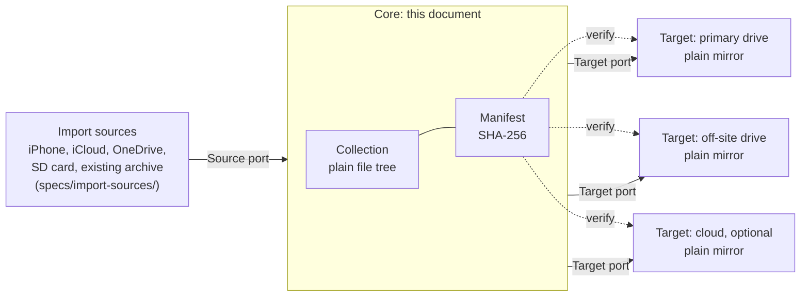

# Turbo-Collection: Specification (Core)

> **Spec version:** 0.1.0-draft
> **Created:** 2026-07-12
> **Status:** Draft. No implementation exists yet.

This document is the **normative source of truth** for what Turbo-Collection must do. It is
language-neutral and tool-neutral on purpose, so that the tests and the implementation can be
regenerated from it in any future implementation language, in the way an RFC outlives any single
implementation of a protocol.

---

## 0. How to use this document

### 0.1 What this document is

| ID           | Requirement                                                                                                                                                                                                                                                                                                                                                                                                                                                                             |
| ------------ | --------------------------------------------------------------------------------------------------------------------------------------------------------------------------------------------------------------------------------------------------------------------------------------------------------------------------------------------------------------------------------------------------------------------------------------------------------------------------------------- |
| **R-META-1** | Normative documents that bind the implementation (R-META-4) MUST, taken together, be sufficient to implement and test Turbo-Collection, with no document outside that set in hand. This specification MUST state everything that does not depend on a particular import source; an import source specification states only what its own source adds. If an implementer needs a fact none of them states, that is a defect, and the fix is to add that fact to whichever one owns its subject. |
| **R-META-4** | A normative document that binds the implementation MUST have a filename ending in `-spec.md`. A normative document that binds the human operator MUST have a filename ending in `-procedure.md`. Code and tests MUST cite documents whose filename ends in `-spec.md` only.                                                                                                                                                                                                             |

This document carries its **own** glossary (Section 3) and its **own** assumptions list (Section 12),
and does not defer them elsewhere.

> **Why the filename carries the kind (R-META-4).** A directory can say what a document is only
> while the document stays in it. Files get copied to drives, attached to messages, and opened
> without their path in view, and the classification has to survive all of that. Putting the kind
> in the name also makes R-META-2 mechanical: a check that code cites nothing outside `-spec.md`
> needs no list of documents to maintain.

Which other documents exist, and what each one governs, is mapped in `docs/spec-guide.md`. That
guide is navigation and binds nothing, so no obligation here depends on it.

### 0.2 Conventions

**Requirement keywords** (MUST, MUST NOT, SHOULD, SHOULD NOT, MAY) are used as defined in **RFC
2119**.

**Requirement IDs** in this document are domain-prefixed: `R-COL-1`, `R-SRC-6`, `R-TGT-12`. Their
stability, and uniqueness of a prefix across documents, are governed by `language-requirement.md`
R-LANG-20.

**Document language.** This document is written in **American English**
(`language-requirement.md` R-LANG-21). Stating it here rather than only by reference matters,
because R-VER-8 scatters copies of this document onto every target, and `language-requirement.md`
does not travel with them.

**Writing rules.** The language discipline this document is written under (controlled vocabulary,
one term per concept, the normative-text/commentary split) is defined in `language-requirement.md`,
which binds every normative document in this project.

---

## 1. Scope, non-goals, and invocation

The diagram below _is_ the scope statement. It draws the line between what this document owns, what
the import source specifications own, and what sits outside Turbo-Collection entirely. Note the symmetry: a port on
each end, and nothing vendor-specific in the middle.



Every copy of the collection (the collection itself, and each target's mirror of it) is verifiable
against the manifest independently, and each target carries its own copy of the manifest (R-TGT-9).
**No copy is privileged.** Fixity, not location, is what establishes that data is intact.

### 1.1 In scope

The durable core: the Source contract, the Target contract, mirror semantics, integrity, filename
safety, artifact versioning, configuration, logging, and the command-line contract.

### 1.2 Out of scope

| Concern                                                                              | Where it lives                                                                    |
| ------------------------------------------------------------------------------------ | --------------------------------------------------------------------------------- |
| Concrete source adapters (iPhone, iCloud, OneDrive, SD card) and their format quirks | Import source specifications under `specs/import-sources/`, one per import source |
| _When_ a run happens (scheduling)                                                    | Outside Turbo-Collection entirely. See Section 1.4.                               |

### 1.3 Non-goals (normative)

Turbo-Collection does **not** do the following, and MUST NOT grow them by accident. Each has a
documented path to becoming a goal later, in Section 10, so that deferring them costs no
architectural flexibility.

| Non-goal                                     | Path to enabling it |
| -------------------------------------------- | ------------------- |
| Albums and tags                              | Section 10          |
| Captions, ratings, face recognition          | Section 10          |
| AI search                                    | Section 10          |
| A browsing graphical interface               | Section 10          |
| Versioning and snapshots _of the collection_ | Section 10          |
| Deduplication                                | Section 10          |

> These are non-goals, not rejections. The distinction matters: a rejection means the idea is wrong,
> and a non-goal means it is simply not being built yet. Section 10 exists to prove the difference is
> real, by showing exactly what each would cost.

### 1.4 Invocation is external

Turbo-Collection is invoked from outside: by **a human on demand**, or by **an OS scheduler**. Both
are equal citizens, and both live outside the system. Turbo-Collection contains no scheduling logic
(R-CLI-2) and is fully usable with no scheduler installed at all (R-CLI-6).

---

## 2. Guiding principles (normative)

These are the principles the requirements are derived from. Where a requirement seems to conflict
with a principle, the conflict is a defect, and one of the two must change.

- **Plain data over clever mechanism.** No database, no container, no archive format. The data must
  be so plain that any tool can read it, so that when a tool dies the data does not.

- **Turbo-Collection only ever adds.** Every operation creates something or reports something.
  Turbo-Collection never deletes a photograph, at a source, in the collection, or at a target, and
  no configuration setting exists that would let it. Deleting is a human act, performed with
  ordinary tools, on evidence Turbo-Collection supplies. This principle names a rule seven
  requirements already followed separately (R-COL-2, R-COL-5, R-SRC-7, R-MIRROR-2, R-INT-6,
  R-INT-7, R-NAME-2), each forbidding one destruction. It has exactly one carve-out, R-MIRROR-8:
  a run may remove its own incomplete work product, which is not data.

- **Redundancy over cleverness.** Storage is cheap; reliability is not. Given a choice between a
  space-saving mechanism (symlinks, hardlinks, in-place transformation, deduplication) and simply
  storing another copy, choose the copy. Duplication that increases the number of independent,
  self-sufficient copies is a feature, not waste. This principle authorizes R-COL-5 (keep the
  original _and_ the derivative) and R-TGT-9 (every target carries its own manifest), and it is why
  symlink-based schemes are rejected in advance.

- **The core is indifferent to both ends.** The core knows nothing about **how a file arrived**
  (Source port) or **where and how it is stored** (Target port). It knows only the collection and the
  two contracts. Every vendor-specific, device-specific, and storage-specific fact lives in an
  adapter, never in the core.

- **Declare, do not assume.** Both ports state what they can guarantee, and Turbo-Collection refuses
  to proceed on a silent guarantee failure (R-SRC-6 on input, R-TGT-6 on output).

- **Re-check, do not trust yesterday.** A guarantee that held last year may not hold today. Declared
  capabilities are re-evaluated on every run and never cached (R-SRC-11, R-TGT-12), because the
  failure this system most needs to survive is a vendor quietly changing its behavior.

- **A record lives with the data it describes, never in a separate index.** There is no central
  database of what is stored where. A directory carries its own manifest (R-INT-1) and its own
  receipt (R-REC-1); every copy carries its own `README.md` (R-TGT-10), its own configuration stating
  what it is (R-CFG-6), and optionally its own copy of this document (R-VER-8); no memory of a source
  is kept between runs (R-SRC-13). A separated directory
  therefore stays interpretable, and there is no index whose loss makes surviving media unreadable.
  The cost is accepted deliberately: records are repeated across copies rather than centralized,
  which is the redundancy principle applied to metadata.

- **Data outlives code, and the specification travels with the data.** The orchestrator is small and
  regenerable from this document, so it is disposable. This document is not, because it is what makes
  regeneration possible. So a copy of it lives on every target, beside the photos it describes, and
  artifacts are written so they can be read even if it is lost anyway (Section 9).

---

## 3. Terminology

Self-contained, per `language-requirement.md` R-LANG-5.

- **Turbo-Collection.** This system: the orchestrator, its ports, and its adapters.

- **Collection.** The authoritative set of original photo and video files, stored as a plain file
  tree. This is the data Turbo-Collection exists to protect. (The word "library" is deliberately
  avoided, because it collides with "code library".)

- **Plain tree.** A directory structure in which every original exists as **exactly one file**,
  **byte-identical** to the original, at a path derived from its path in the collection, and
  **retrievable without any Turbo-Collection software**. A cloud bucket holding one object per file
  qualifies. A chunked, deduplicated, or encrypted repository does not. This definition is
  load-bearing: R-COL-4 and R-TGT-6 both test against it, so it must be decidable by inspection
  rather than by judgment.

- **Layout convention.** The rule that determines where in the collection a file is stored, given
  that file's own bytes, the metadata its import source supplied with it, and that import source.
  R-COL-4 requires every target to follow the collection's layout convention, and R-SRC-10 requires
  the convention to depend on nothing beyond those three. Which convention governs a given kind of
  content is stated in a separate layout specification, so that this document binds no particular
  directory shape.

- **Import source.** One way of getting original bytes into the collection, such as iCloud or a
  camera card. A Source adapter implements exactly one import source; configuration names it
  (R-SRC-3), and R-SRC-10 admits that name into a collection path. What may be assumed about one
  import source is stated in its own specification under `specs/import-sources/`.

- **Copy.** The collection, or a target's mirror of it. No copy is privileged: each carries its own
  manifest and is verifiable against it independently (R-TGT-9).

- **Source.** An origin that supplies files into the collection, reached through the Source port.
  _Source_ names the port and its adapters; _import source_ names the way in that one adapter
  reaches. One adapter reaches exactly one import source.

- **Target.** A backup copy of the collection, reached through the Target port. (The word
  "destination" is deliberately avoided, so that one concept has one name.)

- **Port.** A contract the core depends on: Source, Target, MirrorEngine, IntegrityStore, Config,
  Logger. Durable, and specified normatively in this document.

- **Adapter.** A concrete implementation of a port: an iCloud source, a local-drive target, an rclone
  mirror engine. Swappable, and named only in Section 12.

- **Original.** A file exactly as it arrived, byte-for-byte.

- **Derivative.** Anything Turbo-Collection produced from an original (for example, a JPEG rendered
  from a HEIC). Always additional, never a replacement (R-COL-5).

- **Content file.** An original or a derivative. The photographs and videos a copy exists to hold,
  as distinct from the records describing them. Several requirements are scoped to content files,
  because a rule that protects a photograph from being altered would otherwise forbid
  Turbo-Collection from writing down what it did.

- **Artifact.** Anything Turbo-Collection persists that outlives a single run: the config, the
  manifest, the receipt, the `README.md`, the logs, and any copy of this specification carried
  on a drive. Artifacts are versioned and must be
  self-evident (Section 9). Content files are neither: they are preserved untouched, exactly as they
  arrived. Every file in a copy is either a content file or an artifact.

- **Published (of a specification version).** Stamped into an artifact that has left the machine
  holding the collection (`version-requirement.md` R-PUB-3). A version whose stamp carries the
  `-draft` suffix is not
  published; it changes freely.

- **MAJOR line.** All versions of this specification that share a MAJOR number (for example, the
  2.x line). The **terminal text** of a line is its last published version at the moment the line
  is superseded by the next MAJOR.

- **Format generation.** The artifact formats and collection layout convention in force under a
  MAJOR line. A new format generation begins only at a MAJOR version that changes an artifact
  format or the layout convention; a MAJOR version that only forbids previously conforming
  behavior does not begin one. Format generations change more rarely than specification versions.

- **Migration.** The operation that converts a copy of the collection from an older format
  generation to the current one (R-VER-15, R-VER-16).

- **Change ledger.** The per-version, per-requirement record of specification changes, kept in
  Section 15, as `version-requirement.md` R-PUB-6 requires.

- **Import.** The act of a source supplying files into the collection.

- **Procedure.** A normative document stating the steps a human operator performs to achieve a
  result this specification requires. It binds the operator, not the implementation (R-META-4).

- **Mirror.** To make a target hold every file the collection holds, transferring only files absent
  at that target (R-MIRROR-1), and to record the arrival in the receipt of each directory written
  (R-REC-5). Both are parts of one operation; a transfer whose arrival is unrecorded is an
  incomplete mirror.

- **Receipt.** A per-directory record of the arrivals of that directory's content: where it came
  from, and the dated arrival of that content at each copy (R-REC-1). A manifest states what is
  present now and can be rebuilt by rescanning; a receipt states what happened and can be rebuilt
  from nothing.

- **Arrival.** One event in which content reaches a copy: an import reaching the collection, or a
  mirror reaching a target. Arrivals are what change the number of copies holding a file, and are
  therefore the only events a receipt records (R-REC-2).

- **Dry-run.** A mode in which Turbo-Collection reports what an operation would do and mutates
  nothing (R-SRC-14, R-MIRROR-7).

- **Temporary file.** A file Turbo-Collection creates while writing another file, and which never
  becomes a complete file at its final path. Removing one is the single carve-out from R-MIRROR-3
  (R-MIRROR-8).

- **Manifest.** A JSON file recording a checksum for each file in a copy, together with the hash
  algorithm and the specification version that produced it (R-INT-4).

- **Fixity.** Evidence that data has not changed or corrupted, established by comparing checksums.

- **Capability.** A statement by an adapter about what it can and cannot guarantee (R-SRC-6,
  R-TGT-5). Re-evaluated every run.

- **Run.** A single invocation of Turbo-Collection, which performs its work once and exits.

- **Grouping.** A named set of items within the collection (an album, a tag). **Defined here but
  reserved:** groupings are a non-goal for now (Section 1.3). The term is fixed in advance so that
  the extension path in Section 10 has a name to use.

---

## 4. Collection invariants (`R-COL-*`)

These constrain the collection itself. They outrank everything else in this document: any requirement
that conflicts with them is wrong and must be changed.

| ID          | Requirement                                                                                                                                                                                                                                                                                        |
| ----------- | -------------------------------------------------------------------------------------------------------------------------------------------------------------------------------------------------------------------------------------------------------------------------------------------------- |
| **R-COL-1** | The collection MUST be a plain directory tree of ordinary files. Turbo-Collection MUST NOT introduce a database, archive, container, or any other format that requires software to read the files back.                                                                                            |
| **R-COL-2** | Turbo-Collection MUST preserve originals byte-for-byte. It MUST NOT transcode, recompress, resize, or strip metadata from an original, under any circumstance, including at import.                                                                                                                |
| **R-COL-3** | The collection MUST remain fully usable without Turbo-Collection. Any ordinary file manager or file-copy tool MUST be sufficient to browse it and recover its contents.                                                                                                                            |
| **R-COL-4** | **Every** target MUST be a plain tree, laid out under the same layout convention as the collection, so that a file's path at a target is derived from its path in the collection. A target MAY hold a file that the collection no longer holds.                                                    |
| **R-COL-5** | A derivative in an open format (for example, a JPEG rendered from a HEIC, or a DNG from a proprietary RAW) MAY be stored **in addition to** the original. It MUST be identifiable as derived, and it MUST NEVER replace an original. Deleting every derivative MUST leave the collection complete. |

> **Why R-COL-4 says "every" and grants no exceptions.** It would be tempting to require only that
> _at least one_ target be a plain tree, leaving room for a future versioned repository alongside it.
> That would be a permission carved out for a feature that does not exist and is not wanted yet, and
> it would weaken today's guarantee to serve a hypothetical. As written, the guarantee is the
> strongest available: **every copy in existence is browsable with no tool at all.** The path to
> versioning is documented in Section 10, and it costs one amended requirement. The door stays open
> without being left ajar.

> **Why R-COL-4 no longer says "structurally equivalent".** It did, and that phrasing stopped being
> true once Turbo-Collection lost the ability to delete at a target (R-MIRROR-3). A target keeps every
> file it has ever received, so if a photograph is removed from the collection by hand, the target
> still holds it and the two trees are no longer equivalent. **A target is a superset of the
> collection, not a copy of it**, and that is the intended behavior rather than drift: it is what
> makes an accidental deletion in the collection recoverable. What R-COL-4 still guarantees is the
> part that matters to a finder with no software: the layout is the same, so a file's location is
> predictable from the collection's convention alone.

> **Why R-COL-5 is not specific to HEIC.** The risk is proprietary formats generally. Camera RAW
> formats (CR3, NEF, ARW) are undocumented and single-vendor; HEIC and HEVC are patent-encumbered.
> The rule is the same for all of them, and for whatever replaces them: keep the original bytes, and
> optionally hedge with an open-format copy beside it. Preserve first, hedge second.

---

## 5. The Source port (`R-SRC-*`)

The core must be indifferent to whether a photo arrived by cable, from iCloud, through a OneDrive
sync folder, or from something not yet invented.

This contract is specified completely enough (R-META-1) that **anyone can write a source adapter from
this document alone, without modifying Turbo-Collection's core.** That is the extensibility that
matters. How adapters are loaded is a binding (Section 12), not a requirement.

| ID           | Requirement                                                                                                                                                                                                                                                                                                                                                                    |
| ------------ | ------------------------------------------------------------------------------------------------------------------------------------------------------------------------------------------------------------------------------------------------------------------------------------------------------------------------------------------------------------------------------ |
| **R-SRC-1**  | Files MUST enter the collection only through the Source port. The core MUST contain no logic specific to any individual source, device, vendor, or service.                                                                                                                                                                                                                    |
| **R-SRC-2**  | Adding support for a new source MUST require writing only a new adapter. It MUST NOT require changing the core, this specification's requirements, or any existing adapter.                                                                                                                                                                                                    |
| **R-SRC-3**  | Which sources are active, and their settings, MUST be declared in configuration, not in code. A source MUST be able to be enabled or disabled without a code change.                                                                                                                                                                                                           |
| **R-SRC-4**  | Multiple sources MUST be able to coexist and MUST be importable independently. The failure of one source MUST NOT prevent import from another, and MUST still be reported.                                                                                                                                                                                                     |
| **R-SRC-5**  | A source adapter MUST supply the **original bytes** of each item. It MUST NOT transcode, recompress, or strip metadata in the course of importing.                                                                                                                                                                                                                             |
| **R-SRC-6**  | **The honesty requirement.** If a source **cannot** supply original bytes, the adapter MUST declare this, and Turbo-Collection MUST report it. Turbo-Collection MUST NOT silently accept a degraded file as though it were an original. A degraded import MUST be either refused or explicitly recorded as degraded, per configuration, and **the default MUST be to refuse**. |
| **R-SRC-7**  | Import MUST be read-only with respect to the origin. A source adapter MUST NOT delete, modify, or move anything at the source device or service.                                                                                                                                                                                                                               |
| **R-SRC-8**  | Import MUST be idempotent. Importing the same item twice MUST NOT produce a duplicate in the collection, and re-running an interrupted import MUST converge rather than accumulate.                                                                                                                                                                                            |
| **R-SRC-9**  | An item consisting of multiple files that are semantically one thing (for example, a still image and its paired motion clip) MUST be imported atomically: either all of its parts arrive, or none do. An adapter MUST NOT split such an item silently.                                                                                                                         |
| **R-SRC-10** | The collection path of an item MUST be a pure function of the item's own bytes, the metadata the import source supplies with it, and that import source, under the collection's layout convention.                                                                                                                                                                                 |
| **R-SRC-11** | A source's capabilities MUST be re-evaluated on every run and MUST NOT be cached from a previous run. A source that _begins_ degrading files MUST be caught at the next import, and MUST NOT be assumed to still be honest merely because it was honest before.                                                                                                                |
| **R-SRC-12** | **Import is additive.** Import MUST add files to the collection, and MUST NOT delete, move, rename, or modify a file already in the collection. If a source no longer holds an item the collection already holds, Turbo-Collection MUST take no action and MUST NOT report a discrepancy.                                                                                      |
| **R-SRC-13** | Turbo-Collection MUST NOT compute, record, or report which items a source no longer supplies. Turbo-Collection MUST hold no record of a source's contents between runs, and MUST establish that an item is already imported by inspecting the collection rather than by comparing against a previous state of the source.                                                      |
| **R-SRC-14** | Turbo-Collection MUST support a dry-run mode for import that reports every item a real import would add to the collection, and mutates nothing.                                                                                                                                                                                                                                |

> **What R-SRC-10 still forbids, now that the import source is admitted.** This requirement once said
> the collection layout MUST NOT depend on which source supplied a file, so that two identical photos
> arriving by different import sources landed in the same place. That guarantee is withdrawn
> deliberately. The import source is a path segment because it is the one thing about an arrival that
> a file cannot state about itself, and a photo arriving by two import sources is therefore two files;
> R-SRC-8 sends that case to the duplicate report rather than to an import-time gate. What survives is
> the harder half. A path may depend on the item and on how it arrived, never on **when** it arrived
> or on **what a person later decided about it**. Import order is a property of a run rather than of
> an item, so an ordinal disambiguating suffix is still forbidden. A label assigned after import is
> supplied by no import source, so a directory named for one is still forbidden, which also keeps the
> level from becoming a junk drawer for multi-valued groupings.

> **R-SRC-6 is the requirement that earns its keep.** The realistic failure mode of a cloud photo
> source is not that it breaks loudly. It is that it hands you a slightly worse file and says
> nothing. A system whose entire purpose is preservation must treat a silently degraded original as a
> hard error, not as a successful import.

> **R-SRC-11 is R-SRC-6 extended across time.** Over the decades this system is meant to last, the
> likeliest way the honesty guarantee fails is not that an adapter lies, but that the service beneath
> it changes: a sync client begins transcoding HEIC in some future year, having not done so before.
> Trusting a capability because it was true once is exactly the mistake this system exists to avoid.

> **Why R-SRC-13 forbids a report that sounds useful.** Two comparisons sound alike and are not.
> _Forward_, source to collection, asks what the source holds that the collection lacks: that is the
> import work list, and it is required. _Reverse_, collection to source, asks what the collection
> holds that the source no longer has. Turbo-Collection never asks the second question. Two
> independent reasons. First, a cloud photo source presents a local view that is a cache, so an
> absent item is at least as likely to be a sync failure as a deletion, and such a report would be
> mostly false positives. Second, every true positive is an item already safely in the collection,
> which is the outcome this system exists to produce. R-SRC-13 also generalizes R-SRC-11: the tool
> keeps no memory of a source between runs at all.

> **What R-SRC-12 and R-SRC-13 cost, stated plainly.** Turbo-Collection can never tell an operator
> "you deleted something at the source that was never backed up." Nothing detects that, and nothing
> is meant to. The protection is ordering, not detection: confirm coverage first, delete afterwards.
> R-SRC-14 is what makes that confirmation possible, because an import dry-run reporting zero pending
> items is exactly the evidence that everything at the source has already reached the collection.

---

## 6. The Target port (`R-TGT-*`)

Symmetric to the Source port, and held to the same discipline. Data leaves Turbo-Collection only
through the Target port.

A target is **not merely a path.** It is an adapter that declares what it can and cannot guarantee.

| ID           | Requirement                                                                                                                                                                                                                                                                                                                                                                             |
| ------------ | --------------------------------------------------------------------------------------------------------------------------------------------------------------------------------------------------------------------------------------------------------------------------------------------------------------------------------------------------------------------------------------- |
| **R-TGT-1**  | Data MUST leave the collection only through the Target port. The core MUST contain no logic specific to any individual target, medium, vendor, or service.                                                                                                                                                                                                                              |
| **R-TGT-2**  | Adding support for a new target MUST require writing only a new adapter. It MUST NOT require changing the core, this specification's requirements, or any existing adapter.                                                                                                                                                                                                             |
| **R-TGT-3**  | Which targets are active, and their settings, MUST be declared in configuration, not in code.                                                                                                                                                                                                                                                                                           |
| **R-TGT-4**  | Multiple targets MUST be able to coexist and MUST be written independently. The failure of one target MUST NOT prevent the attempt against another, and MUST still be reported.                                                                                                                                                                                                         |
| **R-TGT-5**  | A target adapter MUST declare its capabilities: whether it is a plain tree, whether it can be verified in place, and whether it is remote.                                                                                                                                                                                                                                              |
| **R-TGT-6**  | **The plain-mirror guarantee.** Turbo-Collection MUST refuse to run if any configured target does not declare itself a plain tree. This check MUST happen before any work is done, enforcing R-COL-4 rather than merely hoping for it.                                                                                                                                                  |
| **R-TGT-7**  | A target adapter MUST be read-only with respect to the collection. It MUST NOT modify, rename, move, or delete any collection file, artifacts included. Writing the collection's receipt is the core's responsibility, never an adapter's (R-REC-6).                                                                                                                                    |
| **R-TGT-8**  | A target adapter MUST NOT delete a file it holds, and MUST NOT expose an operation that deletes a file it holds. (This is the adapter-level counterpart of R-MIRROR-3, deliberately duplicated so that a defect in one layer alone cannot destroy data.)                                                                                                                                |
| **R-TGT-9**  | Each target MUST carry, in each of its directories, a manifest covering **that directory's own** contents (R-INT-1), so that the target is self-verifying without the collection and without Turbo-Collection, and so that any single directory remains verifiable when separated from the rest.                                                                                        |
| **R-TGT-10** | Every copy MUST carry, at its root, a file named `README.md` stating what the data is, how it is organized, and how to verify it. Turbo-Collection MUST write this file where none exists and MUST NOT overwrite one that does. Nothing MUST depend on it: like a log (R-LOG-2) it is orientation only, and the correctness of a copy MUST NOT depend on it existing or being readable. |
| **R-TGT-11** | Every target MUST be restorable by ordinary file copy, using no Turbo-Collection software.                                                                                                                                                                                                                                                                                              |
| **R-TGT-12** | A target's capabilities MUST be re-evaluated on every run and MUST NOT be cached from a previous run (symmetric to R-SRC-11). A target that has ceased to be a plain tree MUST be caught **before** it is written to, not after.                                                                                                                                                        |

> **R-TGT-6 is what makes the architecture honest.** R-COL-4 demands that every target be a plain
> tree. Without a capability declaration, that demand is merely a hope. With one, Turbo-Collection
> can check it before doing any work and refuse a configuration that would leave a copy locked behind
> a tool.

> **What a target carries, and why.** Four things, all of them plain text, all of them negligible
> against terabytes of photos: the **files** themselves, a **manifest** of their checksums (R-TGT-9),
> a **`README.md`** (R-TGT-10), and optionally a copy of the **specification** the target was written
> under (R-VER-8). They serve a single scenario, in escalating order of need: _someone finds this
> drive in forty years, and Turbo-Collection no longer exists._ They read the note to learn what the
> drive is; they verify the files against the manifest, which states its own algorithm and lists one
> file per line (R-INT-4); and they consult the specification only if they need the full rules. The photos are recoverable at every
> step, including the step where the finder reads nothing at all and simply copies the files off.

---

## 7. Preservation requirements

### 7.1 Mirroring (`R-MIRROR-*`)

The semantics of the mirror operation, as distinct from the target contract in Section 6.

| ID             | Requirement                                                                                                                                                                                                                                                                                                                                                                                                             |
| -------------- | ----------------------------------------------------------------------------------------------------------------------------------------------------------------------------------------------------------------------------------------------------------------------------------------------------------------------------------------------------------------------------------------------------------------------- |
| **R-MIRROR-1** | Turbo-Collection MUST copy to a target every collection file that is absent at that target. If a collection **content file** is present at a target with differing content, Turbo-Collection MUST NOT overwrite the target's copy, and MUST report the difference (R-INT-7). An artifact at a target MAY be replaced, under the conditions its own requirements state (R-REC-7 for a receipt, R-INT-10 for a manifest). |
| **R-MIRROR-2** | Mirroring MUST be read-only with respect to every collection **content file**. It MUST NOT modify, rename, move, or delete one. Mirroring MUST write the collection's receipt, and MUST NOT write any other collection file (R-REC-5).                                                                                                                                                                                  |
| **R-MIRROR-3** | Turbo-Collection MUST NOT delete a file at a target, and MUST NOT provide a configuration setting or a command-line flag that permits deletion at a target. The single exception is R-MIRROR-8.                                                                                                                                                                                                                         |
| **R-MIRROR-4** | **Idempotence.** A run against an unchanged collection MUST transfer no file data.                                                                                                                                                                                                                                                                                                                                      |
| **R-MIRROR-5** | Turbo-Collection MUST support more than one target and MUST treat each independently: a failure against one MUST NOT prevent the attempt against another, and MUST still be reported.                                                                                                                                                                                                                                   |
| **R-MIRROR-6** | An interrupted run (power loss, disconnected drive, termination) MUST leave the target in a state from which a subsequent run converges to a correct mirror. A run MUST NOT leave a partially-written file that a later run would mistake for a complete one.                                                                                                                                                           |
| **R-MIRROR-7** | Turbo-Collection MUST support a dry-run mode that reports exactly what a real run would transfer, and mutates nothing.                                                                                                                                                                                                                                                                                                  |
| **R-MIRROR-8** | **The carve-out for incomplete work.** Turbo-Collection MAY remove a temporary file (Section 3) that Turbo-Collection itself created. Turbo-Collection MUST NOT remove anything else. A temporary file MUST be identifiable as a temporary file by its name or its location, so that a human can audit every such removal without Turbo-Collection.                                                                     |
| **R-MIRROR-9** | Turbo-Collection MUST verify a collection file against the manifest immediately before copying that file to a target. Turbo-Collection MUST NOT copy a file whose checksum does not match, and MUST report the mismatch.                                                                                                                                                                                                |

> **Why R-MIRROR-1 no longer overwrites, and what that costs.** The previous text copied every file
> that "differs from the collection's copy", which treated the collection as authoritative. R-INT-7
> says the opposite: on a mismatch neither side is authoritative, and choosing the surviving copy is
> a human decision. Those were two MUSTs in conflict, and R-INT-7 wins. The cost is real and accepted:
> a corrupt file at a target is never healed automatically, and repair becomes an action a human
> requests, consistent with R-INT-6. What is bought is larger. A collection file that corrupts
> silently can no longer overwrite the good copy at every target on the next run.

> **Why R-MIRROR-8 is worded so narrowly.** A carve-out from "never deletes" is the one place this
> specification can reopen the hole it just closed, so it is bounded on three sides at once: only a
> file Turbo-Collection created, only a file that never became complete at its final path, and only a
> file a human can recognize as temporary by looking at it. Deleting one's own incomplete work product
> is not deleting data. R-MIRROR-6 requires that an interrupted run leave no partial file that a later
> run mistakes for a complete one, and write-to-temporary-then-rename is the ordinary way to satisfy
> it, so without this carve-out R-MIRROR-6 would be unimplementable.

> **Why R-MIRROR-9 exists, and what append-only does not protect.** Never deleting protects copies
> that already exist. It does nothing to stop bad bytes reaching new ones. If a collection file
> corrupts silently and is then mirrored to a **fresh** target before anyone notices, the corrupt
> version is the only version that target will ever hold, because R-MIRROR-1 will not overwrite it
> later. Verifying immediately before the copy closes that gap at almost no cost, since the file is
> being read anyway.

### 7.2 Integrity (`R-INT-*`)

| ID           | Requirement                                                                                                                                                                                                                                                                                                                                                                                                                                                                                                                                                                   |
| ------------ | ----------------------------------------------------------------------------------------------------------------------------------------------------------------------------------------------------------------------------------------------------------------------------------------------------------------------------------------------------------------------------------------------------------------------------------------------------------------------------------------------------------------------------------------------------------------------------- |
| **R-INT-1**  | Turbo-Collection MUST record a SHA-256 checksum for every file in a directory, in a manifest stored in that directory and named `manifest.json`. A manifest MUST cover its own directory only, and MUST NOT cover a subdirectory. A directory holding no **content file** needs no manifest. A manifest is the only file it does not cover, because a manifest cannot contain its own checksum.                                                                                                                                                                               |
| **R-INT-2**  | Turbo-Collection MUST be able to verify a collection or a target against a manifest, and MUST report every discrepancy it finds.                                                                                                                                                                                                                                                                                                                                                                                                                                              |
| **R-INT-3**  | Verification MUST distinguish these outcomes per file, and MUST NOT conflate them: **ok**; **missing** (in the manifest, absent on disk); **corrupt** (present, but the checksum differs); **extra** (present on disk, absent from the manifest).                                                                                                                                                                                                                                                                                                                             |
| **R-INT-4**  | The manifest MUST be a JSON document as defined by RFC 8259, encoded in UTF-8. Its first fields MUST be `specVersion`, `layoutConvention` and `algorithm` (R-INT-5, R-VER-3), so that every directory states which rules governed its writing and which layout convention placed its content. It MUST carry a `files` array holding one object per file, each with a `filePath` field stating that file's path within the copy and a `checksum` field stating that file's checksum. The document MUST be written with whitespace that places each file entry on its own line. |
| **R-INT-5**  | The manifest MUST record which hash algorithm produced it, so that changing the algorithm later is explicit and detectable rather than silent.                                                                                                                                                                                                                                                                                                                                                                                                                                |
| **R-INT-6**  | Verification MUST NOT repair, overwrite, or delete anything as a side effect. It reports. Any repair MUST be a separate, explicitly requested action.                                                                                                                                                                                                                                                                                                                                                                                                                         |
| **R-INT-7**  | On a mismatch between a collection **content file** and a target's copy of it, Turbo-Collection MUST report **which side differs** and MUST NOT treat either side as authoritative. Choosing the surviving copy is a human decision. This requirement MUST NOT be applied to artifacts, which are per-copy records and are expected to differ between copies.                                                                                                                                                                                                                 |
| **R-INT-8**  | Turbo-Collection MUST NOT treat a verification result of **extra** at a target as an error, and this outcome alone MUST NOT cause a non-zero exit status. Turbo-Collection MUST report a verification result of **extra** at the collection as a finding. Turbo-Collection MUST NOT report a manifest as **extra** in any copy, since R-INT-1 excludes it by design.                                                                                                                                                                                                          |
| **R-INT-10** | Turbo-Collection MUST NOT replace a file's recorded checksum with a newly computed one unless Turbo-Collection wrote that file's current content itself. Rebuilding a manifest from a copy's present contents MUST be an action a human explicitly requests, and MUST report every difference against the existing manifest rather than overwriting it silently. Adding an entry for a file not yet covered is not a replacement and is unrestricted.                                                                                                                         |

> **Why R-INT-8 singles out one outcome.** R-MIRROR-3 makes a target a superset of the collection
> over time, so files at a target that the manifest does not list are the **expected** steady state
> rather than an anomaly. Without R-INT-8 the healthiest possible target reports the longest list of
> problems, and an operator learns to ignore verification output, which is the failure that costs the
> most here. At the collection the same outcome means something entirely different, an unimported or
> stray file, so it stays a finding there.

> **A recurring hazard, named so it is recognized next time.** A healthy state of this design reads
> as a finding to a naive report. This is the second instance: the first is that a grouping holding
> real copies makes every member a byte-identical duplicate of its canonical original, which a
> duplicate report would flag as waste. Whenever a report is added, ask which of its findings are
> designed behavior, and say so in the report rather than in a footnote.

> **The manifest, by example.** Field names are spelled out rather than
> abbreviated, because R-VER-4 asks whether a stranger can figure the artifact out by looking at it.
>
> ```json
> {
>   "specVersion": "turbo-collection-spec 1.0.0 (2027-03-01)",
>   "layoutConvention": "turbo-collection-photo-layout 1.0.0",
>   "algorithm": "SHA-256",
>   "files": [
>     {
>       "filePath": "2026/2026-08/canon-eos-r6/IMG_1234.HEIC",
>       "checksum": "e3b0c442..."
>     },
>     {
>       "filePath": "2026/2026-08/canon-eos-r6/IMG_1235.HEIC",
>       "checksum": "a1b2c3d4..."
>     }
>   ]
> }
> ```

> **Why the manifest is JSON, and why a second copy is not.** The earlier text required the manifest
> to be in "a standard checksum format, such that a standard checksum utility can verify it". That
> overstated what exists. `sha256sum` is a GNU program, not a standard: POSIX specifies `cksum`, BSD
> ships a different tool with different output, macOS ships a Perl one, and one Windows machine can
> carry two implementations that disagree. The format itself is awkward to parse correctly, with
> binary-mode markers, backslash escaping of unusual filenames, no declared character encoding, and
> comment handling that no implementation documents. JSON is an actual frozen standard, states its own
> encoding, escapes strings unambiguously, and can carry the algorithm and version stamp as ordinary
> fields instead of as a comment convention nobody promises to honor.

> **Why there is no second copy in checksum-utility format.** A **companion manifest** was required
> beside every manifest between 2026-08-13 and 2026-08-16, in the line-oriented form `sha256sum -c`
> reads, so that a copy could be verified by one command and no Turbo-Collection software. It was
> withdrawn. The argument for it assumed a reader who has a checksum utility but cannot obtain a
> format conversion, and that reader is now judged not to exist: anyone able to obtain the conversion
> is equally able to obtain the verification directly, and skips the intermediate file. The
> assumption doing that work is stated in Section 12.3 and reasoned in `docs/design-record.md`
> Section 2 as _a future reader has help_. Note what it does **not** license: the manifest still
> names its own algorithm, carries its own version stamp, and places one file per line (R-INT-4),
> because an assistant can act only on data that says what it is. The convenience was removed; the
> self-description was not.

> **The smallest possible exclusion (R-INT-1).** The requirement used to say "every file in the
> collection", which no implementation can satisfy: a manifest is a file in the collection, so it
> would have to contain its own checksum. The exclusion is deliberately kept to manifests alone rather
> than widened to artifacts generally, because a `README.md`, a configuration file and a carried copy
> of this specification are all static files worth verifying, and excluding them would buy nothing.
> Nothing verifies a manifest itself, and nothing needs to: R-TGT-9 puts an independent manifest on
> every copy, so three copies mean three manifests, and a corrupt one is found by comparison. That is
> the same answer this project gives everywhere, which is redundancy rather than cleverness.

> **Why R-INT-10 exists, and it is not obvious.** A manifest looks disposable, because it can always
> be rebuilt from the collection. But rebuilding it hashes whatever the collection holds **at that
> moment**, corrupted files included, and writes down those hashes as though they were correct. A
> silent regeneration therefore destroys the only evidence that corruption happened, and it does so
> most eagerly in exactly the situation where the evidence matters. Verify first, then rebuild, and
> never rebuild as a side effect of something else.

> **Why R-INT-6 and R-INT-7 exist.** A verifier that "helpfully" repairs can propagate corruption from
> a bad copy over a good one, destroying the very data it was invoked to protect. Detection and repair
> are therefore separated on purpose. Turbo-Collection's job is to tell the truth about what it found.

### 7.3 Filename safety (`R-NAME-*`)

| ID           | Requirement                                                                                                                                                                                                                                                                                                                                                                             |
| ------------ | --------------------------------------------------------------------------------------------------------------------------------------------------------------------------------------------------------------------------------------------------------------------------------------------------------------------------------------------------------------------------------------- |
| **R-NAME-1** | Before copying, Turbo-Collection MUST check collection filenames for hazards that do not survive a move between common filesystems, and MUST report them. At minimum: characters reserved on some filesystems; names differing only by case; Unicode normalization differences (NFC versus NFD); trailing spaces or dots; reserved device names; and path lengths beyond common limits. |
| **R-NAME-2** | Turbo-Collection MUST NOT silently rename a file to resolve such a hazard. It reports; the human decides.                                                                                                                                                                                                                                                                               |
| **R-NAME-3** | A filename hazard MUST NOT, by default, abort an otherwise valid run. Hazards are reported as warnings, because a name that is harmless on today's filesystem still needs backing up today.                                                                                                                                                                                             |

### 7.4 Receipts (`R-REC-*`)

| ID          | Requirement                                                                                                                                                                                                                                                                                                                                                                                                                                                                                                                                      |
| ----------- | ------------------------------------------------------------------------------------------------------------------------------------------------------------------------------------------------------------------------------------------------------------------------------------------------------------------------------------------------------------------------------------------------------------------------------------------------------------------------------------------------------------------------------------------------ |
| **R-REC-1** | Turbo-Collection MUST maintain a **receipt** in every directory into which it writes a content file, and in every directory into which content was offered and refused. Where a refusal is the only thing to record, Turbo-Collection MUST create that directory and write the receipt in it. The receipt MUST record where that directory's content came from, every **arrival** of that content at a copy, and every **refusal**.                                                                                                              |
| **R-REC-2** | A receipt MUST record every event that changes whether the source material a directory came from can safely be deleted: an arrival, and a refusal. It MUST NOT record any other event. Verification in particular MUST NOT be recorded in a receipt.                                                                                                                                                                                                                                                                                             |
| **R-REC-3** | A receipt MUST be a JSON document as defined by RFC 8259, encoded in UTF-8, whose first field is `specVersion` (R-VER-3). It MUST carry an `arrivals` array and, where any refusal has occurred, a `refusals` array. It MUST be written with whitespace that places each arrival and each refusal on its own line.                                                                                                                                                                                                                               |
| **R-REC-4** | Each arrival MUST state, in fields of these names: the copy reached (`copy`), the date it was reached (`date`), the number of content files present in the directory at that moment (`fileCount`), and a **content digest** (`contentDigest`): a SHA-256 checksum computed over the checksums of those content files, in a deterministic order. An arrival recording an import MUST also state the import source that supplied the content (`importSource`). A content digest MUST cover content files only, so that no artifact contributes to it. |
| **R-REC-9** | Each refusal MUST state, in fields of these names: the import source that offered the item (`importSource`), the date it was offered (`date`), the name the item would have been given (`file`), and why it was refused (`reason`). A refusal MUST be recorded whenever Turbo-Collection declines to write content that a source offered, including a degraded item refused under R-SRC-6 and an item skipped because its name is already taken by different content.                                                                               |
| **R-REC-5** | Turbo-Collection MUST append an arrival to a receipt only **after** the content that arrival covers has been completely written to the copy the arrival names.                                                                                                                                                                                                                                                                                                                                                                                   |
| **R-REC-6** | On a mirror, Turbo-Collection MUST append the arrival to the **collection's** receipt, and MUST then place a copy of that receipt in the corresponding directory at the target. The core performs both writes; a target adapter MUST NOT write a receipt (R-TGT-7).                                                                                                                                                                                                                                                                              |
| **R-REC-7** | A receipt MUST be replaced only by a receipt containing every arrival and every refusal the existing receipt contains. Turbo-Collection MUST report any replacement that would not satisfy this, and MUST NOT perform it. A refusal MUST remain after the item it names is later imported successfully, so that the receipt states both events.                                                                                                                                                                                                  |
| **R-REC-8** | A receipt records where content was **placed**, not where it **remains**. Turbo-Collection MUST NOT treat a receipt as evidence that a copy still exists or is still intact, and MUST NOT state a copy count derived from receipts without stating the date of each arrival counted.                                                                                                                                                                                                                                                             |

> **Why receipts exist at all, and why they are not logs.** A manifest is a **state** record: delete it
> and it can be rebuilt by rescanning the tree. A receipt is an **event** record, and can be rebuilt
> from nothing. Without one, an empty directory nobody ever imported into and an empty directory whose
> photographs were deleted are indistinguishable, because absence of data and absence of import look
> identical to any checksum. This also rules out placing receipts under R-LOG-2, which makes logs
> observability only: a receipt is load-bearing before an irreversible act, so it is a preservation
> artifact and lives in this section. A run log and a receipt are two independent records of one
> event, which the redundancy principle authorizes rather than merely tolerates.

> **Why arrivals and refusals, and why not verification (R-REC-2).** A receipt exists so that a human
> can decide whether it is safe to delete the source material a directory came from. Two kinds of event
> bear on that. An **arrival** says a copy now holds the content. A **refusal** says something the
> source offered is in no copy at all, and it is the strongest possible reason not to delete, because
> the refused item exists nowhere else. A refusal is the negative space of an arrival, and it is the
> one fact about an import that no manifest and no checksum can ever recover: an item that never
> landed leaves no trace to find. A **verification** is excluded, for two reasons that a refusal fails
> to meet. It does not change how many copies hold the content, and it is the highest-volume event a
> collection generates, so admitting it would turn a five-line file into hundreds of lines over twenty
> years and destroy the property the record exists for, which is that a person can read it at a
> glance. Refusals are rare by construction. Where verification results belong is R-LOG-1.

> **Why a refusal creates a directory that holds no photograph (R-REC-1).** A refused item never
> landed, so no directory exists to record it in, yet its path is known: R-SRC-10 makes a collection
> path a function of the item's bytes, the metadata its import source supplies, and that import
> source, all of which are in hand at the moment of refusal. Writing the receipt where the item _would_ have gone puts the record
> exactly where somebody looking for that photograph will look. A directory holding a receipt and no
> content is a strange object, and it is precisely the signal worth finding: it says something was
> offered here and is not here.

> **Why a refusal outlives the problem it describes (R-REC-7).** Deleting the refusal once the item
> imports successfully would be tidier and would destroy the audit trail. _Refused 2026-08-14, arrived
> 2026-09-02_ tells you the gap existed and closed; the arrival alone tells you nothing about the
> three weeks when a photograph you believed was safe was in no copy at all.

> **Why the digest, when a manifest sits in the same directory (R-REC-4).** The manifest states what is
> present **now**; an arrival states what was covered **then**. The difference between them is the
> content that has not yet reached that copy, which is the honest measure of exposure and can be
> computed with no other drive connected. It also makes a receipt falsifiable rather than merely
> asserted: the most recent arrival's digest can be recomputed from the directory at any time.

> **Why the ordering in R-REC-5 is not free to choose.** Recording an arrival before the transfer
> completes would leave a failed run claiming content reached a copy it never reached. That is
> over-reporting, and a receipt that over-reports can talk an operator into deleting the only other
> copy. Under-reporting is safe and self-correcting; over-reporting is neither.

> **Why one writer (R-REC-6).** Every mirror runs with the collection present, so the collection is
> the only copy party to every arrival and its receipt is the only complete one. Writing at both ends
> independently would leave two receipts that had each been appended to separately, and reconciling
> them would require a merge operation that R-MIRROR-1 does not describe and that nothing else in this
> specification needs. Copying the collection's receipt outward instead keeps one writer per file,
> keeps the copy an ordinary file copy, and gives every drive the same history.

> **What a target's receipt can and cannot tell you.** A target learns of an arrival only while it is
> connected, so its receipt is complete **as of its last mirror** and silent about anything later. It
> therefore under-reports and never over-reports: it can show fewer copies than exist, never more. For
> a record consulted before an irreversible deletion, that is the correct direction to be wrong, and
> the gap closes by itself at the next mirror.

> **Why R-REC-7 exists.** Everything else in a copy can be rebuilt: content from another copy, a
> manifest by rescanning. Arrival history can be rebuilt from nothing, which makes a receipt the one
> file where an overwrite is unrecoverable. Requiring a replacement to be a strict extension is the
> receipt's counterpart to R-INT-10, and for the same reason: the destructive act is not writing, it is
> writing something that contains less than what was there.

> **Why R-REC-8 is stated as a prohibition.** A receipt is the only record in this design that
> describes bytes that are not present, so it is the only one that can become false without anything
> local changing. A drive that dies in November does not edit the claim recorded in August. R-SRC-13
> forbids remembering a source's contents between runs for exactly this reason; receipts are permitted
> the same shape pointed at targets only because an arrival is a fact Turbo-Collection performed itself
> rather than an inference about someone else's storage. Dates are what keep a stale claim legible as
> stale, and the release procedure, not this record, remains what authorizes a deletion.

> **A receipt is covered by its directory's manifest.** Appending to one therefore makes its recorded
> checksum stale. No exception is needed: Turbo-Collection is a receipt's only writer, so R-INT-10
> already permits replacing that recorded checksum in the same operation. One consequence is
> deliberate: a receipt is not hand-editable, and a receipt edited by hand will be reported as
> **corrupt**.

> **A receipt, by example.** Field names match the manifest's, because these two records and the
> grouping, tombstone and lineage records this project may later want are all one format.
>
> ```json
> {
>   "specVersion": "turbo-collection-spec 1.0.0 (2027-03-01)",
>   "arrivals": [
>     {
>       "event": "import",
>       "copy": "collection",
>       "importSource": "icloud",
>       "date": "2026-08-14",
>       "fileCount": 412,
>       "contentDigest": "9f2a1c..."
>     },
>     {
>       "event": "mirror",
>       "copy": "target",
>       "date": "2026-08-14",
>       "fileCount": 412,
>       "contentDigest": "9f2a1c..."
>     },
>     {
>       "event": "mirror",
>       "copy": "offsite-target",
>       "date": "2026-09-02",
>       "fileCount": 412,
>       "contentDigest": "9f2a1c..."
>     }
>   ],
>   "refusals": [
>     {
>       "importSource": "icloud",
>       "date": "2026-08-14",
>       "file": "IMG_0001.HEIC",
>       "reason": "degraded"
>     }
>   ]
> }
> ```
>
> A copy is named by the string that copy declares for itself in its own configuration (R-CFG-6), never
> by a volume label or a mount path. Both are mutable by anyone in seconds, and a receipt is permanent,
> so a name written here in 2026 must still resolve in 2046 after every drive behind it has been
> replaced.

---

## 8. Operation: configuration, logging, and the command line

### 8.1 Configuration (`R-CFG-*`)

| ID          | Requirement                                                                                                                                                                                                                                                                                                                                                                                                                                                                                                                                                                                              |
| ----------- | -------------------------------------------------------------------------------------------------------------------------------------------------------------------------------------------------------------------------------------------------------------------------------------------------------------------------------------------------------------------------------------------------------------------------------------------------------------------------------------------------------------------------------------------------------------------------------------------------------- |
| **R-CFG-1** | Turbo-Collection MUST read import source declarations, the copies expected to exist, and every option from an external configuration file. It MUST NOT hardcode any path.                                                                                                                                                                                                                                                                                                                                                                                                                            |
| **R-CFG-2** | Configuration MUST be plain data in a text format that a human can read and edit, and that a tool other than Turbo-Collection can parse. It MUST be named `turbo-collection-config.json` and MUST sit at the root of the copy it describes.                                                                                                                                                                                                                                                                                                                                                              |
| **R-CFG-3** | Turbo-Collection MUST validate configuration **before** performing any filesystem mutation. Invalid configuration MUST cause the run to fail immediately, with no partial effect.                                                                                                                                                                                                                                                                                                                                                                                                                        |
| **R-CFG-4** | Turbo-Collection MUST fail rather than guess. A missing, ambiguous, or unparseable setting MUST NOT be silently defaulted into a behavior that loses data or accepts a worse file. In particular, it MUST NOT default into accepting a degraded import (R-SRC-6).                                                                                                                                                                                                                                                                                                                                        |
| **R-CFG-5** | Turbo-Collection MUST be fully operable with configuration supplied from the collection's own storage or on the command line, and MUST NOT require configuration held on the host computer. A host-specific location MAY be searched as a convenience; it MUST NOT be the only place configuration can live.                                                                                                                                                                                                                                                                                             |
| **R-CFG-6** | **Every copy MUST declare its own identity**, in its own configuration file, stating its **role** (`role`, one of `collection` or `target`) and the name by which receipts refer to it (`copy`). Turbo-Collection MUST determine a copy's role and name by reading that declaration, and MUST NOT infer either from a volume label, a mount path, a drive letter, or a command-line argument. Turbo-Collection MUST refuse to run if two copies reachable in one run declare the same `copy` name, and MUST refuse to write to a copy whose declared name is not among the copies configuration expects. |

> **Why R-CFG-5 exists.** A backup is performed wherever the drives are, on whatever computer is
> available, including one the operator does not own and has never used. Storing configuration in a
> per-user location on the host is the ordinary way to build a command-line tool and satisfies every
> other word of R-CFG-1, while making that run impossible. State belonging to a collection travels
> with the collection, which is the same rule that puts a manifest and a receipt beside the data they
> describe.

> **Why a copy names itself (R-CFG-6).** A receipt records the copy an arrival reached, and a receipt
> is permanent, so that name must still resolve decades later after every drive behind it has been
> replaced. Three tempting sources for it all fail. A **volume label** is mutable by anyone in seconds
> and leaves no trace when changed. A **mount path** is a drive letter on one operating system and a
> `/Volumes` entry on another, and it changes between sessions. A **command-line argument** puts the
> permanent record at the mercy of a typo. Reading the name off the copy itself fails none of these,
> and it buys a safety property the others cannot: plugging in the wrong drive becomes detectable
> rather than silent, which is the same reasoning that already makes R-TGT-6 require a target to
> declare that it is a plain tree. It also makes the tool indifferent to where a drive is mounted,
> which is what lets a backup run on a borrowed computer that assigns whatever letter it likes.

> **The artifacts, and their names on disk.** Every copy carries, at its root, `README.md`
> (R-TGT-10), `turbo-collection-config.json` (R-CFG-2), and optionally a copy of the specification
> (R-VER-8). Every directory holding content carries `manifest.json` (R-INT-1) and `receipt.json`
> (R-REC-3). Root files are named so a stranger who finds one drive and nothing else can tell what
> they are; files inside the tree are named tersely, because the root already explains them and
> repeating a prefix in every directory for decades buys nothing.

### 8.2 Logging (`R-LOG-*`)

| ID          | Requirement                                                                                                                                                                                                                                                                                                                                                                    |
| ----------- | ------------------------------------------------------------------------------------------------------------------------------------------------------------------------------------------------------------------------------------------------------------------------------------------------------------------------------------------------------------------------------ |
| **R-LOG-1** | Every run MUST write a plain-text log recording at minimum: start time; end time; the configuration used; per source, the count of items imported and any degraded or refused items; per target, the count and byte total of files transferred; every error encountered; and the final outcome.                                                                                |
| **R-LOG-2** | Logs MUST be observability only. The correctness of the collection or of any target MUST NOT depend on a log file existing or being readable.                                                                                                                                                                                                                                  |
| **R-LOG-3** | A run's log MUST record the Turbo-Collection version and the specification version it conforms to, so that a past run's behavior can be reconstructed.                                                                                                                                                                                                                         |
| **R-LOG-4** | Failures MUST be reported in the log even when the process exits non-zero. A crash MUST NOT be the only evidence that something went wrong.                                                                                                                                                                                                                                    |
| **R-LOG-5** | A log MUST NOT be the only record of an event that changes whether source material can safely be deleted. Such events are recorded in receipts (R-REC-2), which are preservation artifacts; a log MAY additionally record them and MUST NOT be relied on to. Where a log is written is unconstrained, and a log MAY be ephemeral and local to the computer performing the run. |

### 8.3 Command line (`R-CLI-*`)

| ID           | Requirement                                                                                                                                                                                                                                                                                                                                                                                  |
| ------------ | -------------------------------------------------------------------------------------------------------------------------------------------------------------------------------------------------------------------------------------------------------------------------------------------------------------------------------------------------------------------------------------------- |
| **R-CLI-1**  | Turbo-Collection MUST exit **0** on success and non-zero on failure. (The taxonomy of failure classes is deliberately deferred; see Section 8.5 and Section 14.)                                                                                                                                                                                                                             |
| **R-CLI-2**  | **One-shot.** Turbo-Collection MUST perform one run and exit. It MUST NOT daemonize, poll, or schedule itself. _When_ it runs is the responsibility of whatever invokes it.                                                                                                                                                                                                                  |
| **R-CLI-3**  | Turbo-Collection MUST be fully operable from a command line, with no graphical interface required. A graphical interface, if one is ever built, MUST be a consumer of this core and MUST NOT be a dependency of it.                                                                                                                                                                          |
| **R-CLI-4**  | Turbo-Collection MUST NOT require network access to mirror to a locally-attached target.                                                                                                                                                                                                                                                                                                     |
| **R-CLI-5**  | Every operation (**check**, **import**, **mirror**, **verify**, **check-names**, **propagation**) MUST be independently invocable on demand, not only as part of a combined run. Dry-run MUST be a mode of **import** (R-SRC-14) and of **mirror** (R-MIRROR-7), not a separate operation.                                                                                                   |
| **R-CLI-6**  | Turbo-Collection MUST be fully usable with **no scheduler installed or configured**. Scheduling is optional.                                                                                                                                                                                                                                                                                 |
| **R-CLI-7**  | Effects MUST be identical whether Turbo-Collection is invoked by a human or by a scheduler. Output formatting MAY differ (for example, progress reporting on a terminal); effects MUST NOT.                                                                                                                                                                                                  |
| **R-CLI-8**  | An operation MUST NOT require an interactive prompt to complete, because a scheduled run cannot answer one. Every option that changes what a run does MUST be settable in configuration or by a command-line flag.                                                                                                                                                                           |
| **R-CLI-9**  | Turbo-Collection MUST provide a read-only **check** operation that transfers and modifies nothing, and that reports, for every configured source and target: whether it is reachable and authorized; what capabilities it **currently** declares (R-SRC-11, R-TGT-12); and whether the configuration would be refused (R-TGT-6).                                                             |
| **R-CLI-10** | Turbo-Collection MUST provide a read-only **propagation** operation that reports, from receipts alone and with no target connected, which copies each directory's content has reached, the date of each arrival, and the content present that has reached no target. It MUST report every arrival's date (R-REC-8), and MUST NOT state or imply that a copy still exists or is still intact. |

### 8.4 Five distinct read-only inspections

The word "verify" hides five different questions. All five MUST be separately answerable (R-CLI-5),
because they fail in different ways and at different times.

| Question                                                                                 | Operation                | Requirement |
| ---------------------------------------------------------------------------------------- | ------------------------ | ----------- |
| Are my sources and targets reachable, authorized, and still honoring what they promised? | **check**                | R-CLI-9     |
| Do the bytes on this copy still match the manifest? (fixity)                             | **verify**               | R-INT-2     |
| How far behind is this target? What _would_ a run transfer? (drift)                      | **mirror**, dry-run mode | R-MIRROR-7  |
| What does this source still hold that the collection lacks? (source coverage)            | **import**, dry-run mode | R-SRC-14    |
| How many copies hold this content, and when did each receive it? (propagation)           | **propagation**          | R-CLI-10    |

> **Why `check` exists as its own operation.** Fixity answers "is what I stored still intact." It
> cannot answer "is my off-site drive even plugged in," "has my cloud token expired," or "did this
> source start degrading files since last year." Those are questions about the **adapters**, not about
> the data, and a preservation system that only ever notices such problems mid-run notices them too
> late.

> **Source coverage is the one an operator acts on.** The other inspections describe a system's
> health. Source coverage answers "is it safe for me to free up space at the source", which is the
> question that gets asked before an irreversible act by a human. R-SRC-14 answers it in the only form
> that is trustworthy: not "I believe these were imported", but "here is what a real import would
> still bring in", with an empty answer meaning the source holds nothing the collection lacks.

> **Why propagation is separate, and why it needs no drive.** Source coverage establishes that content
> reached the collection. That is one copy, and deleting the source at that point leaves fewer copies
> than before. Propagation answers the other half, which is whether the content then reached anywhere
> else, and it is answerable from receipts alone with no target connected (R-REC-1). It is the only
> inspection that reports on storage that is not present, so R-REC-8 governs how it may speak: it
> states where content was placed and when, never that a copy still exists. An operator combines it
> with a real verification before releasing anything, which is what the release procedure requires.

### 8.5 Exit status

Turbo-Collection MUST exit **0** on success and non-zero on failure (R-CLI-1). That is all this
specification commits to at this version.

The taxonomy of failure classes, and their specific exit codes, is deliberately left open until the
failure modes have been worked through properly (Section 14). Fixing an exit-code table before
knowing what can actually go wrong would be inventing a contract that cannot yet be justified.

---

## 9. Versioning and change (`R-VER-*`)

This section governs how this specification's own version is decided (9.2), how artifacts declare the
version that governs them (9.3), and how a copy crosses a format-generation boundary (9.4).

> **Where the rest of it went.** How a normative document in this project is numbered, published,
> archived, corrected, and recorded in a ledger is stated in
> [`version-requirement.md`](version-requirement.md), which binds every normative document here,
> including this one. Those rules bind the authors of documents, and code has nothing to cite in
> them. Everything left in this section binds the implementation.

### 9.1 The regress, and where it stops

Code is regenerable from this specification, so code need not be preserved. But **this specification
changes too**, which appears to relocate the problem rather than solve it: now we must know which
version an artifact was written under, and we must preserve the specification itself. That is a real
objection, and it is answered in three moves.

1. **The specification is an artifact, and it travels with the data.** Every target carries a copy of
   the version it was written under (R-VER-8). It is a few tens of kilobytes against terabytes; the
   redundancy principle (Section 2) authorizes this without argument. The specification cannot float
   away into abstraction, and it cannot die with a code-hosting service: it survives as long as any
   copy of the collection survives.

2. **Artifacts are self-_evident_, not merely self-_described_** (R-VER-4). A version stamp tells a
   reader _which rules applied_; it MUST NOT be the _key to decoding_. A manifest is one checksum and
   one path per line: it can be read by looking at it, with no specification in hand. So losing the
   specification entirely is survivable. This property is available only because every format is
   plain text, which is the payoff of the choice already made in R-COL-1.

3. **Versioning does not require a decoder.** RFCs _are_ versioned, and rigorously: each is immutable
   once published, and a later RFC explicitly obsoletes or updates an earlier one. What RFCs never
   needed was a _version of English_. That is the distinction that matters: a binary format's version
   tells you **which decoder to use**, so losing its specification destroys the data; a prose
   specification's version tells you **which document you are reading**, and you can read it
   regardless. The chain of versions terminates in something a human, or an AI, can simply read. The
   regress stops, and it stops because of what the artifacts are made of, not because versioning was
   avoided.

### 9.2 The version of this specification

| ID          | Requirement                                                                                                                                                                                                                                                                                                                                                                                                                                                                                                                                                                            |
| ----------- | -------------------------------------------------------------------------------------------------------------------------------------------------------------------------------------------------------------------------------------------------------------------------------------------------------------------------------------------------------------------------------------------------------------------------------------------------------------------------------------------------------------------------------------------------------------------------------------- |
| **R-VER-1** | The bump of this specification's semantic version MUST be decided by the effect on artifacts. **MAJOR**: an artifact written under the previous version would parse differently, change meaning, or become invalid; or the collection layout convention changes; or previously conforming behavior becomes forbidden; or the document language or obligation vocabulary changes (`version-requirement.md` R-PUB-9). **MINOR**: additions only; every artifact written under the previous version keeps its exact meaning. **PATCH**: prose improvement with no behavioral consequence. |

> **Why the bump test is artifact-driven.** Two surfaces could define "breaking": artifacts, or code
> conformance. They disagree: a new MUST is additive for artifacts (everything already written stays
> valid) while making existing code non-conformant. For a preservation system the choice is forced.
> Data outlives code, and code is regenerable from this document; artifacts are regenerable from
> nothing. So artifacts decide the bump, and a release that merely obsoletes code is MINOR.

### 9.3 Stamps and self-evidence

| ID           | Requirement                                                                                                                                                                                                                                                                                                                                                                                   |
| ------------ | --------------------------------------------------------------------------------------------------------------------------------------------------------------------------------------------------------------------------------------------------------------------------------------------------------------------------------------------------------------------------------------------- |
| **R-VER-3**  | Every artifact Turbo-Collection persists (configuration, manifest, receipt, log) MUST record the specification version it was written against, positioned at the **start** of the artifact, so that a reader obtains the version without reading the artifact as a whole.                                                                                                                     |
| **R-VER-4**  | **Self-evidence.** Every artifact MUST be intelligible by inspection alone, without the specification version that produced it. The version stamp is a disambiguator; it MUST NOT be the only key to decoding the artifact.                                                                                                                                                                   |
| **R-VER-5**  | Turbo-Collection MUST NOT silently reinterpret an artifact whose version it does not recognize. An unrecognized version MUST be an explicit failure, never a guess.                                                                                                                                                                                                                           |
| **R-VER-8**  | Every copy MUST record which specification version and which layout convention governed the writing of its content. Every copy SHOULD additionally carry the text of those documents, so that the rules governing the data survive alongside the data; where carried, each MUST be named for the document and the full version of the text it holds, as `turbo-collection-spec-<version>.md`. |
| **R-VER-9**  | Code MUST declare which specification version it conforms to, and every run MUST record that version in its log (R-LOG-3).                                                                                                                                                                                                                                                                    |
| **R-VER-18** | A version stamp MUST state the name of the document it stamps, and the publication date in ISO 8601 form, beside the number: for example, `turbo-collection-spec 1.2.0 (2027-03-01)`.                                                                                                                                                                                                         |

> **R-VER-4 is a design constraint with teeth.** It forbids any artifact format that can only be
> understood by consulting its specification, which rules out binary encodings, opaque headers, and
> compact-but-cryptic schemes **forever**. Every format this project ever adopts must pass one test:
> _could a stranger figure this out by looking at it?_

### 9.4 Format generations and migration

| ID           | Requirement                                                                                                                                                                                                                                                                                                                                                                                                                                                                                                                                                                                                                                                                            |
| ------------ | -------------------------------------------------------------------------------------------------------------------------------------------------------------------------------------------------------------------------------------------------------------------------------------------------------------------------------------------------------------------------------------------------------------------------------------------------------------------------------------------------------------------------------------------------------------------------------------------------------------------------------------------------------------------------------------- |
| **R-VER-6**  | Turbo-Collection MUST read every artifact of the **current format generation**, and MUST write artifacts of the current format generation only. For the previous generation, its obligation is the migration of R-VER-15, not general reading. For older generations it has no reading obligation: an unrecognized stamp is an explicit refusal (R-VER-5).                                                                                                                                                                                                                                                                                                                             |
| **R-VER-15** | A release that introduces a new format generation MUST include a migration from the previous generation. The migration MUST be atomic per copy: at every moment, a copy is wholly of the old generation or wholly of the new, never in between. It MUST verify the copy against its manifest under the old generation's rules before converting, and MUST re-verify the copy under the new generation's rules after converting; both verifications MUST cover every file, not a sample. It MUST leave every original byte-identical. It MUST remain available for at least one full off-site rotation cycle after the release, so that a copy returning late is migrated, not refused. |
| **R-VER-16** | A release MAY also provide a direct migration from a named older generation (for example, generation 3 to generation 7). Such a shortcut MUST check the copy's stamp against its declared source generation and MUST refuse any other; MUST meet every obligation of R-VER-15; and MUST produce an end state identical to crossing each intervening boundary in turn. A shortcut is an addition to the previous-generation migration, never a replacement for it.                                                                                                                                                                                                                      |

> **A format generation is not a specification version.** The specification changes often; formats
> change rarely. Most MAJOR versions will open no new generation at all (forbidding previously
> conforming behavior is MAJOR, yet changes no format). The compatibility promise is phrased per
> generation exactly so that its cost stays visible and small: one bridge, at each rare boundary.

> **Why boundary verification is full, never sampled (R-VER-15).** A generation boundary is the one
> moment when every copy in the fleet is systematically rewritten, which makes it the best
> opportunity silent corruption will ever get. It is also rare. So the expensive check is spent
> exactly there: every file verified on both sides of the crossing. Sampled verification is a
> cadence optimization for routine checking (Section 14), and has no place at a boundary. Atomicity
> per copy exists for the interrupted case: a migration that can be half-applied leaves a copy that
> is of neither generation, which is exactly the state R-VER-5 exists to refuse.

> **"Read forever" is still true, and it is a property of the system, not of any binary.** Older
> generations are recovered, not read. The copy's own stamp (R-VER-3), its self-evidence (R-VER-4),
> its carried manifest, `README.md`, and any carried specification (R-TGT-9, R-TGT-10, R-VER-8), and the
> archived terminal text (`version-requirement.md` R-PUB-5) are together sufficient for a
> then-current human or AI to
> regenerate a reader on demand. And the universal fallback is always available, from any
> generation: verify the copy under its own generation's rules, then regenerate current-generation
> artifacts from the data itself. That works because originals are immutable and the manifest
> declares its own algorithm (R-INT-5).

---

## 10. Extension points: the path from non-goal to goal

Section 1.3 lists what Turbo-Collection does not do. This section is the evidence that deferring
those things costs no architectural flexibility. For each one: what enabling it would require, which
existing requirement already carries it, and **what would not change**.

The last column is the real deliverable. A claim that an architecture is flexible is worth nothing; a
demonstration of what a change would cost is worth something.

| Deferred goal                                          | Path to enabling it                                                                                                                                                                                                                                                                                                                                                                                                                                                                                                                                                                                                                                                                                                                    | Already provided by                                  | Core changes needed                                                                                                                 |
| ------------------------------------------------------ | -------------------------------------------------------------------------------------------------------------------------------------------------------------------------------------------------------------------------------------------------------------------------------------------------------------------------------------------------------------------------------------------------------------------------------------------------------------------------------------------------------------------------------------------------------------------------------------------------------------------------------------------------------------------------------------------------------------------------------------- | ---------------------------------------------------- | ----------------------------------------------------------------------------------------------------------------------------------- |
| **Albums and tags** (groupings)                        | A grouping is a plain-text list of members. **R-COL-2 already pre-decides the hard part**: membership can never live inside a photo's own metadata, because originals are immutable, so it must be an external plain file. The manifest format (R-INT-4) is already exactly the shape of a membership list, so a grouping is a _subset of a manifest_: there is no new format to invent, and a JSON manifest has room for the fields a grouping needs beyond membership, such as curated order. R-INT-1's per-file SHA-256 supplies a stable identity that survives renames and reorganization. Grouping files are ordinary files in the collection, so they are mirrored, checksummed, and verified by machinery that already exists. | R-COL-2, R-INT-1, R-INT-4, R-MIRROR-1                | **None in the core.** One extension to the Source port, so adapters can report groupings. R-SRC-2 already anticipates exactly this. |
| **Captions, ratings, faces**                           | The same shape: per-photo metadata in sidecar files beside the original, never inside it (R-COL-2).                                                                                                                                                                                                                                                                                                                                                                                                                                                                                                                                                                                                                                    | R-COL-2, R-COL-5                                     | None. Sidecars are ordinary files.                                                                                                  |
| **Open-format derivatives, and format-risk reporting** | Proprietary formats (HEIC, HEVC, CR3, NEF, ARW) are a genuine long-term readability risk. A derivation step writes an open-format copy beside each at-risk original, and a read-only report lists which formats in the collection are proprietary or single-vendor.                                                                                                                                                                                                                                                                                                                                                                                                                                                                    | R-COL-5 (derivatives are already permitted), R-INT-1 | None. Derivatives are ordinary files; the report only reads data that already exists.                                               |
| **Versioning and snapshots of the collection**         | A target using a repository format (restic, Borg, Kopia). **This is the one deferred goal that requires amending a requirement rather than merely adding an adapter:** R-COL-4 would change from "every target MUST be a plain tree" to "at least one target MUST be", and R-TGT-6's check would relax from _all_ to _at least one_. The capability machinery (R-TGT-5) already exists to express it; the new adapter simply declares that it is not a plain tree.                                                                                                                                                                                                                                                                     | R-TGT-1, R-TGT-2, R-TGT-5, R-TGT-6                   | **One requirement amended (R-COL-4), one check relaxed (R-TGT-6), one adapter added.** No structural change.                        |
| **Cloud off-site**                                     | A target that happens to be remote. It still stores one object per file, so it is a plain tree and satisfies R-COL-4 **today**, with no amendment at all. It declares itself remote via R-TGT-5.                                                                                                                                                                                                                                                                                                                                                                                                                                                                                                                                       | R-TGT-1, R-TGT-5                                     | None. A new Target adapter.                                                                                                         |
| **Deduplication**                                      | The manifest already holds a content hash for every file, so duplicate detection is a read-only report over data that already exists. Deliberately deferred: the redundancy principle (Section 2) holds that duplicates are cheap and often desirable.                                                                                                                                                                                                                                                                                                                                                                                                                                                                                 | R-INT-1                                              | None.                                                                                                                               |
| **Third-party adapters loaded as plugins**             | The Source and Target contracts are already specified completely enough for anyone to implement an adapter (R-META-1). Making adapters _dynamically discoverable at runtime_ is purely a loading mechanism: a registry, a discovery path, contract versioning. It is deferred because running third-party code against the collection is a trust decision, and because the machinery cuts against keeping the orchestrator thin.                                                                                                                                                                                                                                                                                                       | R-SRC-2, R-TGT-2, R-META-1                           | **None. This specification never says how adapters are loaded**, so this is a change to Section 12 and nothing more.                |
| **Browsing GUI, AI search, face recognition**          | Any such tool is a **consumer** of a plain file tree. It reads the collection; the core never learns it exists. Any index it builds is derived and disposable.                                                                                                                                                                                                                                                                                                                                                                                                                                                                                                                                                                         | R-COL-1, R-COL-3, R-CLI-3                            | **None, ever.** This is the entire payoff of plain files.                                                                           |

---

## 11. Port contracts

The core depends on these interfaces, never on the tools or vendors behind them. Error conditions are
**named, not numbered**, because the exit-code taxonomy is deferred (Section 8.5).

### Source

| Aspect        | Contract                                                                                                                                                                                                                                                                                                      |
| ------------- | ------------------------------------------------------------------------------------------------------------------------------------------------------------------------------------------------------------------------------------------------------------------------------------------------------------- |
| Operations    | `capabilities() -> Capabilities`; `list() -> Item[]`; `fetch(item) -> Bytes`                                                                                                                                                                                                                                  |
| Item          | A logical item, which MAY comprise several files (R-SRC-9), together with its original metadata                                                                                                                                                                                                               |
| Capabilities  | Declares whether the adapter can supply original bytes, and what, if anything, it degrades (R-SRC-6). Re-evaluated every run (R-SRC-11); never cached                                                                                                                                                         |
| Precondition  | The source is reachable and authorized                                                                                                                                                                                                                                                                        |
| Postcondition | Every returned item is byte-identical to the origin's original (R-SRC-5), or is explicitly flagged as degraded                                                                                                                                                                                                |
| MUST NOT      | Delete or modify anything at the origin (R-SRC-7); transcode or strip metadata (R-SRC-5); split a multi-file item (R-SRC-9); let anything but the item, the metadata its import source supplies, and that import source decide a collection path (R-SRC-10); report or retain which items the source no longer supplies (R-SRC-13) |
| Errors        | Source unreachable or unauthorized; source cannot supply originals and degradation is not permitted (R-SRC-6)                                                                                                                                                                                                 |

### Target

| Aspect        | Contract                                                                                                                                                                                                                                                                                                 |
| ------------- | -------------------------------------------------------------------------------------------------------------------------------------------------------------------------------------------------------------------------------------------------------------------------------------------------------- |
| Operations    | `capabilities() -> Capabilities`; `push(collection, options) -> Result`; `verify(manifest) -> VerifyReport`                                                                                                                                                                                              |
| Capabilities  | Declares whether the target is a plain tree, whether it can be verified in place, and whether it is remote (R-TGT-5). Re-evaluated every run (R-TGT-12); never cached                                                                                                                                    |
| Precondition  | The target is reachable and writable, **and declares itself a plain tree** (R-TGT-6)                                                                                                                                                                                                                     |
| Postcondition | The target contains every current collection file (R-MIRROR-1), plus a manifest in each of its directories (R-TGT-9), a receipt in each directory holding content **or recording a refusal** (R-REC-1), and a `README.md` (R-TGT-10). It MAY also contain files the collection no longer holds (R-COL-4) |
| MUST NOT      | Modify the collection (R-TGT-7); write a receipt, which is the core's responsibility (R-REC-6); delete a file it holds, or expose an operation that does (R-TGT-8); store data in a non-plain layout (R-COL-4)                                                                                           |
| Errors        | Target unreachable, unmounted, or unwritable; target does not declare itself a plain tree; transfer failure                                                                                                                                                                                              |

### MirrorEngine

Scoped as _the mechanism by which a target makes itself match the collection_. This is what keeps the
"swap rclone for rsync by changing one adapter" property intact, while the Target port handles _what_
a target is.

| Aspect        | Contract                                                                                                                                                                                                                                                                                                                                                                                                     |
| ------------- | ------------------------------------------------------------------------------------------------------------------------------------------------------------------------------------------------------------------------------------------------------------------------------------------------------------------------------------------------------------------------------------------------------------ |
| Operation     | `mirror(collection, target, excludes, options) -> MirrorResult`                                                                                                                                                                                                                                                                                                                                              |
| Precondition  | Collection readable; target writable                                                                                                                                                                                                                                                                                                                                                                         |
| Postcondition | Target contains every current collection file (R-MIRROR-1); only absent files were transferred (R-MIRROR-4); each arrival is recorded in the collection's receipt and copied to the target (R-REC-6)                                                                                                                                                                                                         |
| Result        | Files transferred, bytes transferred, content files present at the target with differing content (R-MIRROR-1), arrivals recorded, per-file errors                                                                                                                                                                                                                                                            |
| MUST NOT      | Modify a collection content file (R-MIRROR-2); delete at the target, apart from its own temporary files (R-MIRROR-3, R-MIRROR-8); overwrite a differing content file at the target (R-MIRROR-1); record an arrival before its content is completely written (R-REC-5); replace a receipt with one holding fewer arrivals (R-REC-7); leave a partial file that a later run mistakes for complete (R-MIRROR-6) |
| Errors        | Collection unreadable; target unwritable; transfer failure                                                                                                                                                                                                                                                                                                                                                   |

### IntegrityStore

| Aspect        | Contract                                                                                                                                                                            |
| ------------- | ----------------------------------------------------------------------------------------------------------------------------------------------------------------------------------- |
| Operations    | `build(directory) -> Manifest`; `verify(directory, manifest) -> VerifyReport`                                                                                                       |
| Precondition  | Directory readable; for verify, the manifest exists and names its algorithm (R-INT-5)                                                                                               |
| Postcondition | `build` writes a JSON manifest covering that directory alone (R-INT-1, R-INT-4), having verified against any existing manifest first (R-INT-10); `verify` mutates nothing (R-INT-6) |
| Result        | Per file: ok, missing, corrupt, or extra (R-INT-3)                                                                                                                                  |
| MUST NOT      | Repair, overwrite, or delete (R-INT-6); declare either side authoritative on a mismatch (R-INT-7)                                                                                   |
| Errors        | Any discrepancy found                                                                                                                                                               |

### Config

| Aspect        | Contract                                                                        |
| ------------- | ------------------------------------------------------------------------------- |
| Operation     | `load(path) -> Config`                                                          |
| Postcondition | Returns a fully validated Config, or fails before any mutation occurs (R-CFG-3) |
| MUST NOT      | Apply a destructive default for an absent setting (R-CFG-4)                     |
| Errors        | Missing, unparseable, or invalid configuration                                  |

### Logger

| Aspect        | Contract                                                |
| ------------- | ------------------------------------------------------- |
| Operation     | `log(event)`                                            |
| Postcondition | The event is appended, as plain text, to this run's log |
| MUST NOT      | Be load-bearing for correctness (R-LOG-2)               |

### Scheduler

**Not a port.** The scheduler is external to Turbo-Collection (R-CLI-2, R-CLI-6); it merely invokes
the command-line entry point, exactly as a human would. Turbo-Collection ships example schedule
definitions for common operating systems, but contains no scheduling logic.

---

## 12. Current bindings and assumptions

> **This section, and only this section, records _how_ the requirements are met today.** It is
> expected to change, and it is the only section a binding change touches. Nothing above depends on
> any entry here. This section carries its own assumptions list rather than deferring to another
> document.

### 12.1 Bindings (as of 2026-07-12)

| Concern              | Today's binding                                                                |
| -------------------- | ------------------------------------------------------------------------------ |
| MirrorEngine         | rclone (MIT licensed), with rsync as the named fallback                        |
| IntegrityStore       | SHA-256; JSON manifest (R-INT-4)                                               |
| Config               | JSON, parsed by the runtime's standard library, with no third-party dependency |
| Logger               | Plain-text files, one per run                                                  |
| Language and runtime | TypeScript on Node.js, standard library only, zero third-party dependencies    |
| Scheduler (external) | launchd on macOS; cron, systemd timers, or Task Scheduler elsewhere            |
| Source adapters      | **None yet.** See 12.2.                                                        |

**Adapter loading: compiled in.** Adapters are ordinary modules in the codebase, selected by
configuration. There is no dynamic discovery, no plugin registry, and no runtime loading of
third-party code. This is a **binding, not a requirement**: the contracts (R-SRC-_, R-TGT-_) say
nothing about how an adapter is loaded, so a plugin-style loader could replace this with no change to
the specification (Section 10).

Changing a binding is expected to require changing one adapter and no data. **If a proposed change to
a binding would require rewriting the contents of a target, it violates R-COL-4 and the proposal is
wrong.**

### 12.2 Open research question, not an assumption

Several ways exist to get photos off an iPhone: a cable, iCloud, a OneDrive sync folder, a Wi-Fi
export. **They are not equivalent.** Some are believed to re-encode images or strip metadata, which
R-SRC-5 forbids and R-SRC-6 requires Turbo-Collection to detect and refuse.

Which of them can actually supply true originals **must be established empirically and MUST NOT be
assumed.** This blocks the import source specifications, and it is recorded here as an open question
rather than as a binding, precisely so that nobody later mistakes a guess for a finding.

### 12.3 Assumptions to re-verify

Everything below was believed true as of **2026-07-12** and MUST be re-verified before being relied
upon. Re-check periodically, and at every machine or hardware refresh.

| Assumption                                                                                                                                                    | What to re-verify                                                                                                                                                                                                                                                                                                                                                                                                                                                                                                               |
| ------------------------------------------------------------------------------------------------------------------------------------------------------------- | ------------------------------------------------------------------------------------------------------------------------------------------------------------------------------------------------------------------------------------------------------------------------------------------------------------------------------------------------------------------------------------------------------------------------------------------------------------------------------------------------------------------------------- |
| rclone exists, is maintained, and is MIT-licensed                                                                                                             | Tool status and license                                                                                                                                                                                                                                                                                                                                                                                                                                                                                                         |
| rsync remains a viable fallback engine                                                                                                                        | Tool status                                                                                                                                                                                                                                                                                                                                                                                                                                                                                                                     |
| Node.js runs TypeScript directly, with no transpile step                                                                                                      | Runtime behavior and version                                                                                                                                                                                                                                                                                                                                                                                                                                                                                                    |
| SHA-256 remains adequate for fixity                                                                                                                           | Cryptographic norms                                                                                                                                                                                                                                                                                                                                                                                                                                                                                                             |
| exFAT remains the portable cross-OS filesystem                                                                                                                | Filesystem support                                                                                                                                                                                                                                                                                                                                                                                                                                                                                                              |
| macOS uses NFD filename normalization (relevant to R-NAME-1)                                                                                                  | OS behavior                                                                                                                                                                                                                                                                                                                                                                                                                                                                                                                     |
| Proprietary formats (HEIC, HEVC, CR3, NEF, ARW) remain readable by current tooling                                                                            | Format status                                                                                                                                                                                                                                                                                                                                                                                                                                                                                                                   |
| A person recovering this data has access to a capable AI assistant, and can ask it to act on plain, self-describing data (believed true as of **2026-08-16**) | Whether such assistance is still reachable by an ordinary person. This assumption decides what the project pre-builds for a reader who no longer has Turbo-Collection. Standard utilities and ordinary programming skill remain a complete fallback and MUST stay usable; the assumption permits leaving that path merely **possible** rather than convenient, so it permits omitting a format conversion and permits nothing about self-description. Reasoning: `docs/design-record.md` Section 2, _a future reader has help_. |

---

## 13. Conformance

Conformance is checked in **two directions**, both periodically, both able to be AI-assisted.

| ID           | Requirement                                                                                                                                                                               |
| ------------ | ----------------------------------------------------------------------------------------------------------------------------------------------------------------------------------------- |
| **R-META-2** | Code and tests MUST cite requirement IDs from a specification document only. They MUST NOT cite the design record, design discussions, or conversation history.                           |
| **R-META-3** | Any behavior in the code that is not traceable to a requirement is either a specification gap (add the requirement) or unauthorized behavior (remove the code). There is no third option. |

**Internal: code against this specification.** For each requirement, locate the code responsible and
judge it Satisfied, Partial, Violated, or Missing, citing evidence as file and line. The check is
bidirectional: code that does something this specification does not describe is _also_ a finding, and
per R-META-3 it is either a specification gap or unauthorized behavior.

**External: this specification against the world.** Periodically re-validate the assumptions in
Section 12.3. Is the mirror engine still maintained and permissively licensed? Has a better one
appeared? Is SHA-256 still adequate? Have filesystem or hardware norms shifted? And, most
importantly for R-SRC-11: **has a source's behavior changed underneath us?**

**Traceability.** Every requirement ID MUST be traceable to code that implements it and to at least
one test that exercises it. Code cites the ID it satisfies, for example an `R-MIRROR-1` comment on
the function that enforces it, so conformance is audited mechanically rather than inferred. Per
R-META-2, code cites **only** specification IDs. Code declares the specification version it conforms
to (R-VER-9).

**The no-deletion test.** Conformance MUST include a test asserting that no code path deletes a file
at a target or in the collection, apart from the temporary-file carve-out (R-MIRROR-8). This is
checked as a property of the code rather than only as a behavior of a run, because a deletion path
that exists but is not reached today is a defect that a later change activates silently. Under
R-META-3, a delete call traceable to no requirement is unauthorized behavior and is removed.

**The receipt-extension test.** Conformance MUST include a test asserting that no code path writes a
receipt holding fewer arrivals than the receipt it replaces (R-REC-7). This is checked as a property
of the code for the same reason as the no-deletion test: arrival history is the only record in a copy
that cannot be rebuilt from anything else, so an overwrite is unrecoverable rather than merely
expensive.

**Testing.** Every **MUST** in this document MUST map to at least one test. Tests are deterministic
but bound to an implementation language; this specification is the layer above them. On an
implementation-language migration, this document regenerates **both** the tests and the
implementation.

> AI-assisted conformance review is a strong reviewer, not a proof: it can miss subtle behavioral
> bugs. Tests complement it. Neither replaces the other.

---

## 14. Open questions

Two deserve their own working session, because each is a design problem rather than a gap.

1. **Failure modes and exit codes.** Work through what can actually go wrong, then define the
   taxonomy. Deliberately not invented in advance (Section 8.5).

2. **Source viability.** Which way off an iPhone can actually satisfy R-SRC-5 (Section 12.2). This is
   empirical, and it blocks the iCloud import source specification.

Smaller, and answerable in passing:

- **Cloud as an additional off-site target.** The physical off-site method is settled in
  `procedures/turbo-collection-offsite-procedure.md`. Whether a cloud target is ever added alongside
  it stays open; R-MIRROR-5 and R-TGT-4 are written to accommodate one without change.
- **Verification cadence:** full verification of a multi-terabyte copy is expensive. Verify
  everything on some schedule, verify a random sample per run, or both? The requirements above permit
  any of these. Per-directory manifests (R-INT-1) make a partial pass a natural unit, which shapes
  this question without answering it.
- **Where derivatives live:** beside the original, or in a parallel tree? Mirrored to targets, or
  regenerated on demand?

---

## 15. Change ledger

This section is the ledger required by `version-requirement.md` R-PUB-6: one entry per published
version, holding the version stamp and one line per requirement ID added, amended, or withdrawn,
stating what changed and why. Errata (R-PUB-8) are entered here. Because MINOR versions are additive
(R-VER-1), a MAJOR line's terminal text plus this ledger determines every version of that line
(R-PUB-2).

No version has been published yet (R-PUB-3). Draft history below is informal; a draft carries
no obligations and receives no per-ID ledger entries.

| Version     | Date       | Change                                                                                                                                                                                                                                                                                                                                                                                                                                                                                                                                                                                                                                                                                                                                                                                                                                                                                                                                                                                                                                                                                                                                                                                                                                                                                                                                                                                                                                                                                                                                                                                                                                                                                                                                                                                                                                                                                                                                                                                                                                                                                                                                                                                                                                                                                                                                                                                                                                                                                                                                                                                                                                                                                                                                                                                                                                                                                                                                                                                                                                                                                                                                                                                     |
| ----------- | ---------- | ------------------------------------------------------------------------------------------------------------------------------------------------------------------------------------------------------------------------------------------------------------------------------------------------------------------------------------------------------------------------------------------------------------------------------------------------------------------------------------------------------------------------------------------------------------------------------------------------------------------------------------------------------------------------------------------------------------------------------------------------------------------------------------------------------------------------------------------------------------------------------------------------------------------------------------------------------------------------------------------------------------------------------------------------------------------------------------------------------------------------------------------------------------------------------------------------------------------------------------------------------------------------------------------------------------------------------------------------------------------------------------------------------------------------------------------------------------------------------------------------------------------------------------------------------------------------------------------------------------------------------------------------------------------------------------------------------------------------------------------------------------------------------------------------------------------------------------------------------------------------------------------------------------------------------------------------------------------------------------------------------------------------------------------------------------------------------------------------------------------------------------------------------------------------------------------------------------------------------------------------------------------------------------------------------------------------------------------------------------------------------------------------------------------------------------------------------------------------------------------------------------------------------------------------------------------------------------------------------------------------------------------------------------------------------------------------------------------------------------------------------------------------------------------------------------------------------------------------------------------------------------------------------------------------------------------------------------------------------------------------------------------------------------------------------------------------------------------------------------------------------------------------------------------------------------------ |
| 0.1.0-draft | 2026-07-12 | First draft. Core plus the Source and Target port contracts. Concrete source adapters deferred to `spec-sources.md`. Section 9 (Versioning) provisional.                                                                                                                                                                                                                                                                                                                                                                                                                                                                                                                                                                                                                                                                                                                                                                                                                                                                                                                                                                                                                                                                                                                                                                                                                                                                                                                                                                                                                                                                                                                                                                                                                                                                                                                                                                                                                                                                                                                                                                                                                                                                                                                                                                                                                                                                                                                                                                                                                                                                                                                                                                                                                                                                                                                                                                                                                                                                                                                                                                                                                                   |
| 0.1.0-draft | 2026-07-17 | Section 9 rewritten from provisional to full policy: R-VER-1, R-VER-2, R-VER-6 amended; R-VER-10 to R-VER-21 added; Section 14 open question 1 resolved; Section 3 gained the publication, format-generation, migration, and ledger terms; this section became the ledger. Normative documents moved to top-level `spec/`; superseded terminal texts will live in top-level `superseded/`.                                                                                                                                                                                                                                                                                                                                                                                                                                                                                                                                                                                                                                                                                                                                                                                                                                                                                                                                                                                                                                                                                                                                                                                                                                                                                                                                                                                                                                                                                                                                                                                                                                                                                                                                                                                                                                                                                                                                                                                                                                                                                                                                                                                                                                                                                                                                                                                                                                                                                                                                                                                                                                                                                                                                                                                                 |
| 0.1.0-draft | 2026-07-25 | Layout and naming restructure. Filename changes: `spec/spec.md` became `specs/turbo-collection-spec.md`, and `spec/language-requirement.md` became `specs/language-requirement.md`. The planned single `spec-sources.md` became one source specification per vendor surface under `specs/sources/`, each paired with the procedures a human operator follows. R-META-4 added: the filename states whether a normative document binds the implementation or the operator. Section 0.2 gained the rule that requirement-ID prefixes are unique across normative documents. R-VER-8 amended to name the copy carried on a target; R-VER-12 amended so archived texts carry the document's own filename; R-VER-13 amended to record filename changes and to require every reference to be updated with them; R-VER-18 amended to require the document name in a version stamp. Section 3 gained the procedure term.                                                                                                                                                                                                                                                                                                                                                                                                                                                                                                                                                                                                                                                                                                                                                                                                                                                                                                                                                                                                                                                                                                                                                                                                                                                                                                                                                                                                                                                                                                                                                                                                                                                                                                                                                                                                                                                                                                                                                                                                                                                                                                                                                                                                                                                                            |
| 0.1.0-draft | 2026-08-01 | Section 9 split by audience. Eleven requirements that bound document authors rather than the implementation moved to a new normative document, `specs/version-requirement.md`, and were renumbered under prefix `R-PUB-*`: R-VER-1 to R-PUB-1, R-VER-2 to R-PUB-2, R-VER-10 to R-PUB-3, R-VER-11 to R-PUB-4, R-VER-12 to R-PUB-5, R-VER-13 to R-PUB-6, R-VER-14 to R-PUB-7, R-VER-17 to R-PUB-8, R-VER-19 to R-PUB-9, R-VER-20 to R-PUB-10, R-VER-21 to R-PUB-11. R-VER-1 is retained here in amended form, stating only this specification's own artifact-driven bump test, which is what R-PUB-1 requires each normative document to state. R-VER-18 moved from Section 9.2 into Section 9.3 beside the other stamp requirements. Sections 9.4 and 9.6 were removed; former 9.5 became 9.4. R-VER-3 to R-VER-9, R-VER-15, R-VER-16 and R-VER-18 are unchanged. Rationale: [`../docs/decisions/2026-08-01-version-requirement-split-decision.md`](../docs/decisions/2026-08-01-version-requirement-split-decision.md).                                                                                                                                                                                                                                                                                                                                                                                                                                                                                                                                                                                                                                                                                                                                                                                                                                                                                                                                                                                                                                                                                                                                                                                                                                                                                                                                                                                                                                                                                                                                                                                                                                                                                                                                                                                                                                                                                                                                                                                                                                                                                                                                                                    |
| 0.1.0-draft | 2026-08-01 | Section 0 split by audience, as Section 9 was. R-META-2 and R-META-3 moved into Section 13, beside the conformance checking that enforces them, keeping their numbers. The document-hierarchy table moved to `docs/spec-guide.md`, which binds nothing; it was about to exist in three places at once. Requirement-ID stability and prefix uniqueness are no longer restated here and are governed by `language-requirement.md` R-LANG-20, which states once a rule that no single document can satisfy alone. Section 0.1 renamed from "Document hierarchy" to "What this document is". R-META-1 and R-META-4 are unchanged. R-META-2's wording now says "the design record" rather than naming `plan.md`, which was renamed to `docs/design-record.md` on this date. Rationale: [`../docs/decisions/2026-08-01-docs-and-specs-separation-decision.md`](../docs/decisions/2026-08-01-docs-and-specs-separation-decision.md).                                                                                                                                                                                                                                                                                                                                                                                                                                                                                                                                                                                                                                                                                                                                                                                                                                                                                                                                                                                                                                                                                                                                                                                                                                                                                                                                                                                                                                                                                                                                                                                                                                                                                                                                                                                                                                                                                                                                                                                                                                                                                                                                                                                                                                                              |
| 0.1.0-draft | 2026-08-01 | Section 0.2 gained a document-language declaration, naming American English and citing `language-requirement.md` R-LANG-21. Stated here rather than only by reference because R-VER-8 scatters copies of this document onto every target, while `language-requirement.md` does not travel with them, so a scattered copy could otherwise not state its own language as `version-requirement.md` R-PUB-11 requires. No requirement added, amended, or withdrawn.                                                                                                                                                                                                                                                                                                                                                                                                                                                                                                                                                                                                                                                                                                                                                                                                                                                                                                                                                                                                                                                                                                                                                                                                                                                                                                                                                                                                                                                                                                                                                                                                                                                                                                                                                                                                                                                                                                                                                                                                                                                                                                                                                                                                                                                                                                                                                                                                                                                                                                                                                                                                                                                                                                                            |
| 0.1.0-draft | 2026-08-13 | **The manifest becomes JSON.** R-INT-4 amended from "plain text in a standard, widely-readable checksum format, such that a standard checksum utility can verify it" to a JSON document (RFC 8259, UTF-8) naming its fields: `specVersion` and `algorithm` first, then a `files` array of `filePath` and `checksum` objects, one entry per line. The previous text overstated what exists, since `sha256sum` is a GNU program rather than a standard, its format is fragmented across implementations and awkward to parse correctly, and carrying the algorithm and version stamp in it depends on comment handling that no implementation documents. R-INT-9 added: a **companion manifest** in checksum-utility format beside every manifest, so the one-command verification path costs a reader nothing while such tools exist; Turbo-Collection reads the JSON manifest and treats neither as authoritative on disagreement. R-INT-10 added: a recorded checksum MUST NOT be replaced by a newly computed one unless Turbo-Collection wrote that file's content itself, because rebuilding a manifest records the hashes of whatever is present, corruption included, and destroys the evidence; adding entries for files not yet covered is unrestricted. R-INT-1 amended from "every file in the collection", which no implementation could satisfy since a manifest is a file in the collection and cannot hold its own checksum; a manifest and its companion are now the only exclusions, and R-INT-8 gained a clause so they are not reported as **extra**. Section 3 gained _copy_, used by R-INT-1, R-INT-4, R-INT-9 and R-VER-15 and previously undefined. R-VER-3 amended from "readable before the artifact is parsed" to "positioned at the start of the artifact", which a JSON field can satisfy and a comment convention no longer has to. Section 3 gained _companion manifest_ and rewrote _manifest_. The IntegrityStore port contract and the Section 12 bindings row were updated to match. Rationale: [`../docs/decisions/2026-08-16-manifest-format-decision.md`](../docs/decisions/2026-08-16-manifest-format-decision.md).                                                                                                                                                                                                                                                                                                                                                                                                                                                                                                                                                                                                                                                                                                                                                                                                                                                                                                                                                                                                                                   |
| 0.1.0-draft | 2026-08-15 | **Receipts, per-directory manifests, and the content/artifact split.** Added `R-REC-1` to `R-REC-8` in a new Section 7.4: a receipt in every directory holding content, recording its source and every arrival of that content at a copy; arrivals only, with verification excluded; JSON with one arrival per line; each arrival stating copy, date, file count and a content digest; appended only after the content is written; written by the core to the collection and copied outward, never written by a target adapter; replaceable only by a receipt holding every arrival the existing one holds; and forbidden from being read as evidence that a copy still exists. `R-INT-1` amended from one manifest per copy to **one per directory**, covering that directory alone, which answers the manifest-scope question formerly in Section 14; `R-TGT-9` amended to match. Section 3 gained _content file_, _receipt_ and _arrival_, amended _Artifact_ to list the receipt and companion manifest and to state that every file is one or the other, and amended _Mirror_ to include recording the arrival. Four requirements written before artifacts were a distinct class were scoped to content: `R-MIRROR-1` (an artifact at a target may be replaced under its own rules), `R-MIRROR-2` (mirroring writes the collection's receipt and nothing else there), `R-INT-7` (never applied to artifacts, which are expected to differ between copies), `R-TGT-7` (a receipt is the core's to write). Added `R-CFG-5`, requiring configuration to be usable from the collection's own storage or the command line rather than from the host, and `R-LOG-5`, requiring a run's log to be written to the drives; both exist because a backup may be performed on a borrowed computer. Added `R-CLI-10`, a read-only **propagation** report answering how many copies hold content and when each received it, from receipts alone with no target connected; `R-CLI-5` gained the operation and Section 8.4 grew from four inspections to five. Section 2 gained the principle _a record lives with the data it describes, never in a separate index_. Section 13 gained the receipt-extension test. Section 14 lost the manifest-scope question and gained one on naming artifacts on disk. Rationale: [`../docs/decisions/2026-08-16-receipts-decision.md`](../docs/decisions/2026-08-16-receipts-decision.md).                                                                                                                                                                                                                                                                                                                                                                                                                                                                                                                                                                                                                                                                                                                                                                      |
| 0.1.0-draft | 2026-08-16 | **Artifacts get names, copies get identities, and receipts get refusals.** Every artifact is now named on disk, closing the Section 14 question: `manifest.json` (R-INT-1), `receipt.json` (R-REC-3), `turbo-collection-config.json` (R-CFG-2), `README.md` (R-TGT-10). Root files are self-describing and files inside the tree are terse, because a root explains its own tree. **`R-CFG-6` added:** every copy declares its own `role` and `copy` name in its own configuration, and the tool reads them there rather than inferring from a volume label, a mount path, a drive letter or a command-line argument, all three of which are mutable while a receipt is permanent; two copies claiming one name, or writing to an unexpected copy, are refusals to run. This also makes a wrongly-connected drive detectable, extending the pattern `R-TGT-6` already set. **`R-VER-7` withdrawn**, its ID retired: it required a plain-text marker at the collection root recording specification version and layout convention, which duplicated `specVersion` already present in every manifest; the half that was not duplicated is now `layoutConvention`, added to `R-INT-4` beside it, so every directory states what governed it and a separated directory stays interpretable. **`R-TGT-10` reworked** from a target-only "recovery note" to `README.md` on every copy, written where absent and never overwritten, explicitly carrying `R-LOG-2`'s status of binding nothing. **`R-VER-8` split**: recording which specification version governs a copy stays a MUST and is already satisfied by manifests, while carrying the text becomes a SHOULD, which V1 declines. **Receipts widened to refusals.** `R-REC-2` amended from "arrivals and no other event" to every event bearing on whether source material can safely be deleted, which is arrivals and refusals; verification stays excluded and its reasoning is untouched. The previous wording generalized past its own rationale, which argued only about verification's volume and irrelevance to copy count, neither of which a refusal shares. `R-REC-9` added, naming a refusal's fields. `R-REC-1` widened to require a receipt where content was offered and refused, creating that directory even though it will hold no photograph, since `R-SRC-10` makes the path computable at the moment of refusal. `R-REC-7` extended to refusals, which outlive the problem they describe. `R-REC-3` and `R-REC-4` now **name every field**, which they had described in prose while `R-INT-4` named the manifest's; the example lost its volume labels and its `source` field, which is now `route`, since _source_ is the port and the acquisition route is what an arrival records. **`R-LOG-5` inverted**: it required a log to be written to the drives, and now forbids a log from being the only record of a deletion-relevant event, permitting logs to be ephemeral and local to the machine performing a run. Receipts carrying refusals is what made that safe. `R-VER-3`'s artifact list corrected, the Source port and Target port contracts updated, and Section 14's artifact-naming question removed. |
| 0.1.0-draft | 2026-08-16 | **A future reader is assumed to have help, and the companion manifest is withdrawn.** Section 12.3 gained a dated assumption: a person recovering this data has access to a capable AI assistant and can ask it to act on plain, self-describing data. `R-INT-9` is **withdrawn** on that basis, and its ID is retired rather than reused. It required a companion manifest beside every manifest, in the line-oriented form a standard checksum utility reads, so a copy could be verified by one command and no Turbo-Collection software. The argument for it assumed a reader who holds a checksum utility but cannot obtain a format conversion; that reader is now judged not to exist, because anyone able to obtain the conversion can obtain the verification directly. The 2026-08-13 reasoning is superseded on this point only: the manifest stays JSON, and every reason it became JSON still holds. `R-INT-1` and `R-INT-8` lost their companion clauses, Section 3 lost the _companion manifest_ term and its mention in _Artifact_, the manifest example lost its companion block, the `R-TGT-10` commentary now sends a finder to the manifest itself, and the IntegrityStore contract and Section 12.1 bindings row were updated. Section 14's artifact-naming question narrowed to two files. Commentary added stating what the assumption does **not** license: the manifest still names its algorithm, carries its version stamp, and places one file per line, because an assistant can act only on data that says what it is. Reasoning: `../docs/design-record.md` Section 2, _a future reader has help_.                                                                                                                                                                                                                                                                                                                                                                                                                                                                                                                                                                                                                                                                                                                                                                                                                                                                                                                                                                                                                                                                                                                                                                                                                                                                                                                                                                                                                                                                                                                                                          |
| 0.1.0-draft | 2026-08-16 | **The acquisition route enters the collection path.** `R-SRC-10` replaced. It said the collection layout MUST NOT depend on which source supplied a file, and that two identical photos arriving by different routes MUST land in the same place; it now says a collection path MUST be a pure function of the item's own bytes, the metadata the acquisition route supplies with it, and that route. The old guarantee is **withdrawn**, not reworded: a photo acquired by two routes is now two files, which `R-SRC-8` already routes to the duplicate report rather than to an import-time gate. The replacement confirmed on 2026-07-29, which admitted bytes and embedded metadata only, is superseded before landing: embedded metadata excludes what a route supplies alongside an item, such as an album name and its curated order, and would have forbidden the album layout. What survives is the prohibition on paths depending on a run or on a later human decision, so ordinal disambiguating suffixes and human-assigned grouping directories stay forbidden; commentary added stating this, since the requirement's teeth moved. Section 3 gained _acquisition route_ and reworded _Layout convention_, which had restated the old rule. The Source port contract's MUST NOT row updated to match.                                                                                                                                                                                                                                                                                                                                                                                                                                                                                                                                                                                                                                                                                                                                                                                                                                                                                                                                                                                                                                                                                                                                                                                                                                                                                                                                                                                                                                                                                                                                                                                                                                                                                                                                                                                                                                                                        |
| 0.1.0-draft | 2026-08-16 | **The vendor surface is dropped, leaving one category.** `specs/sources/` renamed to `specs/acquisition-routes/`; every reference here updated (`version-requirement.md` R-PUB-6). The 2026-07-25 structure had two levels, a **vendor surface** (Apple iCloud Photos) holding several **routes** into it (Mac Photos export, iCloud for Windows, iCloud web, iPhone over USB), and one document per surface. The surface level is withdrawn: only the **acquisition route** remains, one document per route, because the surface named a thing the project has no use for and ran a second word beside the one it does use. `sources/` was rejected as the directory name for being generic enough to have caused repeated confusion, and because _Source_ is already the port. Section 1's scope table and diagram, and Section 14's second open question, reworded from source specification to route specification. No requirement added, amended, or withdrawn by this entry.                                                                                                                                                                                                                                                                                                                                                                                                                                                                                                                                                                                                                                                                                                                                                                                                                                                                                                                                                                                                                                                                                                                                                                                                                                                                                                                                                                                                                                                                                                                                                                                                                                                                                                                                                                                                                                                                                                                                                                                                                                                                                                                                                                                                         |
| 0.1.0-draft | 2026-08-16 | **Sufficiency becomes a property of a set.** R-META-1 amended from "this specification MUST be sufficient to implement and test Turbo-Collection with no other document in hand" to the same obligation held jointly by every normative document that binds the implementation, which R-META-4 already identifies by filename. The previous wording predated the 2026-07-25 split into one source specification per vendor surface and had been false since it: a source specification states facts an implementer needs and that this document deliberately does not carry, so the old text made the structure a standing defect against itself. R-META-1 gained a division of labor, so that relaxing the unit of sufficiency does not permit this document to be hollowed out: this specification states everything not depending on a particular acquisition route, and a route specification states only what its own route adds. R-META-1 and R-META-4 now state one boundary from two directions, R-META-4 restricting what code may cite and R-META-1 guaranteeing that set suffices. Three passages citing R-META-1 for a consequence it no longer has were corrected: Section 0.1 on this document's own glossary and assumptions list, and the Section 12 note, now state the fact without the citation; Section 3's self-containment note now cites `language-requirement.md` R-LANG-5, which is what actually requires a document to define its own terms. No other requirement added, amended, or withdrawn.                                                                                                                                                                                                                                                                                                                                                                                                                                                                                                                                                                                                                                                                                                                                                                                                                                                                                                                                                                                                                                                                                                                                                                                                                                                                                                                                                                                                                                                                                                                                                                                                                                                                 |
| 0.1.0-draft | 2026-08-13 | **Append-only adopted.** Section 2 gained the guiding principle _Turbo-Collection only ever adds_, naming a rule that R-COL-2, R-COL-5, R-SRC-7, R-MIRROR-2, R-INT-6, R-INT-7 and R-NAME-2 already followed separately. **Mirror-delete withdrawn as a feature:** R-MIRROR-3 amended from "MUST NOT delete unless explicitly enabled" to an unconditional prohibition with no setting that permits it, and R-TGT-8 amended from a default-disabled refusal to an unconditional one. The ID for the prohibition is kept rather than withdrawn, so the obligation stays in normative text; the configurable behavior is what is gone. R-MIRROR-1 amended: a file present at a target with differing content is reported, never overwritten, resolving a contradiction between two MUSTs in favor of R-INT-7. R-COL-4 amended from "structurally equivalent to the collection" to same-layout-convention, because a target is now a superset. R-CFG-4 and R-LOG-1 lost their mirror-delete and deletion clauses; R-MIRROR-7 lost "or delete"; R-TGT-5 lost the deletion capability; R-CLI-8 reworded, having authorized destructive actions that no longer exist. Added: R-SRC-12 (import is additive, source absence causes nothing), R-SRC-13 (the collection-to-source direction is never computed and no memory of a source is kept between runs), R-SRC-14 (import dry-run), R-MIRROR-8 (the temporary-file carve-out), R-MIRROR-9 (verify immediately before copying to a target), R-INT-8 (**extra** at a target is not an error). R-CLI-5 gained the rule that dry-run is a mode rather than a sixth operation. Section 8.4 grew from three inspections to four, with coverage added. Section 13 gained the no-deletion conformance test. Section 3 dropped the _mirror-delete_ term and gained _dry-run_ and _temporary file_. Section 14 lost the collection-location question, answered by `procedures/turbo-collection-setup-procedure.md`. Rationale: [`../docs/decisions/2026-08-13-append-only-decision.md`](../docs/decisions/2026-08-13-append-only-decision.md).                                                                                                                                                                                                                                                                                                                                                                                                                                                                                                                                                                                                                                                                                                                                                                                                                                                                                                                                                                                                                                                                                                            |
| 0.1.0-draft | 2026-08-22 | **The acquisition route becomes the import source.** One term replaces another throughout, and `specs/acquisition-routes/` is renamed `specs/import-sources/`, with every reference here updated (`version-requirement.md` R-PUB-6). _Acquisition_ named the act this document already calls **import**, defined in Section 3 as the act of a source supplying files into the collection, so the project carried two Latin roots for one act, which `language-requirement.md` R-LANG-6 forbids. The 2026-08-16 rejection of `sources/` as a directory name rested on the bare word being generic enough to read as source code; a qualifier removes that, so a second noun is no longer needed to disambiguate and _route_ is retired. `R-META-1`, `R-SRC-10`, `R-CFG-1`, `R-REC-4` and `R-REC-9` amended for the term, changing no obligation. **`R-REC-4` and `R-REC-9` additionally rename a receipt field**, `route` to `importSource`. That is an artifact change, and would be MAJOR and open a new format generation had any version been published (R-PUB-3); the spelled-out name also answers `R-VER-4` self-evidence better, since `"route": "icloud"` invites the question _route to what_. Section 3 gained _Import source_ in place of _Acquisition route_, and _Source_ gained a clause separating the port from the way in that one adapter reaches, the two having been brought into contact by the rename. Section 1's diagram and scope table, the `R-SRC-10` and `R-REC-1` commentary, the Source port contract, Section 12.2, and Section 14's second open question reworded. Rationale: [`../docs/decisions/2026-08-22-import-source-decision.md`](../docs/decisions/2026-08-22-import-source-decision.md). |
