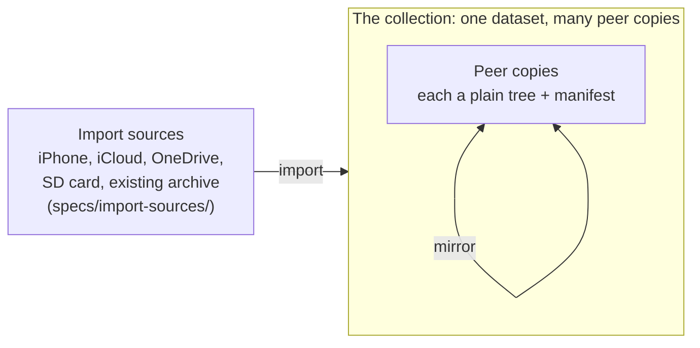

# Turbo-Collection: Specification (Core)

> **Spec version:** 0.1.0-draft **Created:** 2026-07-12 **Status:** Draft. No
> implementation exists yet.

This document is the **normative source of truth** for what Turbo-Collection
must do. It is language-neutral and tool-neutral on purpose, so that the tests
and the implementation can be regenerated from it in any future implementation
language, in the way an RFC outlives any single implementation of a protocol.

This document carries its **own** glossary (Section 3) and its **own**
assumptions list (Section 12), and does not defer them elsewhere. Which document
binds what, that the documents binding the implementation are jointly
sufficient, and how code cites and traces to them, are governed by
`traceability-requirement.md` (`R-META-*`). Which other documents exist, and
what each one governs, is mapped in `docs/spec-guide.md`, which is navigation and
binds nothing, so no obligation here depends on it.

---

## 0. Conventions

**Requirement keywords** (MUST, MUST NOT, SHOULD, SHOULD NOT, MAY) are used as
defined in **RFC 2119**.

**Requirement IDs** in this document are domain-prefixed: `R-COL-1`, `R-SRC-6`,
`R-TGT-12`. Their stability, and uniqueness of a prefix across documents, are
governed by `language-requirement.md` R-LANG-20. A prefix belongs to exactly one
document, so an ID cited here without a document name is still unambiguous.
Prefixes cited by this document and defined elsewhere: `R-META-*` in
`traceability-requirement.md`, `R-MFILE-*` in `meta-file-spec.md`, `R-PHOTO-*`
in `photo-path-layout-spec.md`, `R-PUB-*` in `version-requirement.md`, and
`R-LANG-*` in `language-requirement.md`.

**Document language.** This document is written in **American English**
(`language-requirement.md` R-LANG-21). Stating it here rather than only by
reference matters, because R-VER-8 scatters copies of this document onto every
copy, and `language-requirement.md` does not travel with them.

**Writing rules.** The language discipline this document is written under
(controlled vocabulary, one term per concept, the normative-text/commentary
split) is defined in `language-requirement.md`, which binds every normative
document in this project.

---

## 1. Scope, non-goals, and invocation

The diagram below _is_ Turbo Collection scope statement. It draws the line
between what this document owns, what the import source specifications own, and
what sits outside Turbo-Collection entirely. Note the two boundaries: one where
content enters by import, one where a copy is read and written on its
medium, and nothing vendor-specific between them.

```mermaid
flowchart LR
    IN["Import sources<br/>iPhone, iCloud, OneDrive,<br/>SD card, existing archive<br/>(specs/import-sources/)"]

    subgraph COLL["The collection: one dataset, many peer copies"]
        C["Peer copies<br/>each a plain tree + manifest"]
        C <-->|mirror| C
    end

    IN -->|import| COLL
```

Every copy is a plain tree carrying its own manifest, verifiable against it
independently and reachable as files on its medium (R-TGT-9). **Copies are
peers: no copy is privileged.** Mirroring is symmetric and add-only, filling
whichever copy lacks a file another holds, in whichever direction each file
needs; on a mismatch neither side is authoritative (R-INT-7). Fixity, not
location, is what establishes that data is intact.

### 1.1 In scope

The durable core: Import contract, Storage layout contract, Mirror
semantics, integrity, filename safety, meta file versioning, configuration,
logging, and the command-line contract.

### 1.2 Out of scope

| Concern                                                                        | Where it lives                                                                    |
| ------------------------------------------------------------------------------ | --------------------------------------------------------------------------------- |
| Concrete importers (iPhone, iCloud, OneDrive, SD card) and their format quirks | Import source specifications under `specs/import-sources/`, one per import source |
| _When_ a run happens (scheduling)                                              | Outside Turbo-Collection entirely. See Section 1.4.                               |

### 1.3 Non-goals (normative)

Turbo-Collection does **not** do the following, and MUST NOT grow them by
accident. Each has a documented path to becoming a goal later, in Section 10, so
that deferring them costs no architectural flexibility.

| Non-goal                                     | Path to enabling it |
| -------------------------------------------- | ------------------- |
| Albums and tags                              | Section 10          |
| Captions, ratings, face recognition          | Section 10          |
| AI search                                    | Section 10          |
| A browsing graphical interface               | Section 10          |
| Versioning and snapshots _of the collection_ | Section 10          |
| Deduplication                                | Section 10          |

> These are non-goals, not rejections. The distinction matters: a rejection
> means the idea is wrong, and a non-goal means it is simply not being built
> yet. Section 10 exists to prove the difference is real, by showing exactly
> what each would cost.

### 1.4 Invocation is external

Turbo-Collection is invoked from outside: by **a human on demand**, or by **an
OS scheduler**. Both are equal citizens, and both live outside the system.
Turbo-Collection contains no scheduling logic (R-CLI-2) and is fully usable with
no scheduler installed at all (R-CLI-6).

---

## 2. Guiding principles (normative)

These are the principles the requirements are derived from. Where a requirement
seems to conflict with a principle, the conflict is a defect, and one of the two
must change.

- **Plain data over clever mechanism.** No database, no container, no archive
  format. The data must be so plain that any tool can read it, so that when a
  tool dies the data does not. The same holds at the point a file arrives: a
  vendor may be an import source, never a custodian of what it supplies, so a
  vendor tool can be needed to perform an import but never to read a stored file
  (R-SRC-5).

- **Turbo-Collection only ever adds.** Every operation creates something or
  reports something. Turbo-Collection never deletes a photograph, at an import
  source or in any copy of the collection, and no configuration setting exists
  that would let it. Deleting is a human act, performed with ordinary tools, on
  evidence Turbo-Collection supplies. This principle names a rule seven
  requirements already followed separately (R-COL-2, R-COL-5, R-SRC-7,
  R-MIRROR-2, R-INT-6, R-INT-7, R-NAME-2), each forbidding one destruction. It
  has exactly one carve-out, R-MIRROR-8: a run may remove its own incomplete
  work product, which is not data.

- **Redundancy over cleverness.** Storage is cheap; reliability is not. Given a
  choice between a space-saving mechanism (symlinks, hardlinks, in-place
  transformation, deduplication) and simply storing another copy, choose the
  copy. Duplication that increases the number of independent, self-sufficient
  copies is a feature, not waste. This principle authorizes R-COL-5 (keep the
  original _and_ the derivative) and R-TGT-9 (every copy carries its own
  manifest), and it is why symlink-based schemes are rejected in advance.

- **The Core is indifferent to Import Sources.** The core knows nothing about how a
  file arrived or what medium a copy is stored on. It knows only the collection:
  plain trees and their manifests. Every fact about where a file came from lives
  in Importer that brought it in; every fact about the medium a copy sits on
  lives at the Storage port; none lives in the core.

- **Declare, do not assume.** The importer and the store each state what they
  can guarantee, and Turbo-Collection refuses to proceed on a silent guarantee
  failure (R-SRC-6 on input, R-TGT-6 on output).

- **Re-check, do not trust yesterday.** A guarantee that held last year may not
  hold today. Declared capabilities are re-evaluated on every run and never
  cached (R-SRC-11, R-TGT-12), because the failure this system most needs to
  survive is a vendor quietly changing its behavior.

- **A Record lives with the data it describes, never in a separate index.**
  There is no central database of what is stored where. A directory carries its
  own manifest (R-MFILE-8) and its own receipt (R-MFILE-13); every copy carries
  its own `README.md` (R-MFILE-22), its own configuration stating what it is
  (R-MFILE-19), and optionally its own copy of this document (R-VER-8); no
  memory of an import source is kept between runs (R-SRC-13). A separated
  directory therefore stays interpretable, and there is no index whose loss
  makes surviving media unreadable. The cost is accepted deliberately: records
  are repeated across copies rather than centralized, which is the redundancy
  principle applied to metadata.

- **Data outlives code, and the specification travels with the data.** The
  orchestrator is small and regenerable from this document, so it is disposable.
  This document is not, because it is what makes regeneration possible. So a
  copy of it lives on every copy of the collection, beside the photos it
  describes, and meta files are written so they can be read even if it is lost
  anyway (Section 9).

---

## 3. Terminology

Self-contained, per `language-requirement.md` R-LANG-5.

- **Turbo-Collection.** This system: the orchestrator, its importers, its
  copies' storage, and its mirror engine.

- **Collection.** The set of original files this project preserves: photographs
  and videos, and any other kind of file a layout specification claims
  (R-SRC-15). It is one logical dataset, held as one or more **peer copies**,
  each a plain tree (R-COL-1). This is the data Turbo-Collection exists to
  protect. (The word "library" is deliberately avoided, because it collides with
  "code library".)

- **Plain tree.** A directory structure in which every original exists as
  **exactly one file**, **byte-identical** to the original, at a path derived
  from its path in the collection, and **retrievable without any
  Turbo-Collection software**. A cloud bucket holding one object per file
  qualifies. A chunked, deduplicated, or encrypted repository does not. This
  definition is load-bearing: R-COL-4 and R-TGT-6 both test against it, so it
  must be decidable by inspection rather than by judgment.

- **Layout convention.** A rule that determines where in the collection a
  content file is stored, given that file's own bytes, the metadata its import
  source supplied with it, and that import source. R-COL-4 requires every copy
  to follow the collection's layout conventions, and R-SRC-10 requires a
  convention to depend on nothing beyond those three.

- **Layout specification.** A normative document that defines one layout
  convention and states which items that convention claims (R-SRC-15). Layout
  specifications may coexist, each claiming different items, so that this
  document binds no particular directory shape.

- **Import Source.** One way of getting original bytes into the collection, such
  as iCloud or a camera card. An import source is an **instance**: a personal
  and a work iCloud account are two import sources, each named by the operator
  (`icloud-personal`, `icloud-work`). An importer imports from exactly one import
  source; the leaf manifest records which import source placed a directory (its
  `importSource` block's `specId`, `meta-file-spec.md` R-MFILE-9), and R-SRC-10
  admits that identifier into a collection path. What may be assumed about one
  import source is stated in its own specification under
  `specs/import-sources/`, one specification per import source; such
  specifications may reference one another.

- **Copy.** One physical instance of the collection, held on one storage medium.
  Copies are **peers**: no copy is
  privileged, each carries its own manifest and is verifiable against it
  independently (R-TGT-9), and mirroring is symmetric among them.

- **Importer.** The component that brings original files into the collection
  from one **import source**. An importer is internal to Turbo-Collection and
  reaches exactly one import source; an import source is the outside origin
  files are imported from.

- **Medium.** Where a copy is stored: a local drive, a removable drive, or a
  cloud bucket. A copy is read and written as plain files on its medium, by
  import, mirror, and verify alike. Each copy declares what its medium can and
  cannot guarantee (R-TGT-5).

- **Original.** A file exactly as it arrived, byte-for-byte.

- **Derivative.** Anything Turbo-Collection produced from an original (for
  example, a JPEG rendered from a HEIC). Always additional, never a replacement
  (R-COL-5).

- **Content file.** An original or a derivative: any file a copy holds that is
  neither a meta file nor an ignored file. Photographs and videos are one kind
  of content file; which kinds a collection takes in is decided by layout
  specifications (R-SRC-15), not by this document. Several requirements are
  scoped to content files, because a rule that protects a photograph from being
  altered would otherwise forbid Turbo-Collection from writing down what it did.

- **Meta file.** A file Turbo-Collection writes into a copy that describes that
  copy or what happened to it: the configuration file, the ignore file, a
  manifest, a receipt, the `README.md`, and any copy of a specification carried
  on a drive. What each one is called, where it sits, and what is inside it are
  stated by `meta-file-spec.md`. Content files are preserved untouched, exactly
  as they arrived. Every file in a copy is a content file, a meta file, or an
  ignored file. A log is none of these, because a log is never written inside a
  copy (R-LOG-5).

- **Ignored file.** A file in a copy that matches a pattern in that copy's
  ignore file, `.tcignore` (`meta-file-spec.md` R-MFILE-20). Turbo-Collection
  records no ignored file in a manifest and mirrors none to another copy
  (R-MFILE-21).

- **Published File with Specification Version).** Stamped into a meta file that
  has left the machine holding the collection (`version-requirement.md`
  R-PUB-3). A version whose stamp carries the `-draft` suffix is not published;
  it changes freely.

- **MAJOR Version.** All versions of this specification that share a MAJOR
  number (for example, the 2.x line). The **terminal text** of a line is its
  last published version at the moment the line is superseded by the next MAJOR.

- **Major Version Upgrade.** The conversion of a copy of the collection from an
  older MAJOR version of `meta-file-spec.md` to the current one (R-MFILE-24,
  R-MFILE-25). It is not an operation of its own: an operation that writes into
  such a copy performs it first (R-VER-22).

- **Import.** Bringing files into the collection from an import source, performed by an importer.

- **Init.** The operation that creates a directory for new copy with no other
  copy present, which is how a collection's first copy comes to exist
  (R-CLI-11).

- **Adoption.** The import that the init operation performs of the files already
  in a directory as it makes that directory a copy (R-CLI-12). An adopted file
  stays at the path it had.

- **Backup.** The operation an operator runs to bring the collection's peer
  copies into agreement, so the collection survives the loss of any one copy
  (R-CLI-5). Its mechanism is a non-destructive, symmetric mirror across those
  copies (Section 7.1); recovering data from a copy is _restore_. A backup given
  an empty directory, or one that does not exist, creates a new copy there
  (R-CLI-13); every copy after the first comes to exist this way.

- **Procedure.** A normative document stating the steps a human operator
  performs to achieve a result this specification requires. It binds the
  operator, not the implementation (R-META-4).

- **Mirror.** To bring peer copies into agreement by copying to a copy any
  content file another copy holds and it lacks (R-MIRROR-1), and recording each
  arrival in the receipt of each directory written (R-REC-5). Mirroring is
  **symmetric** (no copy is privileged; it fills whichever copy is missing a
  file, in whichever direction each file needs) and **add-only** (it never
  overwrites a differing file and never deletes). Both the transfer and its
  record are parts of one operation; a transfer whose arrival is unrecorded is
  an incomplete mirror. The mirror is the mechanism the **backup** operation
  performs.

- **Receipt.** A per-directory record of the arrivals of that directory's
  content: where it came from, and the dated arrival of that content at each
  copy (R-MFILE-13). A manifest states what is present now and can be rebuilt by
  rescanning; a receipt states what happened and can be rebuilt from nothing.

- **Arrival.** One event in which content reaches a copy: an import bringing
  external bytes into a copy, or a mirror bringing to a copy content another
  copy already holds. Arrivals are what change the number of copies holding a
  file, and are therefore the only events a receipt records (R-MFILE-13).

- **Dry-run.** A mode in which Turbo-Collection reports what an operation would
  do and mutates nothing (R-SRC-14, R-MIRROR-7).

- **Temporary file.** A file Turbo-Collection creates while writing another
  file, and which never becomes a complete file at its final path. Removing one
  is the single carve-out from R-MIRROR-3 (R-MIRROR-8).

- **Manifest.** A JSON file recording a checksum for each file in a copy,
  together with the hash algorithm and the specification version that produced
  it (R-MFILE-9).

- **Fixity.** Evidence that data has not changed or corrupted, established by
  comparing checksums.

- **Capability.** A statement by an importer about what it can and cannot
  guarantee (R-SRC-6, R-TGT-5). Re-evaluated every run.

- **Run.** A single invocation of Turbo-Collection, which performs its work once
  and exits.

- **Grouping.** A named set of items within the collection (an album, a tag).
  **Defined here but reserved:** groupings are a non-goal for now (Section 1.3).
  The term is fixed in advance so that the extension path in Section 10 has a
  name to use.

---

## 4. Collection invariants (`R-COL-*`)

These constrain the collection itself. They outrank everything else in this
document: any requirement that conflicts with them is wrong and must be changed.

**R-COL-1.** The collection MUST be a plain directory tree of ordinary files.
Turbo-Collection MUST NOT introduce a database, archive, container, or any other
format that requires software to read the files back.

**R-COL-2.** Turbo-Collection MUST preserve originals byte-for-byte. It MUST NOT
transcode, recompress, resize, or strip metadata from an original, under any
circumstance, including at import.

**R-COL-3.** The collection MUST remain fully usable without Turbo-Collection.
Any ordinary file manager or file-copy tool MUST be sufficient to browse it and
recover its contents.

**R-COL-4.** **Every** copy MUST be a plain tree, laid out under the same layout
conventions, so that a content file's path is derived the same way in every
copy. A copy MAY hold a content file that another copy does not.

> **Example.** One copy may hold photos another lacks; that is intended, and not
> a discrepancy to be fixed by deleting.

**R-COL-5.** A derivative in an open format (for example, a JPEG rendered from a
HEIC, or a DNG from a proprietary RAW) MAY be stored **in addition to** the
original. It MUST be identifiable as derived, and it MUST NEVER replace an
original. Deleting every derivative MUST leave the collection complete.

> **Example.** The HEIC stays; a JPEG rendered from it sits beside it as a
> hedge, flagged as derived.

> **Rationale.** The plain-files thesis and add-only shape behind these
> invariants, and why proprietary formats are hedged:
> [design-record §2 and §3](../docs/design-record.md); the withdrawal that lets
> one copy hold files another lacks:
> [the append-only decision](../docs/decisions/2026-08-13-append-only-decision.md).

---

## 5. Import (`R-SRC-*`)

The core must be indifferent to whether a photo arrived by cable, from iCloud,
through a OneDrive sync folder, or from something not yet invented.

This contract is specified completely enough (R-META-1) that **anyone can write
an importer from this document alone, without modifying Turbo-Collection's
core.** That is the extensibility that matters. How importers are loaded is a
binding (Section 12), not a requirement.

**R-SRC-1.** Files MUST enter the collection only by import. The
core MUST contain no logic specific to any individual import source, device,
vendor, or service.

**R-SRC-2.** Adding support for a new import source MUST require writing only a new
importer. It MUST NOT require changing the core, this specification's
requirements, or any existing importer.

**R-SRC-3.** Which import sources a run draws from, and their settings, MUST be
supplied to Turbo-Collection as data rather than hardcoded in code. An import
source MUST be able to be added or removed without a code change.

**R-SRC-4.** Multiple import sources MUST be able to coexist and MUST be importable
independently. The failure of one import source MUST NOT prevent import from another,
and MUST still be reported.

**R-SRC-5.** An importer MUST supply the **original bytes** of each item, as
plain files. It MUST NOT transcode, recompress, or strip metadata in the course
of importing. A vendor tool MAY be required to perform an import. A vendor tool
MUST NOT be required to read a stored file. Where an import source delivers content only
inside a proprietary container, the importer MUST unpack it to plain original
files within the import, and MUST refuse where it cannot.

**R-SRC-6.** **The honesty requirement.** If an import source **cannot** supply original
bytes, the importer MUST declare this, and Turbo-Collection MUST report it.
Turbo-Collection MUST NOT silently accept a degraded file as though it were an
original. A degraded import MUST be either refused or explicitly recorded as
degraded, per configuration, and **the default MUST be to refuse**.

> **Example.** A cloud import source that returns a slightly recompressed file and
> reports success is refused by default, not imported as an original.

**R-SRC-7.** Import MUST be read-only with respect to the origin, except in
adoption (R-CLI-12), where the origin is the directory being made a copy: there,
Turbo-Collection MAY write meta files into that directory, and MUST NOT delete,
modify, or move an adopted file. An importer MUST NOT delete, modify, or move
anything at the import source.

**R-SRC-8.** Import MUST be idempotent. Importing the same item twice MUST NOT
produce a duplicate in the collection, and re-running an interrupted import MUST
converge rather than accumulate.

**R-SRC-9.** An item consisting of multiple files that are semantically one
thing (for example, a still image and its paired motion clip) MUST be imported
atomically: either all of its parts arrive, or none do. An importer MUST NOT
split such an item silently.

**R-SRC-10.** The collection path of an item MUST be a pure function of the
item's own bytes, the metadata the import source supplies with it, and that
import source, under the collection's layout convention.

> **Example.** No `-2` suffix to disambiguate import order, and no directory
> named for a label a person adds after import.

**R-SRC-11.** An import source's capabilities MUST be re-evaluated on every run and MUST
NOT be cached from a previous run. An import source that _begins_ degrading files MUST
be caught at the next import, and MUST NOT be assumed to still be honest merely
because it was honest before.

**R-SRC-12.** **Import is additive.** Import MUST add files to the collection,
and MUST NOT delete, move, rename, or modify a file already in the collection.
If an import source no longer holds an item the collection already holds,
Turbo-Collection MUST take no action and MUST NOT report a discrepancy.

**R-SRC-13.** Turbo-Collection MUST NOT compute, record, or report which items an
import source no longer supplies. Turbo-Collection MUST hold no record of an
import source's contents between runs, and MUST establish that an item is already
imported by inspecting the collection rather than by comparing against a previous
state of the import source.

**R-SRC-14.** Turbo-Collection MUST support a dry-run mode for import that
reports every item a real import would add to the collection, and mutates
nothing.

> **Example.** Before freeing space at an import source, an import dry-run that reports
> zero pending items shows everything there has already reached the collection.

**R-SRC-15.** A layout specification MUST state which items it claims, as a
condition on an item's own bytes, the metadata its import source supplies with
it, and that import source. Turbo-Collection MUST determine an item's collection
path under the layout specification that claims that item. Turbo-Collection MUST
NOT import an item that no layout specification claims, and MUST report every
such item. If more than one layout specification claims an item,
Turbo-Collection MUST refuse to run.

> **Example.** An item no layout claims is reported and skipped; an item two
> layouts claim stops the run, because its path would be ambiguous.

**R-SRC-16.** On importing into an existing import-source directory,
Turbo-Collection MUST compare the running import source's version against the
`importSource.version` that directory's manifest records (`meta-file-spec.md`
R-MFILE-9). If they share the same MAJOR line (`version-requirement.md`
R-PUB-1), Turbo-Collection MAY reuse the directory, and where it writes to it
MUST re-stamp `importSource.version` to the running version. If the running
version begins a new MAJOR line, Turbo-Collection MUST NOT reuse the directory,
and MUST place the imported content under a different import-source `specId`.
What compatibility an import source guarantees within a MAJOR line is stated by
that import source's own specification; the core does not adjudicate it.

**R-SRC-17.** An importer MUST NOT write into a copy of the collection, and MUST
NOT create, modify, or delete any meta file. Turbo-Collection alone writes
collection content and meta files: an importer supplies an item's content, and
Turbo-Collection reads it, determines the item's collection path (R-SRC-10), and
performs the write.

**R-SRC-18.** An importer MAY declare the number of items it expects to supply
in a run. Where it does, Turbo-Collection MUST compare that count against the
number of items it actually received from the importer, and MUST report any
mismatch.

**R-SRC-19.** An importer MUST be able to detect degradation of an item, by
verifying delivered bytes against something the import source exposes about the
original, such as its size, codec, or a hash. Where an importer cannot detect
whether an import source degrades, it MUST refuse that import source rather than import from
it.

> **Rationale.** Why the honesty and detectability rules, the import-source path
> segment, and the version re-stamp are shaped this way:
> [the import-source decision](../docs/decisions/2026-08-22-import-source-decision.md),
> [the append-only decision](../docs/decisions/2026-08-13-append-only-decision.md),
> and [design-record §2](../docs/design-record.md).

---

## 6. The Storage port (`R-TGT-*`)

The contract through which a copy is read from and written to its storage
medium, held to the same discipline as the importer. A copy is reached only
through the Storage port.

A copy is **not merely a path.** Its store is an adapter that declares what it
can and cannot guarantee. (The `R-TGT-*` requirements keep the IDs they carried
when this was the Target port; the concept is reframed, the numbers are not.)

**R-TGT-1.** A copy MUST be read and written only through the Storage port. The
core MUST contain no logic specific to any individual storage medium, vendor, or
service.

**R-TGT-2.** Adding support for a new kind of storage medium MUST require
writing only a new adapter. It MUST NOT require changing the core, this
specification's requirements, or any existing adapter.

**R-TGT-3.** Which copies a run acts on, and the storage settings each needs,
MUST be supplied to Turbo-Collection as data rather than hardcoded in code.

**R-TGT-4.** Multiple copies MUST be able to coexist and MUST be acted on
independently. The failure against one copy MUST NOT prevent the attempt against
another, and MUST still be reported.

**R-TGT-5.** A storage adapter MUST declare its capabilities: whether the copy
it backs is a plain tree, whether it can be verified in place, whether it is
remote, and whether it can report a stable identifier for the volume the copy is
stored on (R-MFILE-26, R-REC-9).

**R-TGT-6.** **The plain-tree guarantee.** Turbo-Collection MUST refuse to run
if any copy it would act on does not declare itself a plain tree. This check
MUST happen before any work is done, enforcing R-COL-4 rather than merely hoping
for it.

**R-TGT-7.** A storage adapter MUST NOT modify, rename, move, or delete a file
already present in the copy it backs, meta files included. Adding a new file the
core hands it is not a modification. Writing a copy's receipt is the core's
responsibility, never an adapter's (R-REC-6).

**R-TGT-8.** A storage adapter MUST NOT delete a file it holds, and MUST NOT
expose an operation that deletes a file it holds. (This is the adapter-level
counterpart of R-MIRROR-3, deliberately duplicated so that a defect in one layer
alone cannot destroy data.)

**R-TGT-9.** Each copy MUST carry, in each of its directories, a manifest
covering **that directory's own** contents (R-MFILE-8), so that the copy is
self-verifying without any other copy and without Turbo-Collection, and so that
any single directory remains verifiable when separated from the rest.

**R-TGT-11.** Every copy MUST be restorable by ordinary file copy, using no
Turbo-Collection software.

> **Example.** With Turbo-Collection gone, a finder restores a copy by copying
> its files off the drive with any file manager.

**R-TGT-12.** A copy's storage capabilities MUST be re-evaluated on every run
and MUST NOT be cached from a previous run (symmetric to R-SRC-11). A copy that
has ceased to be a plain tree MUST be caught **before** it is written to, not
after.

> **Rationale.** Why a copy is a declared plain tree rather than a bare path,
> and what a copy carries for a future finder:
> [design-record §4 and §5](../docs/design-record.md),
> [the peer-model decision](../docs/decisions/2026-09-05-peer-model-decision.md),
> and
> [the storage-hardware decision](../docs/decisions/2026-08-10-storage-hardware-decision.md).

---

## 7. Preservation requirements

### 7.1 Mirroring (`R-MIRROR-*`)

The semantics of the mirror mechanism, as distinct from the storage contract in
Section 6. Mirroring is symmetric between peer copies, and is what the
**backup** operation (R-CLI-5) performs.

**R-MIRROR-1.** When mirroring two copies, Turbo-Collection MUST copy to each
copy every content file the other holds that is absent at it. If a **content
file** is present in both copies with differing content, Turbo-Collection MUST
NOT overwrite either copy, and MUST report the difference (R-INT-7). A meta file
MAY be replaced, under the conditions its own requirements state (R-REC-7 for a
receipt, R-INT-10 for a manifest).

> **Example.** Two copies hold different bytes at the same path: neither is
> overwritten, and the difference is reported.

**R-MIRROR-2.** Mirroring MUST be read-only with respect to every **content
file** already present in a copy. It MUST NOT modify, rename, move, or delete
one. Mirroring MUST record each arrival it makes in that directory's receipt,
and beyond the content files it adds and the meta files R-MIRROR-1 permits, MUST
write no other file into a copy (R-REC-5).

**R-MIRROR-3.** Turbo-Collection MUST NOT delete a file in any copy, and MUST
NOT provide a configuration setting or a command-line flag that permits deletion
in a copy. The single exception is R-MIRROR-8.

**R-MIRROR-4.** **Idempotence.** Mirroring copies already in agreement MUST
transfer no file data.

**R-MIRROR-5.** Turbo-Collection MUST support more than one copy and MUST treat
each independently: a failure against one MUST NOT prevent the attempt against
another, and MUST still be reported.

**R-MIRROR-6.** An interrupted run (power loss, disconnected drive, termination)
MUST leave a copy in a state from which a subsequent run converges to a correct
mirror. A run MUST NOT leave a partially-written file that a later run would
mistake for a complete one.

**R-MIRROR-7.** Turbo-Collection MUST support a dry-run mode that reports
exactly what a real run would transfer, and mutates nothing.

**R-MIRROR-8.** **The carve-out for incomplete work.** Turbo-Collection MAY
remove a temporary file (Section 3) that Turbo-Collection itself created.
Turbo-Collection MUST NOT remove anything else. A temporary file MUST be
identifiable as a temporary file by its name or its location, so that a human
can audit every such removal without Turbo-Collection.

> **Example.** A half-written `photo.jpg.part` from an interrupted run may be
> removed; `photo.jpg` may not.

**R-MIRROR-9.** Turbo-Collection MUST verify a content file against its copy's
manifest immediately before copying that file to another copy. Turbo-Collection
MUST NOT copy a file whose checksum does not match, and MUST report the
mismatch.

> **Example.** A file that corrupted silently in one copy is caught before it
> reaches a fresh copy.

> **Rationale.** Why mirroring is add-only and symmetric, and what that costs
> and buys:
> [the append-only decision](../docs/decisions/2026-08-13-append-only-decision.md)
> and [design-record §2](../docs/design-record.md).

### 7.2 Integrity (`R-INT-*`)

**R-INT-2.** Turbo-Collection MUST be able to verify any copy against a
manifest, and MUST report every discrepancy it finds.

**R-INT-3.** Verification MUST distinguish these outcomes per file, and MUST NOT
conflate them: **ok**; **missing** (in the manifest, absent on disk);
**corrupt** (present, but the checksum differs); **extra** (present on disk,
absent from the manifest).

**R-INT-5.** The manifest MUST record which hash algorithm produced it, so that
changing the algorithm later is explicit and detectable rather than silent.

**R-INT-6.** Verification MUST NOT repair, overwrite, or delete anything as a
side effect. It reports. Any repair MUST be a separate, explicitly requested
action.

> **Example.** Verification only reports; a verifier that "repaired" could
> overwrite a good copy with a bad one.

**R-INT-7.** On a mismatch between two copies' **content files** at the same
path, Turbo-Collection MUST report **which copies differ** and MUST NOT treat
any copy as authoritative. Choosing the surviving copy is a human decision. This
requirement MUST NOT be applied to meta files, which are per-copy records and
are expected to differ between copies.

**R-INT-8.** Turbo-Collection MUST report a **content file** that is **extra**
(present on disk, absent from its directory's manifest) as a finding, in
whichever copy it appears. This outcome alone MUST NOT cause a non-zero exit
status, because a copy may legitimately hold a content file that its manifest,
written before that file was mirrored in, does not list. Turbo-Collection MUST
NOT report a manifest as **extra** in any copy, since R-MFILE-8 excludes it by
design.

**R-INT-10.** Turbo-Collection MUST NOT replace a file's recorded checksum with
a newly computed one unless Turbo-Collection wrote that file's current content
itself. Rebuilding a manifest from a copy's present contents MUST be an action a
human explicitly requests, and MUST report every difference against the existing
manifest rather than overwriting it silently. Adding an entry for a file not yet
covered is not a replacement and is unrestricted.

> **Example.** A silent rebuild would hash a corrupted file and record its bad
> checksum as correct.

> **The manifest.** Its name, placement, fields, and format are stated by
> [`meta-file-spec.md`](meta-file-spec.md) (R-MFILE-8 through R-MFILE-12), the
> only document code may cite for them.

> **Rationale.** Why detection and repair are kept separate, why a manifest
> rebuild is never silent, and why JSON with nothing beside it:
> [the manifest-format decision](../docs/decisions/2026-08-16-manifest-format-decision.md)
> and
> [the append-only decision](../docs/decisions/2026-08-13-append-only-decision.md).

### 7.3 Filename safety (`R-NAME-*`)

**R-NAME-1.** Before copying, Turbo-Collection MUST check collection filenames
for hazards that do not survive a move between common filesystems, and MUST
report them. At minimum: characters reserved on some filesystems; names
differing only by case; Unicode normalization differences (NFC versus NFD);
trailing spaces or dots; reserved device names; and path lengths beyond common
limits.

**R-NAME-2.** Turbo-Collection MUST NOT silently rename a file to resolve such a
hazard. It reports; the human decides.

**R-NAME-3.** A filename hazard MUST NOT, by default, abort an otherwise valid
run. Hazards are reported as warnings, because a name that is harmless on
today's filesystem still needs backing up today.

### 7.4 Receipts (`R-REC-*`)

**R-REC-5.** Turbo-Collection MUST write an arrival file only **after** the
content that arrival covers has been completely written to the copy the arrival
names. The content an arrival covers is the content present in the directory at
that moment, which MAY be less than the whole directory; every file it covers
MUST be completely written, so that a partial arrival is still an honest
snapshot.

> **Example.** A run that dies mid-transfer leaves no arrival claiming the
> content arrived.

**R-REC-6.** On a mirror, Turbo-Collection MUST record an arrival as a receipt
file (R-MFILE-13, R-MFILE-14) for each directory into which it placed content,
and MUST bring both copies' receipt files to the union of the two for every
directory the mirror covers, not only those into which it placed content,
copying into a copy every receipt file the other holds that it lacks and never
overwriting one, since receipt files are immutable (R-MFILE-13). A directory in
which the mirror placed nothing gets no new arrival, because an arrival records
a placement and not a verification (R-REC-8), yet its receipt files still
converge, so one connected copy reports every copy's state for every directory
rather than only for those a given run changed. Every receipt write is the
core's responsibility; a storage adapter MUST NOT write a receipt (R-TGT-7).

**R-REC-7.** Turbo-Collection MUST NOT delete or alter a receipt file
(R-MFILE-13). An error therefore outlives the problem it describes: when the
content an error names later reaches the copy, the arrival is a new file and the
earlier error file remains, so the receipt states both events.

**R-REC-8.** A receipt records where content was **placed**, not where it
**remains**. Turbo-Collection MUST NOT treat a receipt as evidence that a copy
still exists or is still intact, and MUST NOT state a copy count derived from
receipts without stating the date of each arrival counted.

**R-REC-9.** Turbo-Collection MAY record a location receipt (R-MFILE-26) for the
copy it is operating on, stating that copy's `volumeId` and `relativePath` so a
later run can find the copy with fewer questions. It MUST write one only when
the copy's observed location differs from the most recent location receipt
already on record for that copy, so that an unchanged location does not
accumulate files. A location receipt locates a **candidate** only:
Turbo-Collection MUST confirm a copy's identity by reading its configuration
(R-MFILE-19) before treating a found copy as that copy or writing to it, and
MUST NOT infer identity from a matched `volumeId` or `relativePath`. The hint
MUST be optional and non-load-bearing: Turbo-Collection MUST function without
it, MUST fall back to asking when it is absent or no longer resolves, and MUST
NOT store an absolute path, deriving the mount point at run time from `volumeId`
through the Storage port (R-TGT-5) instead. Location receipts propagate as every
receipt file does: on a mirror, Turbo-Collection MUST bring both copies'
copy-root location receipts to the union of the two, copying into each copy
every one the other holds that it lacks and never overwriting one (R-REC-6,
R-REC-7). A location receipt records where a copy was **observed**, not where it
**remains** (R-REC-8).

> **Example.** A matched `volumeId` says only "look here"; the copy's identity
> is confirmed from its own configuration (R-MFILE-19), never from the matched
> id, so a reformatted or swapped drive simply fails to resolve.

> **Rationale.** Why receipts exist and are not logs, record arrivals and errors
> but never verifications, stay immutable, and why a location hint never settles
> identity:
> [the receipts decision](../docs/decisions/2026-09-07-receipts-decision.md) and
> [the location-receipt decision](../docs/decisions/2026-09-10-location-receipt-decision.md).
> The receipt file format, with a worked example, lives in
> [`meta-file-spec.md`](meta-file-spec.md) (R-MFILE-13).

---

## 8. Operation: configuration, logging, and the command line

> **Rationale.** Why configuration travels with the collection, why a copy names
> itself, why init and backup are the only operations that create a copy, and
> why the read-only inspections are kept distinct:
> [the config-placement decision](../docs/decisions/2026-09-27-config-placement-decision.md),
> [the collection-naming decision](../docs/decisions/2026-09-28-collection-naming-decision.md),
> [the backup-naming decision](../docs/decisions/2026-09-27-backup-naming-decision.md),
> and [design-record §10](../docs/design-record.md).

### 8.1 Configuration (`R-CFG-*`)

**R-CFG-1.** Turbo-Collection MUST read a copy's own identity and any persisted
option from an external configuration file, whose contents `meta-file-spec.md`
states, rather than hardcoding them. It MUST NOT hardcode any path, and MUST NOT
require a copy to declare the other copies expected to exist, which are
discovered at run time.

**R-CFG-3.** Turbo-Collection MUST validate configuration **before** performing
any filesystem mutation. Invalid configuration MUST cause the run to fail
immediately, with no partial effect.

**R-CFG-4.** Turbo-Collection MUST fail rather than guess. A missing, ambiguous,
or unparseable setting MUST NOT be silently defaulted into a behavior that loses
data or accepts a worse file. In particular, it MUST NOT default into accepting
a degraded import (R-SRC-6).

**R-CFG-5.** Turbo-Collection MUST be fully operable with configuration supplied
from the collection's own storage or on the command line, and MUST NOT require
configuration held on the host computer. A host-specific location MAY be
searched as a convenience; it MUST NOT be the only place configuration can live.

### 8.2 Logging (`R-LOG-*`)

**R-LOG-1.** Every run MUST write a plain-text log recording at minimum: start
time; end time; the configuration used; per import source, the count of items imported
and any degraded or refused items; per copy, the count and byte total of files
transferred; every error encountered; and the final outcome.

**R-LOG-2.** Logs MUST be observability only. The correctness of any copy of the
collection MUST NOT depend on a log file existing or being readable.

**R-LOG-3.** A run's log MUST record the Turbo-Collection version and the
specification version it conforms to, so that a past run's behavior can be
reconstructed.

**R-LOG-4.** Failures MUST be reported in the log even when the process exits
non-zero. A crash MUST NOT be the only evidence that something went wrong.

**R-LOG-5.** A log MUST NOT be the only record of an event that changes whether
material at an import source can safely be deleted. Such events are recorded in receipts
(R-MFILE-13); a log MAY additionally record them and MUST NOT be relied on to.
Turbo-Collection MUST NOT write a log inside a copy. A log MAY be written
elsewhere on a drive that holds a copy, and MAY be ephemeral and local to the
computer performing the run.

### 8.3 Command line (`R-CLI-*`)

**R-CLI-1.** Turbo-Collection MUST exit **0** on success and non-zero on
failure. (The taxonomy of failure classes is deliberately deferred; see Section
8.5 and Section 14.)

**R-CLI-2.** **One-shot.** Turbo-Collection MUST perform one run and exit. It
MUST NOT daemonize, poll, or schedule itself. _When_ it runs is the
responsibility of whatever invokes it.

**R-CLI-3.** Turbo-Collection MUST be fully operable from a command line, with
no graphical interface required. A graphical interface, if one is ever built,
MUST be a consumer of this core and MUST NOT be a dependency of it.

**R-CLI-4.** Turbo-Collection MUST NOT require network access to back up to a
locally-attached copy.

**R-CLI-5.** Every operation MUST be independently invocable on demand, not only
as part of a combined run: **init**, **import**, **backup**, **status**, and the
verify inspections, **verify fixity** (R-INT-2), **verify access** (R-CLI-9),
and **verify names** (R-NAME-1). Dry-run MUST be a mode of **init** (R-CLI-11),
of **import** (R-SRC-14), and of **backup** (R-MIRROR-7), not a separate
operation.

**R-CLI-6.** Turbo-Collection MUST be fully usable with **no scheduler installed
or configured**. Scheduling is optional.

**R-CLI-7.** Effects MUST be identical whether Turbo-Collection is invoked by a
human or by a scheduler. Output formatting MAY differ (for example, progress
reporting on a terminal); effects MUST NOT.

**R-CLI-8.** An operation MUST NOT require an interactive prompt to complete,
because a scheduled run cannot answer one. Every option that changes what a run
does MUST be settable in configuration or by a command-line flag.

**R-CLI-9.** Turbo-Collection MUST provide a read-only **verify access**
inspection that transfers and modifies nothing, and that reports, for every
import source and copy a run would act on: whether it is reachable and authorized; what
capabilities it **currently** declares (R-SRC-11, R-TGT-12); and whether the
configuration would be refused (R-TGT-6).

**R-CLI-10.** Turbo-Collection MUST provide a read-only **status** operation
that reports, from receipts alone and with no other copy connected, which copies
each directory's content has reached, the date of each arrival, and the content
present that has reached no other copy. It MUST report every arrival's date
(R-REC-8), and MUST NOT state or imply that a copy still exists or is still
intact.

**R-CLI-11.** Turbo-Collection MUST provide an **init** operation that makes the
directory it is given a copy, by writing into that directory a configuration
file (`meta-file-spec.md` R-MFILE-17), a `README.md` where none exists
(R-MFILE-22), and, where no ignore file exists, an ignore file holding the
starter patterns that `meta-file-spec.md` describes (R-MFILE-20). Init MUST
create a directory it is given that does not exist (R-CLI-14). Init MUST take
the new copy's `collectionName` from a name given on the command line, and MUST
use `main` where no name is given. Init MUST refuse to act on a directory that
is inside a copy or that contains a copy. Given a directory that is already a
copy, init MUST fail without changing anything, and MUST report that the
directory is already a copy.

**R-CLI-12.** Having made a directory a copy, init MUST adopt every file, other
than a meta file or an ignored file, that is already in that directory or in a
directory beneath it, by importing each such file from
an import source whose items are the files already there. Turbo-Collection MUST
leave each adopted file at the path it had, and MUST NOT move, rename, modify,
or delete an adopted file. Where the layout specification that claims an adopted
item (R-SRC-15) would place that item at a different path, init MUST refuse to
run.

> **Example.** A starter ignore file is written before adoption, so a
> `.DS_Store` the OS scatters is not adopted as permanent content.

**R-CLI-13.** In a **backup**, Turbo-Collection MUST mirror every directory the
backup is given that is a copy (Section 7.1). Before mirroring, Turbo-Collection
MUST create a new copy in each directory the backup is given that does not
exist, or that holds no file at any depth except files matching a pattern in the
ignore file of the backup's existing copy. Turbo-Collection MUST refuse a backup
that would create a new copy unless that backup is given exactly one existing
copy. Turbo-Collection MUST refuse to create a new copy unless a name for the
new copy is given on the command line; that name becomes the new copy's
`collectionName`. To create a new copy, Turbo-Collection MUST write into its
directory a configuration file (`meta-file-spec.md` R-MFILE-17), a `README.md`
(R-MFILE-22), and, where the existing copy has an ignore file, a duplicate of
that ignore file (R-MFILE-20). Turbo-Collection MUST refuse to act on a
directory given to a backup that is not a copy and that holds any file not
matching such a pattern, and MUST report every file that directory holds.

> **Example.** A backup creates a copy only in an empty directory, so files
> already there are not pulled into the collection by the two-way mirror.

**R-CLI-14.** Turbo-Collection MUST NOT create a copy in any operation other
than **init** and **backup**, and in every other operation MUST refuse to act on
a directory given as a copy that is not a copy. Where init or backup creates a
directory, Turbo-Collection MUST create only the last segment of that
directory's path, and MUST refuse a path whose parent directory does not exist.

> **Example.** Only the final path segment is created, so a disconnected
> removable drive fails rather than building a copy on the local disk.

### 8.4 Distinct read-only inspections

"Verify my collection" sounds like one request, but it is several. Each MUST be
separately answerable (R-CLI-5), because they fail in different ways and at
different times.

| Question                                                                                | Operation                | Requirement |
| --------------------------------------------------------------------------------------- | ------------------------ | ----------- |
| Are my import sources and copies reachable, authorized, and still honoring what they promised? | **verify access**        | R-CLI-9     |
| Do the bytes on this copy still match the manifest? (fixity)                            | **verify fixity**        | R-INT-2     |
| Would any filename fail to survive a move to another filesystem? (name hazards)         | **verify names**         | R-NAME-1    |
| How far apart are two copies? What _would_ a run transfer? (drift)                      | **backup**, dry-run mode | R-MIRROR-7  |
| What does this import source still hold that the collection lacks? (import-source coverage)           | **import**, dry-run mode | R-SRC-14    |
| How many copies hold this content, and when did each receive it? (propagation)          | **status**               | R-CLI-10    |

> **Example.** `status` reads receipts, not bytes, so it reports which copies
> received content and when with no other drive connected; it never claims a
> copy still exists or is intact today (R-REC-8).

### 8.5 Exit status

Turbo-Collection MUST exit **0** on Success and non-zero on failure (R-CLI-1).
That is all this specification commits to at this version.

The taxonomy of failure classes, and their specific exit codes, is deliberately
left open until the failure modes have been worked through properly (Section
14). Fixing an exit-code table before knowing what can actually go wrong would
be inventing a contract that cannot yet be justified.

---

## 9. Versioning and change (`R-VER-*`)

This section governs how this specification's own version is decided (9.2), how
meta files declare the version that governs them (9.3), and how a copy crosses a
format-generation boundary (9.4).

> **Where the rest of it went.** How a normative document in this project is
> numbered, published, archived, and corrected is stated in
> [`version-requirement.md`](version-requirement.md), which binds every
> normative document here, including this one. Those rules bind the authors of
> documents, and code has nothing to cite in them. Everything left in this
> section binds the implementation.

### 9.1 The regress, and where it stops

Code is regenerable from this specification, so code need not be preserved. But
**this specification changes too**, which appears to relocate the problem rather
than solve it: now we must know which version a meta file was written under, and
we must preserve the specification itself. That is a real objection, and it is
answered in three moves.

1. **The specification is a meta file, and it travels with the data.** Every
   copy carries the version it was written under (R-VER-8). It is a few tens of
   kilobytes against terabytes; the redundancy principle (Section 2) authorizes
   this without argument. The specification cannot float away into abstraction,
   and it cannot die with a code-hosting service: it survives as long as any
   copy of the collection survives.

2. **Meta files are self-_evident_, not merely self-_described_** (R-MFILE-6). A
   version stamp tells a reader _which rules applied_; it MUST NOT be the _key
   to decoding_. A manifest is one checksum and one path per line: it can be
   read by looking at it, with no specification in hand. So losing the
   specification entirely is survivable. This property is available only because
   every format is plain text, which is the payoff of the choice already made in
   R-COL-1.

3. **Versioning does not require a decoder.** RFCs _are_ versioned, and
   rigorously: each is immutable once published, and a later RFC explicitly
   obsoletes or updates an earlier one. What RFCs never needed was a _version of
   English_. That is the distinction that matters: a binary format's version
   tells you **which decoder to use**, so losing its specification destroys the
   data; a prose specification's version tells you **which document you are
   reading**, and you can read it regardless. The chain of versions terminates
   in something a human, or an AI, can simply read. The regress stops, and it
   stops because of what the meta files are made of, not because versioning was
   avoided.

### 9.2 The version of this specification

**R-VER-1.** The bump of this specification's semantic version MUST be decided
by the effect on **behavior**. **MAJOR**: previously conforming behavior becomes
forbidden; or a port contract changes so that an existing adapter stops
conforming; or the document language or obligation vocabulary changes
(`version-requirement.md` R-PUB-9). **MINOR**: additions only; everything
conforming under the previous version still conforms. **PATCH**: prose
improvement with no behavioral consequence. A change of meta file format is
measured by `meta-file-spec.md`, and a change of layout by the layout
specification it belongs to, under each of their own bump tests.

### 9.3 Stamps and self-evidence

**R-VER-8.** Every copy MUST record which specification version and which layout
convention governed the writing of its content. Every copy SHOULD additionally
carry the text of those documents, so that the rules governing the data survive
alongside the data; where carried, each MUST be named for the document and the
full version of the text it holds, as `turbo-collection-spec-<version>.md`.

**R-VER-9.** Code MUST declare which specification version it conforms to, and
every run MUST record that version in its log (R-LOG-3).

**R-VER-18.** A version stamp MUST state the name of the document it stamps, and
the publication date in ISO 8601 form, beside the number: for example,
`turbo-collection-spec 1.2.0 (2027-03-01)`.

### 9.4 Migration

What a correct migration between MAJOR versions of the meta file format produces
is stated by `meta-file-spec.md` (R-MFILE-23, R-MFILE-24, R-MFILE-25), together
with the support window that decides which versions Turbo-Collection reads. This
document states only how a migration is invoked.

**R-VER-22.** Turbo-Collection MUST NOT require a separate operation to migrate
a copy: an operation that writes into a copy of an older MAJOR version migrates
that copy first (R-MFILE-23). A dry-run of such an operation MUST report every
copy the operation would migrate.

> **Rationale.** Why document-lifecycle rules moved to `version-requirement.md`,
> why this document's number tracks behavior, and why migration folds into the
> operation that needs it:
> [the version-requirement split decision](../docs/decisions/2026-08-01-version-requirement-split-decision.md)
> and
> [the future-reader decision](../docs/decisions/2026-08-16-future-reader-decision.md).

---

## 10. Extension points: the path from non-goal to goal

Section 1.3 lists what Turbo-Collection does not do. This section is the
evidence that deferring those things costs no architectural flexibility. For
each one: what enabling it would require, which existing requirement already
carries it, and **what would not change**.

The last column is the real deliverable. A claim that an architecture is
flexible is worth nothing; a demonstration of what a change would cost is worth
something.

| Deferred goal                                          | Path to enabling it                                                                                                                                                                                                                                                                                                                                                                                                                                                                                                                                                                                                                                                                                                                        | Already provided by                                    | Core changes needed                                                                                                                  |
| ------------------------------------------------------ | ------------------------------------------------------------------------------------------------------------------------------------------------------------------------------------------------------------------------------------------------------------------------------------------------------------------------------------------------------------------------------------------------------------------------------------------------------------------------------------------------------------------------------------------------------------------------------------------------------------------------------------------------------------------------------------------------------------------------------------------ | ------------------------------------------------------ | ------------------------------------------------------------------------------------------------------------------------------------ |
| **Albums and tags** (groupings)                        | A grouping is a plain-text list of members. **R-COL-2 already pre-decides the hard part**: membership can never live inside a photo's own metadata, because originals are immutable, so it must be an external plain file. The manifest format (R-MFILE-9) is already exactly the shape of a membership list, so a grouping is a _subset of a manifest_: there is no new format to invent, and a JSON manifest has room for the fields a grouping needs beyond membership, such as curated order. R-MFILE-8's per-file SHA-256 supplies a stable identity that survives renames and reorganization. Grouping files are ordinary files in the collection, so they are mirrored, checksummed, and verified by machinery that already exists. | R-COL-2, R-MFILE-8, R-MFILE-9, R-MIRROR-1              | **None in the core.** One extension to the Source port, so importers can report groupings. R-SRC-2 already anticipates exactly this. |
| **Captions, ratings, faces**                           | The same shape: per-photo metadata in sidecar files beside the original, never inside it (R-COL-2).                                                                                                                                                                                                                                                                                                                                                                                                                                                                                                                                                                                                                                        | R-COL-2, R-COL-5                                       | None. Sidecars are ordinary files.                                                                                                   |
| **Open-format derivatives, and format-risk reporting** | Proprietary formats (HEIC, HEVC, CR3, NEF, ARW) are a genuine long-term readability risk. A derivation step writes an open-format copy beside each at-risk original, and a read-only report lists which formats in the collection are proprietary or single-vendor.                                                                                                                                                                                                                                                                                                                                                                                                                                                                        | R-COL-5 (derivatives are already permitted), R-MFILE-8 | None. Derivatives are ordinary files; the report only reads data that already exists.                                                |
| **Versioning and snapshots of the collection**         | A copy using a repository format (restic, Borg, Kopia). **This is the one deferred goal that requires amending a requirement rather than merely adding an adapter:** R-COL-4 would change from "every copy MUST be a plain tree" to "at least one copy MUST be", and R-TGT-6's check would relax from _all_ to _at least one_. The capability machinery (R-TGT-5) already exists to express it; the new adapter simply declares that it is not a plain tree.                                                                                                                                                                                                                                                                               | R-TGT-1, R-TGT-2, R-TGT-5, R-TGT-6                     | **One requirement amended (R-COL-4), one check relaxed (R-TGT-6), one adapter added.** No structural change.                         |
| **Cloud off-site**                                     | A copy whose store happens to be remote. It still stores one object per file, so it is a plain tree and satisfies R-COL-4 **today**, with no amendment at all. It declares itself remote via R-TGT-5.                                                                                                                                                                                                                                                                                                                                                                                                                                                                                                                                      | R-TGT-1, R-TGT-5                                       | None. A new Storage adapter.                                                                                                         |
| **Deduplication**                                      | The manifest already holds a content hash for every file, so duplicate detection is a read-only report over data that already exists. Deliberately deferred: the redundancy principle (Section 2) holds that duplicates are cheap and often desirable.                                                                                                                                                                                                                                                                                                                                                                                                                                                                                     | R-MFILE-8                                              | None.                                                                                                                                |
| **Third-party adapters loaded as plugins**             | The Source and Storage contracts are already specified completely enough for anyone to implement an adapter (R-META-1). Making adapters _dynamically discoverable at runtime_ is purely a loading mechanism: a registry, a discovery path, contract versioning. It is deferred because running third-party code against the collection is a trust decision, and because the machinery cuts against keeping the orchestrator thin.                                                                                                                                                                                                                                                                                                          | R-SRC-2, R-TGT-2, R-META-1                             | **None. This specification never says how adapters are loaded**, so this is a change to Section 12 and nothing more.                 |
| **Browsing GUI, AI search, face recognition**          | Any such tool is a **consumer** of a plain file tree. It reads the collection; the core never learns it exists. Any index it builds is derived and disposable.                                                                                                                                                                                                                                                                                                                                                                                                                                                                                                                                                                             | R-COL-1, R-COL-3, R-CLI-3                              | **None, ever.** This is the entire payoff of plain files.                                                                            |

---

## 11. Port contracts

The core depends on these interfaces, never on the tools or vendors behind them.
Error conditions are **named, not numbered**, because the exit-code taxonomy is
deferred (Section 8.5).

### Importer

| Aspect        | Contract                                                                                                                                                                                                                                                                                                                           |
| ------------- | ---------------------------------------------------------------------------------------------------------------------------------------------------------------------------------------------------------------------------------------------------------------------------------------------------------------------------------- |
| Operations    | `capabilities() -> Capabilities`; `list() -> Item[]`; `fetch(item) -> Bytes`                                                                                                                                                                                                                                                       |
| Item          | A logical item, which MAY comprise several files (R-SRC-9), together with its original metadata                                                                                                                                                                                                                                    |
| Capabilities  | Declares whether the importer can supply original bytes, and what, if anything, it degrades (R-SRC-6). Re-evaluated every run (R-SRC-11); never cached                                                                                                                                                                             |
| Precondition  | The import source is reachable and authorized                                                                                                                                                                                                                                                                                             |
| Postcondition | Every returned item is byte-identical to the origin's original (R-SRC-5), or is explicitly flagged as degraded                                                                                                                                                                                                                     |
| MUST NOT      | Delete or modify anything at the origin (R-SRC-7); transcode or strip metadata (R-SRC-5); split a multi-file item (R-SRC-9); let anything but the item, the metadata its import source supplies, and that import source decide a collection path (R-SRC-10); report or retain which items the import source no longer supplies (R-SRC-13) |
| Errors        | Import source unreachable or unauthorized; an import source cannot supply originals and degradation is not permitted (R-SRC-6)                                                                                                                                                                                                                      |

### Storage

| Aspect        | Contract                                                                                                                                                                                                                                                                                                 |
| ------------- | -------------------------------------------------------------------------------------------------------------------------------------------------------------------------------------------------------------------------------------------------------------------------------------------------------- |
| Operations    | `capabilities() -> Capabilities`; `read(copy) -> Contents`; `write(copy, files, options) -> Result`; `verify(manifest) -> VerifyReport`                                                                                                                                                                  |
| Capabilities  | Declares whether the copy is a plain tree, whether it can be verified in place, whether it is remote, and whether it can report a stable volume identifier for the copy (R-TGT-5). Re-evaluated every run (R-TGT-12); never cached                                                                       |
| Precondition  | The copy is reachable, and writable when written, **and declares itself a plain tree** (R-TGT-6)                                                                                                                                                                                                         |
| Postcondition | The copy holds every content file the run added to it (R-MIRROR-1), plus a manifest in each of its directories (R-TGT-9), a receipt in each directory holding content **or recording an error** (R-MFILE-13), and a `README.md` (R-MFILE-22). It MAY hold a content file another copy does not (R-COL-4) |
| MUST NOT      | Modify a content file already present in the copy (R-TGT-7); write a receipt, which is the core's responsibility (R-REC-6); delete a file it holds, or expose an operation that does (R-TGT-8); store data in a non-plain layout (R-COL-4)                                                               |
| Errors        | Copy unreachable, unmounted, or unwritable; copy does not declare itself a plain tree; transfer failure                                                                                                                                                                                                  |

### MirrorEngine

Scoped as _the mechanism by which two copies are brought into agreement_. This
is what keeps the "swap rclone for rsync by changing one adapter" property
intact, while the Storage port handles _what_ a copy is.

| Aspect        | Contract                                                                                                                                                                                                                                                                                                                                                                               |
| ------------- | -------------------------------------------------------------------------------------------------------------------------------------------------------------------------------------------------------------------------------------------------------------------------------------------------------------------------------------------------------------------------------------- |
| Operation     | `mirror(copyA, copyB, excludes, options) -> MirrorResult`                                                                                                                                                                                                                                                                                                                              |
| Precondition  | Both copies readable; the copy being written is writable                                                                                                                                                                                                                                                                                                                               |
| Postcondition | Each copy holds every content file the other holds (R-MIRROR-1); only absent files were transferred (R-MIRROR-4); each arrival is recorded in a receipt file and both copies' receipt files are brought to their union (R-REC-6)                                                                                                                                                       |
| Result        | Files transferred, bytes transferred, content files present in both copies with differing content (R-MIRROR-1), arrivals recorded, per-file errors                                                                                                                                                                                                                                     |
| MUST NOT      | Modify a content file already present in a copy (R-MIRROR-2); delete in a copy, apart from its own temporary files (R-MIRROR-3, R-MIRROR-8); overwrite a differing content file (R-MIRROR-1); record an arrival before its content is completely written (R-REC-5); delete or alter a receipt file (R-REC-7); leave a partial file that a later run mistakes for complete (R-MIRROR-6) |
| Errors        | A copy unreadable; a copy unwritable; transfer failure                                                                                                                                                                                                                                                                                                                                 |

### IntegrityStore

| Aspect        | Contract                                                                                                                                                                                |
| ------------- | --------------------------------------------------------------------------------------------------------------------------------------------------------------------------------------- |
| Operations    | `build(directory) -> Manifest`; `verify(directory, manifest) -> VerifyReport`                                                                                                           |
| Precondition  | Directory readable; for verify, the manifest exists and names its algorithm (R-INT-5)                                                                                                   |
| Postcondition | `build` writes a JSON manifest covering that directory alone (R-MFILE-8, R-MFILE-9), having verified against any existing manifest first (R-INT-10); `verify` mutates nothing (R-INT-6) |
| Result        | Per file: ok, missing, corrupt, or extra (R-INT-3)                                                                                                                                      |
| MUST NOT      | Repair, overwrite, or delete (R-INT-6); declare either side authoritative on a mismatch (R-INT-7)                                                                                       |
| Errors        | Any discrepancy found                                                                                                                                                                   |

### Config

| Aspect        | Contract                                                                        |
| ------------- | ------------------------------------------------------------------------------- |
| Operation     | `load(path) -> Config`                                                          |
| Postcondition | Returns a fully validated Config, or fails before any mutation occurs (R-CFG-3) |
| MUST NOT      | Apply a destructive default for an absent setting (R-CFG-4)                     |
| Errors        | Missing, unparseable, or invalid configuration                                  |

### Logger

| Aspect        | Contract                                                |
| ------------- | ------------------------------------------------------- |
| Operation     | `log(event)`                                            |
| Postcondition | The event is appended, as plain text, to this run's log |
| MUST NOT      | Be load-bearing for correctness (R-LOG-2)               |

---

## 12. Current bindings and assumptions

> **This section, and only this section, records _how_ the requirements are met
> today.** It is expected to change, and it is the only section a binding change
> touches. Nothing above depends on any entry here. This section carries its own
> assumptions list rather than deferring to another document.

### 12.1 Bindings (as of 2026-07-12)

| Concern              | Today's binding                                                                 |
| -------------------- | ------------------------------------------------------------------------------- |
| MirrorEngine         | rclone (MIT licensed), with rsync as the named fallback                         |
| IntegrityStore       | SHA-256; JSON manifest (R-MFILE-9)                                              |
| Config               | JSON, parsed by the runtime's standard library, with no third-party dependency  |
| Logger               | Plain-text files, one per run, written outside every copy (R-LOG-5)             |
| Pattern matching     | `ignore` (MIT), vendored, for gitignore pattern semantics                       |
| Language and runtime | TypeScript on Node.js, standard library first, minimal third-party dependencies |
| Scheduler (external) | launchd on macOS; cron, systemd timers, or Task Scheduler elsewhere             |
| Importers            | **None yet.** See 12.2.                                                         |

**Minimal third-party dependencies, and the test one must pass.** This binding
said _zero_ until 2026-08-27, which stated a ban where the reasoning supports a
filter. An operating system, a filesystem, and a vendor's export are
dependencies this project cannot avoid and does not pretend to; a package pulled
from a registry is different in kind, because it is optional, it must be fetched
again to rebuild, and it runs inside the process that writes to copies of
irreplaceable data. What it cannot do is endanger the data itself: R-COL-3 makes
a collection usable with no Turbo-Collection at all, so a package that
disappears costs a rebuild rather than a photograph. A package is therefore
permitted when all three hold, and is otherwise written by hand:

- It implements a **documented format** that this specification already cites.
- It carries **no transitive dependencies**.
- It is **vendored into the repository**, with its license notice, rather than
  resolved at build time, so the tool still builds with no registry reachable.

`ignore` is admitted on that test: it implements gitignore pattern semantics,
which R-MFILE-20 cites, it has no dependencies of its own, and its MIT license
permits copying it into this repository. Which package performs matching is a
binding; what a pattern means is a requirement, so replacing it changes no
obligation.

**Adapter loading: compiled in.** Adapters are ordinary modules in the codebase,
selected by configuration. There is no dynamic discovery, no plugin registry,
and no runtime loading of third-party code. This is a **binding, not a
requirement**: the contracts (R-SRC-_, R-TGT-_) say nothing about how an adapter
is loaded, so a plugin-style loader could replace this with no change to the
specification (Section 10).

Changing a binding is expected to require changing one adapter and no data. **If
a proposed change to a binding would require rewriting the contents of a copy,
it violates R-COL-4 and the proposal is wrong.**

### 12.2 Open research question, not an assumption

Several ways exist to get photos off an iPhone: a cable, iCloud, a OneDrive sync
folder, a Wi-Fi export. **They are not equivalent.** Some are believed to
re-encode images or strip metadata, which R-SRC-5 forbids and R-SRC-6 requires
Turbo-Collection to detect and refuse.

Which of them can actually supply true originals **must be established
empirically and MUST NOT be assumed.** This blocks the import source
specifications, and it is recorded here as an open question rather than as a
binding, precisely so that nobody later mistakes a guess for a finding.

### 12.3 Assumptions to re-verify

Everything below was believed true as of **2026-07-12** and MUST be re-verified
before being relied upon. Re-check periodically, and at every machine or
hardware refresh.

| Assumption                                                                                                                                                    | What to re-verify                                                                                                                                                                                                                                                                                                                                                                                                                                                                                                               |
| ------------------------------------------------------------------------------------------------------------------------------------------------------------- | ------------------------------------------------------------------------------------------------------------------------------------------------------------------------------------------------------------------------------------------------------------------------------------------------------------------------------------------------------------------------------------------------------------------------------------------------------------------------------------------------------------------------------- |
| rclone exists, is maintained, and is MIT-licensed                                                                                                             | Tool status and license                                                                                                                                                                                                                                                                                                                                                                                                                                                                                                         |
| rsync remains a viable fallback engine                                                                                                                        | Tool status                                                                                                                                                                                                                                                                                                                                                                                                                                                                                                                     |
| Node.js runs TypeScript directly, with no transpile step                                                                                                      | Runtime behavior and version                                                                                                                                                                                                                                                                                                                                                                                                                                                                                                    |
| SHA-256 remains adequate for fixity                                                                                                                           | Cryptographic norms                                                                                                                                                                                                                                                                                                                                                                                                                                                                                                             |
| exFAT remains the portable cross-OS filesystem                                                                                                                | Filesystem support                                                                                                                                                                                                                                                                                                                                                                                                                                                                                                              |
| macOS uses NFD filename normalization (relevant to R-NAME-1)                                                                                                  | OS behavior                                                                                                                                                                                                                                                                                                                                                                                                                                                                                                                     |
| Proprietary formats (HEIC, HEVC, CR3, NEF, ARW) remain readable by current tooling                                                                            | Format status                                                                                                                                                                                                                                                                                                                                                                                                                                                                                                                   |
| A person recovering this data has access to a capable AI assistant, and can ask it to act on plain, self-describing data (believed true as of **2026-08-16**) | Whether such assistance is still reachable by an ordinary person. This assumption decides what the project pre-builds for a reader who no longer has Turbo-Collection. Standard utilities and ordinary programming skill remain a complete fallback and MUST stay usable; the assumption permits leaving that path merely **possible** rather than convenient, so it permits omitting a format conversion and permits nothing about self-description. Reasoning: `docs/design-record.md` Section 2, _a future reader has help_. |

---

## 13. Conformance

Conformance is checked in **two directions**, both periodically, both able to be
AI-assisted.

**Internal: code against this specification.** For each requirement, locate the
code responsible and judge it Satisfied, Partial, Violated, or Missing, citing
evidence as file and line. The check is bidirectional: code that does something
this specification does not describe is _also_ a finding, and per R-META-3 it is
either a specification gap or unauthorized behavior.

**External: this specification against the world.** Periodically re-validate the
assumptions in Section 12.3. Is the mirror engine still maintained and
permissively licensed? Has a better one appeared? Is SHA-256 still adequate?
Have filesystem or hardware norms shifted? And, most importantly for R-SRC-11:
**has an import source's behavior changed underneath us?**

**Traceability.** Every requirement ID MUST be traceable to code that implements
it and to at least one test that exercises it. Code cites the ID it satisfies,
for example an `R-MIRROR-1` comment on the function that enforces it, so
conformance is audited mechanically rather than inferred. Per R-META-2, code
cites **only** specification IDs. Code declares the specification version it
conforms to (R-VER-9).

**The no-deletion test.** Conformance MUST include a test asserting that no code
path deletes a file in any copy of the collection, apart from the temporary-file
carve-out (R-MIRROR-8). This is checked as a property of the code rather than
only as a behavior of a run, because a deletion path that exists but is not
reached today is a defect that a later change activates silently. Under
R-META-3, a delete call traceable to no requirement is unauthorized behavior and
is removed.

**The receipt-extension test.** Conformance MUST include a test asserting that
no code path writes a receipt holding fewer arrivals than the receipt it
replaces (R-REC-7). This is checked as a property of the code for the same
reason as the no-deletion test: arrival history is the only record in a copy
that cannot be rebuilt from anything else, so an overwrite is unrecoverable
rather than merely expensive.

**Testing.** Every **MUST** in this document MUST map to at least one test.
Tests are deterministic but bound to an implementation language; this
specification is the layer above them. On an implementation-language migration,
this document regenerates **both** the tests and the implementation.

> AI-assisted conformance review is a strong reviewer, not a proof: it can miss
> subtle behavioral bugs. Tests complement it. Neither replaces the other.

---

## 14. Open questions

Two deserve their own working session, because each is a design problem rather
than a gap.

1. **Failure modes and exit codes.** Work through what can actually go wrong,
   then define the taxonomy. Deliberately not invented in advance (Section 8.5).

2. **Import source viability.** Which way off an iPhone can actually satisfy R-SRC-5
   (Section 12.2). This is empirical, and it blocks the iCloud import source
   specification.

Smaller, and answerable in passing:

- **Cloud as an additional off-site copy.** The physical off-site method is
  settled in `procedures/turbo-collection-offsite-procedure.md`. Whether a cloud
  copy is ever added alongside it stays open; R-MIRROR-5 and R-TGT-4 are written
  to accommodate one without change.
- **Verification cadence:** full verification of a multi-terabyte copy is
  expensive. Verify everything on some schedule, verify a random sample per run,
  or both? The requirements above permit any of these. Per-directory manifests
  (R-MFILE-8) make a partial pass a natural unit, which shapes this question
  without answering it.
- **Where derivatives live:** beside the original, or in a parallel tree?
  Mirrored to every copy, or regenerated on demand?
